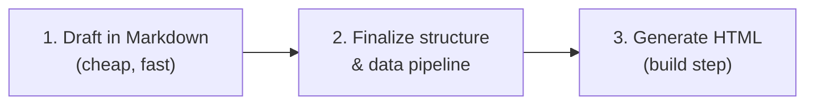

Every time I ask an AI coding agent to visualize something — a cost breakdown, a comparison table, an architecture diagram, a status scorecard — it reaches for HTML. Not markdown. Not a chart library. Just a single `.html` file with inlined CSS and JS that opens in any browser.

These reports are genuinely useful. The problem is they die in the chat window. You save them to your desktop, maybe share one in Slack, and a week later nobody can find it. The URL doesn't exist because there is no URL.

The kernel of this pattern came from earlier machine learning work. When I published a [PyTorch ASR phoneme analysis](/pytorch-asr-example/), the Jupyter notebook's richest output — inline graphs, model activation heatmaps, audio spectrograms — couldn't live in a markdown post. So I exported the notebook to a self-contained HTML file and [served it directly from the Jekyll site](/assets/pdfs/pytorch_asr_phonemes.html). No processing, no layout wrapping — just an `.html` file committed to the repo and deployed alongside everything else. It worked immediately. Stable URL, version-tracked in git, viewable by anyone with the link.

That one-off solution sat in my head until AI coding agents started producing the same kind of output: single-file HTML with inlined styles, rich visuals, zero dependencies. The difference is volume — agents produce these constantly. The fix is the same: publish them to the static site. Same Jekyll blog, same GitHub Pages hosting, same GitHub Actions pipeline — but instead of one notebook export, you're serving a collection of generated reports at stable, bookmarkable URLs.

<!-- excerpt-end -->

## Why HTML Is the Agent's Native Visual Language

HTML is the format AI coding agents produce best. When you ask an agent to create a chart, a dashboard, or a one-off analysis visual, it defaults to HTML — and for good reason:

- **No toolchain required.** HTML renders in any browser. No build step, no package install, no framework boilerplate.
- **Self-contained by default.** A single `.html` file with inlined CSS and JS is a complete deliverable. Drop it in Slack, attach it to a ticket, open it from your desktop — it just works.
- **Rich interactivity without libraries.** Vanilla JS gives you sortable tables, tab navigation, filterable lists, and responsive layouts. CSS gives you bar charts, donut charts, and gradient fills. SVG gives you sparklines and architecture diagrams. No Chart.js, no D3, no React.
- **Iterative by nature.** Ask the agent to add a column, change a color, add a new tab — it edits the file and you refresh. The feedback loop is seconds, not minutes.

This makes HTML the natural output format for everything from a quick cost comparison table to a full multi-tab operational dashboard. The pattern described here takes that output and gives it a permanent home.

## The Pattern

**Self-contained HTML reports committed to a Jekyll site, served via GitHub Pages at stable URLs.**

An AI agent generates a single `.html` file from data you provide. You commit it to your Jekyll repository. GitHub Actions builds and deploys. The result is a permanent, bookmarkable URL that you can share, update, and track in git history.

### Key Properties

- **Single-file, zero-dependency** — opens from `file://`, works in any browser, survives email forwarding
- **Generated, not hand-coded** — the agent reads data and writes HTML. The report is a build artifact.
- **Statically hosted** — no server-side logic, no database, no session state. Just files served by GitHub Pages.
- **Stable URLs** — each report has a fixed URL. Updates overwrite the same file in git.
- **Version tracked** — every change is a commit. You can diff reports, revert, or see when data changed.

## Architecture


### Jekyll Site Layout

```text
your-site/
├── _posts/              # regular blog posts (markdown)
├── _drafts/             # unpublished drafts
├── reports/             # HTML reports (self-contained)
│   ├── index.html       # landing page listing all reports
│   ├── cost-summary.html
│   ├── infra-scorecard.html
│   └── usage-trends.html
├── _data/               # source data for generators (optional)
│   ├── costs.csv
│   └── metrics.json
└── tools/               # generator scripts (optional)
    └── generate_report.py
```

The `reports/` directory sits alongside your regular Jekyll content. Jekyll passes `.html` files through without processing (no Liquid, no layout wrapping) as long as they don't have front matter. Your reports render exactly as the agent produced them.

## Report Design Standards

### What makes a good AI-generated report

- **Single `.html` file** with all CSS and JS inlined
- **No external CDN links**, no separate asset files
- **Must render correctly from `file://`** without a web server (testable before committing)
- **Dark mode default** — matches most developer environments and looks professional
- **Responsive** — readable on mobile if someone opens the link on their phone

### Visualization without libraries

| Data Shape | Chart Type | Implementation |
|-----------|-----------|----------------|
| Categories ranked by value | Horizontal bar | CSS percentage-width divs |
| Part-of-whole (< 6 segments) | Donut/ring | CSS `conic-gradient` |
| Two values compared per row | Grouped bar | CSS divs side by side |
| Time-series trend (compact) | Sparkline | Inline SVG `<polyline>` |
| Architecture diagrams | Box-and-arrow | Inline SVG or Mermaid (if Jekyll-rendered) |
| Flow/sequence diagrams | Flowchart, sequence | Mermaid in markdown posts; inline SVG in HTML reports |

### Interactivity

- Tab navigation for multi-section reports (show/hide divs, URL hash updates)
- Sortable tables (click column headers, vanilla JS)
- Filterable tables (text input, debounced, shows visible/total count)

All of this works without any external dependencies. The agent knows these patterns well.

### A note on Mermaid

For diagrams in markdown blog posts (like this one), [Mermaid](https://mermaid.js.org/) is the better choice — it renders from text descriptions during the Jekyll build, stays version-controllable, and diffs cleanly. For self-contained HTML reports, inline SVG is preferable since Mermaid requires a JS library. The rule: Mermaid for blog content, inline SVG for standalone reports.

## Content Development Workflow

### Markdown First, HTML Second

A report has two layers: the **content** (what it says) and the **presentation** (how it looks). Iterating on both simultaneously in HTML is expensive — every change touches markup, styling, and content together.

The recommended workflow separates these concerns:



| Concern | Markdown iteration | Direct HTML iteration |
|---------|-------------------|----------------------|
| **Token cost per cycle** | Low — plain text, no markup overhead | High — CSS, JS, HTML structure on every edit |
| **Reviewability** | Easy to diff, easy to read | Harder to spot content changes in markup noise |
| **Repeatability** | Content is reusable across formats | Content is locked inside one HTML file |
| **Separation of concerns** | Content decisions separate from styling decisions | Everything tangled together |

**Step 1: Draft content in markdown.** Work with the agent to define what the report should contain — sections, narrative text, data requirements, table structures, key metrics. Iterate until the content is right. This is cheap.

**Step 2: Finalize the data pipeline.** Once the content structure is stable, build the script that fetches/transforms the data.

**Step 3: Generate HTML as a build step.** The generator reads the data and content structure, then produces the final HTML. This is a one-way transformation — you don't edit the HTML directly.

### When to skip this

For quick one-off visuals (a single table, a quick chart to share), going straight to HTML is fine. The markdown-first workflow pays off when:

- The report will be maintained over time (living dashboard)
- Multiple people need to review or contribute content
- The content is complex enough that getting it right takes multiple iterations
- You want to reuse the same content in multiple formats

## Publishing to GitHub Pages

### Manual workflow (quick sharing)

```bash
# Agent generates the report
# You review it locally (open in browser from file://)
# Commit and push

git add reports/my-report.html
git commit -m "Update cost summary report with May data"
git push
```

The existing GitHub Actions Jekyll workflow builds and deploys. Your report is live at `https://yoursite.org/reports/my-report` within minutes.

### Automated workflow (living dashboards)

For reports that refresh on a schedule, add a GitHub Actions workflow:

```yaml
name: Generate Reports
on:
  schedule:
    - cron: '0 10 * * 1'  # Every Monday at 10:00 UTC
  workflow_dispatch:       # Manual trigger

jobs:
  generate:
    runs-on: ubuntu-latest
    steps:
      - uses: actions/checkout@v4

      - uses: actions/setup-python@v5
        with:
          python-version: '3.12'

      - name: Install dependencies
        run: pip install -r tools/requirements.txt

      - name: Generate reports
        run: python tools/generate_report.py
        env:
          DATA_SOURCE_TOKEN: ${{ secrets.DATA_SOURCE_TOKEN }}

      - name: Commit and push
        run: |
          git config user.name "github-actions[bot]"
          git config user.email "github-actions[bot]@users.noreply.github.com"
          git add reports/
          git diff --staged --quiet || git commit -m "Auto-update reports $(date +%Y-%m-%d)"
          git push
```

This generates fresh reports weekly and commits them. The regular Jekyll deploy workflow picks up the change and publishes.

### Two URL strategies

**Stable URL (living dashboards):** Same filename, overwritten on each update. One URL always shows the latest.

```
https://yoursite.org/reports/cost-summary
```

**Dated snapshot (point-in-time deliverables):** Date in the filename. Each publish creates a new file. Old versions stay accessible.

```
https://yoursite.org/reports/cost-summary-2026-05-26
```

## When to Use HTML Reports vs Markdown Posts

| Use Case | Format | Why |
|----------|--------|-----|
| Analysis you want to share quickly | HTML report | Rich visuals, self-contained, no Jekyll processing |
| Permanent reference article | Markdown post | Integrated with site navigation, RSS, SEO |
| Living dashboard (refreshed regularly) | HTML report | Generated from data, not hand-written |
| Tutorial or how-to | Markdown post | Benefits from site layout, comments, related posts |
| One-off presentation or slide deck | HTML report | Custom layout, animations, speaker notes |
| Quick throwaway comparison | HTML report | Fast to generate, easy to share URL, easy to delete later |

The key insight: **markdown posts are for content you write; HTML reports are for content the agent generates from data.** They coexist in the same repository and the same deployed site.

## Example: A Simple Report Generator

The real power of this pattern shows when you separate content from generation. Here's a minimal but complete example:

**`_data/report-content.json`** — what the report says (iterate here cheaply):

```json
{
  "title": "Monthly Infrastructure Summary",
  "methodology": "Costs use AmortizedCost metric from AWS Cost Explorer.",
  "assumptions": [
    "Monthly projections extrapolate partial-month data to 30 days linearly",
    "Spot instance savings are excluded from baseline comparisons"
  ]
}
```

**`tools/generate_report.py`** — how the report looks (change rarely):

```python
#!/usr/bin/env python3
"""Generate a self-contained HTML report from CSV data and content config."""

import csv
import json
from pathlib import Path
from datetime import datetime

def generate_report(data_path: Path, content_path: Path, output_path: Path):
    """Read CSV data + content config and produce a single-file HTML report."""

    with open(content_path) as f:
        content = json.load(f)

    with open(data_path) as f:
        rows = list(csv.DictReader(f))

    total = sum(float(r['cost']) for r in rows)
    generated = datetime.now().strftime('%Y-%m-%d %H:%M')
    title = content["title"]
    methodology = content.get("methodology", "")

    html = f"""<!DOCTYPE html>
<html lang="en">
<head>
    <meta charset="UTF-8">
    <meta name="viewport" content="width=device-width, initial-scale=1.0">
    <title>{title}</title>
    <style>
        * {{ margin: 0; padding: 0; box-sizing: border-box; }}
        body {{ font-family: -apple-system, system-ui, sans-serif;
               background: #1a1a2e; color: #e0e0e0; padding: 2rem; }}
        h1 {{ color: #fff; margin-bottom: 0.5rem; }}
        .meta {{ color: #888; margin-bottom: 2rem; }}
        table {{ width: 100%; border-collapse: collapse; }}
        th, td {{ padding: 0.75rem 1rem; text-align: left;
                  border-bottom: 1px solid #333; }}
        th {{ color: #aaa; font-weight: 600; }}
        .total {{ font-size: 2rem; color: #4ecdc4; margin: 1rem 0; }}
    </style>
</head>
<body>
    <h1>{title}</h1>
    <p class="meta">Generated: {generated}</p>
    <p class="meta" style="font-size:12px">{methodology}</p>
    <div class="total">${{total:,.2f}}</div>
    <table>
        <thead><tr><th>Service</th><th>Cost</th></tr></thead>
        <tbody>
"""
    for row in sorted(rows, key=lambda r: float(r['cost']), reverse=True):
        html += f"            <tr><td>{row['service']}</td><td>${float(row['cost']):,.2f}</td></tr>\n"

    html += """        </tbody>
    </table>
</body>
</html>"""

    output_path.write_text(html)
    print(f"Report generated: {output_path}")

if __name__ == "__main__":
    generate_report(
        data_path=Path("_data/costs.csv"),
        content_path=Path("_data/report-content.json"),
        output_path=Path("reports/cost-summary.html")
    )
```

The key insight from working with this pattern: **`report-content.json` is where you iterate with the agent.** Changing what the report says (title, methodology notes, assumptions, section headings) is cheap — just editing a JSON file. Changing how it looks (the generator) is expensive. Separating them means you can refine content in 10 iterations for the token cost of one HTML rewrite.

## Why Not Just Use a Dashboard Tool?

Tools like Grafana, Metabase, or Looker are great for operational dashboards backed by live data sources. But they require:

- Infrastructure to run (servers, databases, auth)
- Configuration and maintenance
- Access management for viewers
- A data source connection that stays alive

AI-generated HTML reports are the opposite end of the spectrum:

- **Zero infrastructure** — GitHub Pages is free
- **Zero maintenance** — static files don't break
- **Universal access** — anyone with the URL can view it
- **Disposable** — delete the file and it's gone. No orphaned dashboards.
- **Offline-capable** — download the HTML and it works without internet

They're not a replacement for Grafana. They're a replacement for "let me paste this table into Slack" or "I'll put together a quick slide for the meeting."

## Related Posts

- [PyTorch ASR Phoneme Analysis](/pytorch-asr-example/) — The original notebook-to-HTML export that planted this idea
- [Managing Cross-AI Agent Context](/managing-cross-ai-agent-context/) — How context and steering files guide agent output
- [AI Coding Agent Context Files Reference](/ai-coding-agent-context-files-reference/) — Configuration patterns for AI coding tools
- [From Publish to Reader: The Content Distribution Pipeline](/jekyll-content-distribution-pipeline/) — How content reaches readers once published
