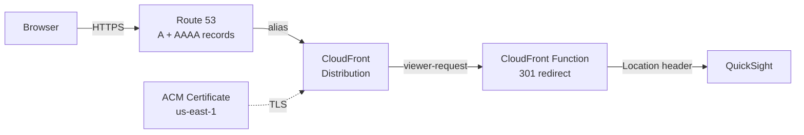

AWS QuickSight is a powerful BI tool, but its default URLs are not something you hand to a business user. A URL like `https://quicksight.aws.amazon.com/?region=us-east-1&directory_alias=analytics` works, but `https://analytics.example.com` is what people actually remember and bookmark.

I built a Terraform module — [terraform-aws-quicksight-redirect](https://github.com/mcgarrah/terraform-aws-quicksight-redirect) — that solves this with a CloudFront Function, ACM, and Route 53. One module call, one CloudFront distribution, as many vanity domains as you need.

At first, people just had to deal with the ugly URL for Quicksight. But when we added a second Quicksight for non-prod testing and a prod for regular customers, the complexity hit and people got annoyed. A proposal was an Nginx proxy running on an EC2 burning cycles for no value for a couple of redirects here and there. That just did not sit well with me. THis felt like something that should be possible wihtout a VM burning costs all the time.

Enter a fortunate encounter with CFF in an article I reading and the idea of using it on the CDN edge to execute a small bit of code for a redirect. The original idea was more complete with an APIGW and Lambda setup, but that just became something that would annoy my collegues to maintain later.

<!-- excerpt-end -->

## The Problem

QuickSight's sign-in URL encodes both the AWS region and a directory alias as query parameters. If you have multiple QuickSight instances across regions or accounts, each one gets its own ugly URL. Sharing these with non-technical stakeholders is friction you don't need.

The goal: `https://analytics.example.com` → 301 redirect → QuickSight. HTTPS, custom domain, no servers.

## Architecture



The key insight is that a CloudFront Function runs at the edge on every viewer request — before the request ever reaches an origin. This means:

1. Route 53 A and AAAA records alias your custom domains to a single CloudFront distribution (dual-stack IPv4/IPv6).
2. ACM provides HTTPS for all configured domains. The certificate must be in `us-east-1` because CloudFront is a global service.
3. The CloudFront Function inspects the `Host` header and returns a 301 redirect to the appropriate QuickSight URL.
4. The origin is set to a dummy value (`none.none`) — it is never contacted. All requests are handled by the function.

No EC2, no Lambda, no API Gateway. The only running cost is CloudFront request pricing, which for redirect traffic is negligible.

## The CloudFront Function

The function itself is minimal. Terraform generates the redirect map at deploy time using `jsonencode()`, which safely escapes all values:

```javascript
function handler(event) {
    var redirects = {"analytics.example.com":"https://quicksight.aws.amazon.com/?region=us-east-1&directory_alias=analytics","reporting.example.com":"https://quicksight.aws.amazon.com/?region=us-west-2&directory_alias=reporting"};
    var host = event.request.headers.host.value;
    var newurl = redirects[host] || "https://quicksight.aws.amazon.com";

    return {
        statusCode: 301,
        statusDescription: "Moved Permanently",
        headers: { location: { value: newurl } }
    };
}
```

Unmatched hostnames fall back to the base QuickSight URL rather than returning an error. The `cloudfront-js-2.0` runtime is used, which is the current CloudFront Functions runtime.

One design decision worth noting: the redirect map is baked into the function code at deploy time. This means adding a new domain requires a `terraform apply`, but it also means there is no external lookup, no latency, and no failure mode at runtime.

## Using the Module

### Single redirect

```hcl
module "quicksight_redirect" {
  source = "github.com/mcgarrah/terraform-aws-quicksight-redirect"

  name_prefix         = "quicksight"
  r53_hosted_zone_id  = "Z1234567890ABC"
  acm_certificate_arn = "arn:aws:acm:us-east-1:123456789012:certificate/..."

  redirects = {
    "analytics.example.com" = {
      aws_region      = "us-east-1"
      directory_alias = "analytics"
    }
  }
}
```

### Multiple redirects, one distribution

A single module instance handles multiple domains through one CloudFront distribution. This is the cost-efficient path — you pay for one distribution regardless of how many domains you add:

```hcl
module "quicksight_redirects" {
  source = "github.com/mcgarrah/terraform-aws-quicksight-redirect"

  name_prefix         = "quicksight"
  r53_hosted_zone_id  = var.r53_hosted_zone_id
  acm_certificate_arn = var.acm_certificate_arn

  redirects = {
    "analytics.example.com" = {
      aws_region      = "us-east-1"
      directory_alias = "analytics"
    }
    "reporting.example.com" = {
      aws_region      = "us-west-2"
      directory_alias = "reporting"
    }
  }
}
```

Pin to a specific version for production use:

```hcl
source = "github.com/mcgarrah/terraform-aws-quicksight-redirect?ref=v1.0.0"
```

## AWS Resources Created

The module creates a small, well-defined set of resources:

- **Route 53 A and AAAA records** — one pair per domain, all aliased to the same CloudFront distribution
- **CloudFront distribution** — single distribution with the dummy origin and `PriceClass_100` (North America and Europe) to keep costs down
- **CloudFront cache policy** — forwards the `Host` header so the function can route by hostname
- **CloudFront Function** — the 301 redirect logic
- **S3 bucket** *(optional)* — created only when `enable_access_logging = true`, with AES256 encryption, public access blocked, and 90-day log expiration

## Access Logging

Logging is off by default. When you need it, there are two modes:

**Managed bucket** — the module creates and manages an S3 bucket:

```hcl
enable_access_logging = true
access_log_prefix     = "quicksight/"
```

**Bring your own bucket** — for teams that need SSE-KMS, custom lifecycle policies, or centralized logging:

```hcl
enable_access_logging         = true
access_log_bucket_domain_name = aws_s3_bucket.my_log_bucket.bucket_regional_domain_name
access_log_prefix             = "quicksight/"
```

The external bucket must have ACLs enabled with `BucketOwnerPreferred` object ownership and the `log-delivery-write` canned ACL. Rather than exposing every S3 configuration option as a module variable, the bring-your-own-bucket model lets callers configure the bucket exactly as their organization requires.

## Input Validation

All input variables include Terraform validation blocks to catch misconfiguration before `apply`:

- `name_prefix` — alphanumeric and hyphens only (prevents injection into resource names)
- `r53_hosted_zone_id` — must match the `Z...` format of a valid hosted zone ID
- `acm_certificate_arn` — must be a valid ACM ARN in `us-east-1` specifically
- `redirects` domain keys — validated as proper hostnames
- `aws_region` values — lowercase alphanumeric and hyphens only
- `directory_alias` values — alphanumeric and hyphens only

These validations prevent the most common mistakes — particularly the `us-east-1` certificate requirement, which is easy to get wrong if you deploy from a different region.

## Things Worth Knowing

A few non-obvious details that tripped me up during development:

**The dummy origin is intentional.** CloudFront requires an origin to be configured even if you never intend to use it. Since the CloudFront Function intercepts every request and returns a redirect, the origin is never contacted. Setting it to `none.none` makes this explicit.

**The ACM certificate must be in `us-east-1`.** CloudFront is a global service and only reads certificates from `us-east-1`, regardless of where you deploy everything else. The variable validation enforces this, but it is worth understanding why.

**The module does not declare a provider or backend.** This is intentional Terraform module hygiene — the caller configures those. If you are deploying from a region other than `us-east-1`, you may need a provider alias for ACM certificate creation.

**`PriceClass_100` limits edge locations to North America and Europe.** If your users are primarily in those regions this is the right default. Change it to `PriceClass_All` if you need global coverage.

## Source

The module is on GitHub: [mcgarrah/terraform-aws-quicksight-redirect](https://github.com/mcgarrah/terraform-aws-quicksight-redirect). The `examples/quicksight` directory has a complete working example with a `terraform.tfvars.example` to get started quickly.
