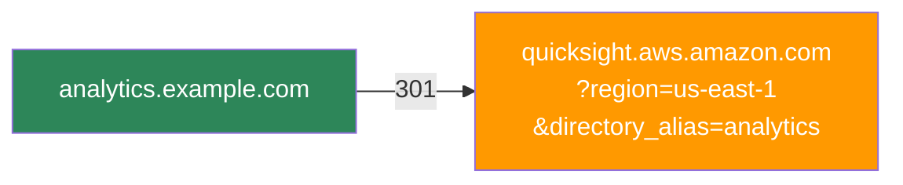
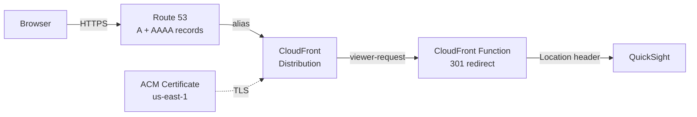

When we added a second QuickSight instance for non-prod testing alongside production, the URL problem went from annoying to unworkable. Business users were mixing up environments, bookmarking the wrong one, and asking which account alias to type every time. Someone proposed an Nginx proxy on EC2 to handle the redirects. A VM burning money 24/7 for a handful of HTTP 301s felt wrong.

Then I stumbled across CloudFront Functions — lightweight JavaScript that runs at the CDN edge on every request, before it ever reaches an origin. No EC2, no Lambda, no API Gateway. Just a few lines of code that return a redirect. I built a Terraform module around it, and it's been running in production for over a year.

<!-- excerpt-end -->

## The Problem

QuickSight's sign-in page asks users to type their account name every time they visit:


Without a vanity URL, users have to remember their directory alias, type it into this field, and then authenticate. With multiple QuickSight instances across regions or accounts, each one gets its own ugly URL with the alias baked into query parameters. Sharing these with non-technical stakeholders is friction you don't need.

The goal: turn that manual step into a clean vanity domain that skips the account name prompt entirely with a 301 redirect:



HTTPS, custom domain, no servers.

## What It Costs

This is the part that still surprises me. After a year of production use with multiple QuickSight instances, the CloudFront costs for all redirects combined were under **$0.06 per month**. Most months it's literally free.

| Approach | Monthly Cost | What You're Paying For |
|----------|-------------|----------------------|
| EC2 t3.micro + Nginx | ~$8.50 | VM running 24/7 for a few redirects |
| API Gateway + Lambda | ~$1-3 | Execution time, invocations, API Gateway requests |
| **CloudFront Function** | **$0.00 - $0.06** | **Request pricing only, no compute** |

CloudFront pricing for HTTPS requests in North America and Europe is $0.01 per 10,000 requests. The Always Free tier covers the first 10 million requests per month. For redirect traffic — which is what this is — you will likely never leave the free tier. ACM certificates are free. Route 53 hosted zone costs $0.50/month (which you're already paying if you have the domain). S3 logging costs don't register in Cost Explorer.

The module uses `PriceClass_100` (North America and Europe) by default to keep costs minimal. Change to `PriceClass_All` if you need global edge coverage.

## Architecture



The key insight is that a CloudFront Function runs at the edge on every viewer request — before the request ever reaches an origin. This means:

1. Route 53 A and AAAA records alias your custom domains to a single CloudFront distribution (dual-stack IPv4/IPv6).
2. ACM provides HTTPS for all configured domains. The certificate must be in `us-east-1` because CloudFront is a global service.
3. The CloudFront Function inspects the `Host` header and returns a 301 redirect to the appropriate QuickSight URL.
4. The origin is set to a dummy value (`none.none`) — it is never contacted. All requests are handled by the function.

No EC2, no Lambda, no API Gateway. The only running cost is CloudFront request pricing, which for redirect traffic is negligible.

## The CloudFront Function

The function itself is minimal. Terraform generates the redirect map at deploy time using `jsonencode()`, which safely escapes all values:

```javascript
function handler(event) {
    var redirects = {"analytics.example.com":"https://quicksight.aws.amazon.com/?region=us-east-1&directory_alias=analytics","reporting.example.com":"https://quicksight.aws.amazon.com/?region=us-west-2&directory_alias=reporting"};
    var host = event.request.headers.host.value;
    var newurl = redirects[host] || "https://quicksight.aws.amazon.com";

    return {
        statusCode: 301,
        statusDescription: "Moved Permanently",
        headers: { location: { value: newurl } }
    };
}
```

Unmatched hostnames fall back to the base QuickSight URL rather than returning an error. The `cloudfront-js-2.0` runtime is used, which is the current CloudFront Functions runtime.

One design decision worth noting: the redirect map is baked into the function code at deploy time. This means adding a new domain requires a `terraform apply`, but it also means there is no external lookup, no latency, and no failure mode at runtime.

## Using the Module

The module is published on the [Terraform Registry](https://registry.terraform.io/modules/mcgarrah/quicksight-redirect/aws/latest). A single module instance handles multiple domains through one CloudFront distribution — you pay for one distribution regardless of how many domains you add:

```hcl
module "quicksight_redirects" {
  source  = "mcgarrah/quicksight-redirect/aws"
  version = "~> 1.0"

  name_prefix         = "quicksight"
  r53_hosted_zone_id  = var.r53_hosted_zone_id
  acm_certificate_arn = var.acm_certificate_arn

  redirects = {
    "analytics.example.com" = {
      aws_region      = "us-east-1"
      directory_alias = "analytics"
    }
    "reporting.example.com" = {
      aws_region      = "us-west-2"
      directory_alias = "reporting"
    }
  }
}
```

Works just as well with a single redirect — remove the second entry and you're done.

You can also reference the GitHub source directly, pinned to a version:

```hcl
source = "github.com/mcgarrah/terraform-aws-quicksight-redirect?ref=v1.0.0"
```

## AWS Resources Created

The module creates a small, well-defined set of resources:

- **Route 53 A and AAAA records** — one pair per domain, all aliased to the same CloudFront distribution
- **CloudFront distribution** — single distribution with the dummy origin and `PriceClass_100` (North America and Europe) to keep costs down
- **CloudFront cache policy** — forwards the `Host` header so the function can route by hostname
- **CloudFront Function** — the 301 redirect logic
- **S3 bucket** *(optional)* — created only when `enable_access_logging = true`, with AES256 encryption, public access blocked, and 90-day log expiration

## Access Logging

Logging is off by default. When you need it, there are two modes:

**Managed bucket** — the module creates and manages an S3 bucket:

```hcl
enable_access_logging = true
access_log_prefix     = "quicksight/"
```

**Bring your own bucket** — for teams that need SSE-KMS, custom lifecycle policies, or centralized logging:

```hcl
enable_access_logging         = true
access_log_bucket_domain_name = aws_s3_bucket.my_log_bucket.bucket_regional_domain_name
access_log_prefix             = "quicksight/"
```

The external bucket must have ACLs enabled with `BucketOwnerPreferred` object ownership and the `log-delivery-write` canned ACL. Rather than exposing every S3 configuration option as a module variable, the bring-your-own-bucket model lets callers configure the bucket exactly as their organization requires.

## Input Validation

All input variables include Terraform validation blocks to catch misconfiguration before `apply`:

- `name_prefix` — alphanumeric and hyphens only (prevents injection into resource names)
- `r53_hosted_zone_id` — must match the `Z...` format of a valid hosted zone ID
- `acm_certificate_arn` — must be a valid ACM ARN in `us-east-1` specifically
- `redirects` domain keys — validated as proper hostnames
- `aws_region` values — lowercase alphanumeric and hyphens only
- `directory_alias` values — alphanumeric and hyphens only

These validations prevent the most common mistakes — particularly the `us-east-1` certificate requirement, which is easy to get wrong if you deploy from a different region.

## Things Worth Knowing

A few non-obvious details that tripped me up during development:

**The dummy origin is intentional.** CloudFront requires an origin to be configured even if you never intend to use it. Since the CloudFront Function intercepts every request and returns a redirect, the origin is never contacted. Setting it to `none.none` makes this explicit.

**The ACM certificate must be in `us-east-1`.** CloudFront is a global service and only reads certificates from `us-east-1`, regardless of where you deploy everything else. The variable validation enforces this, but it is worth understanding why.

**The module does not declare a provider or backend.** This is intentional Terraform module hygiene — the caller configures those. If you are deploying from a region other than `us-east-1`, you may need a provider alias for ACM certificate creation.

**`PriceClass_100` limits edge locations to North America and Europe.** If your users are primarily in those regions this is the right default. Change it to `PriceClass_All` if you need global coverage.

## Source

The module is on GitHub: [mcgarrah/terraform-aws-quicksight-redirect](https://github.com/mcgarrah/terraform-aws-quicksight-redirect). The `examples/quicksight` directory has a complete working example with a `terraform.tfvars.example` to get started quickly.

The module is published on the [Terraform Registry](https://registry.terraform.io/modules/mcgarrah/quicksight-redirect/aws/latest). Versions are driven by Git tags — each `vX.Y.Z` tag becomes a registry version automatically.

To verify the module is available on the registry:

```bash
# Check the registry API directly
curl -s https://registry.terraform.io/v1/modules/mcgarrah/quicksight-redirect/aws | jq '.version'

# Or use terraform to validate
terraform init   # downloads the module from the registry
terraform validate
```

## Wrapping Up

The whole point of this module is that your users bookmark `analytics.example.com` and never see the account name prompt again. One `terraform apply`, a few DNS records, and a CloudFront Function that costs less per month than a cup of coffee. After a year in production, it's one of those rare infrastructure decisions I haven't had to think about since the day I deployed it.

The module is open source — if you're running QuickSight and tired of sharing ugly URLs, give it a try.
