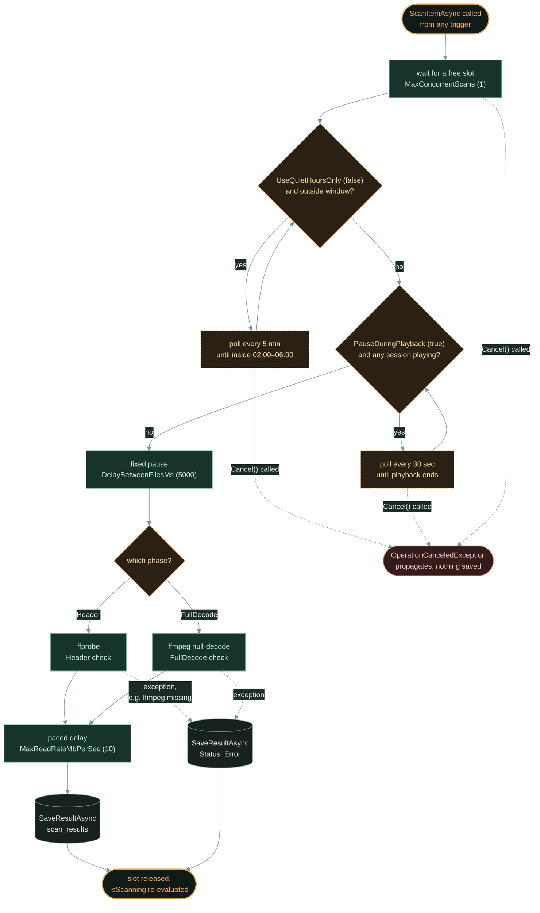

The [architecture article](/jellyfin-media-integrity-architecture-design/) laid out the design decisions — two-phase scanning, I/O throttling, SQLite persistence, event-driven updates. This article implements the core: the plugin skeleton, FFmpeg integration, and the bounded scan engine.

<!-- excerpt-end -->

> **Implementation status (updated July 31, 2026):** The scanner core described in this article is fully implemented and shipping — plugin scaffold, FFmpeg wrapper, resolver, and scan engine are all real, not target code. A few things changed from the original design as bugs and gaps surfaced during hardening: the FFmpeg process wrapper now drains stdout/stderr concurrently with process exit (to avoid an OS pipe-buffer deadlock on large stderr output) and kills the process tree on cancellation instead of leaving orphaned ffmpeg processes; `IsScanning` is tracked with `Interlocked` counters rather than a semaphore-count comparison; and the scan engine gained two pacing mechanisms not shown in the original code below — a quiet-hours window check and a post-scan read-rate throttle. See the [Scan Pacing update](#update-quiet-hours-and-read-rate-throttling) at the end of this article for details.

This is Part 3 of the [Jellyfin Media Integrity Scanner](/jellyfin-media-integrity-scanner-introduction/) development series.

## Project Structure

Following the [jellyfin-plugin-template](https://github.com/jellyfin/jellyfin-plugin-template) pattern:

> **Build environment note (updated July 31, 2026):** The dedicated Proxmox LXC build/integration-test container is now operational (.NET 9 SDK, `jellyfin-ffmpeg`, and a test Jellyfin instance), alongside GitHub Actions CI.

```
jellyfin-plugin-media-integrity-scanner/
├── Jellyfin.Plugin.MediaIntegrityScanner/
│   ├── Plugin.cs                    # Plugin entry point
│   ├── PluginConfiguration.cs       # User-configurable settings
│   ├── ScheduledTasks/
│   │   ├── HeaderScanTask.cs        # Phase 1 scheduled task
│   │   └── DeepScanTask.cs          # Phase 2 scheduled task
│   ├── Scanner/
│   │   ├── IScanEngine.cs           # Scanner interface
│   │   ├── ScanEngine.cs            # Bounded, throttled scan orchestrator
│   │   ├── FfmpegWrapper.cs         # FFmpeg/ffprobe process management
│   │   ├── FfmpegResolver.cs        # Cross-platform binary resolution
│   │   └── ScanResult.cs            # Result model
│   ├── Data/
│   │   ├── IDatabaseManager.cs      # Database interface
│   │   ├── SqliteDatabaseManager.cs # SQLite implementation
│   │   └── Models/
│   │       └── ScanRecord.cs        # Database entity
│   ├── EventHandlers/
│   │   └── LibraryMonitor.cs        # ItemAdded/Removed hooks
│   ├── Api/
│   │   └── MediaIntegrityController.cs  # REST API
│   └── Web/
│       └── integrity_dashboard.html # Admin UI
├── Jellyfin.Plugin.MediaIntegrityScanner.csproj
├── Jellyfin.Plugin.MediaIntegrityScanner.sln
├── Directory.Build.props
├── .github/workflows/build.yml
└── manifest.json
```

## Plugin Entry Point

The plugin registers its services with Jellyfin's dependency injection:

```csharp
using MediaBrowser.Common.Plugins;
using MediaBrowser.Model.Plugins;
using Microsoft.Extensions.DependencyInjection;

namespace Jellyfin.Plugin.MediaIntegrityScanner;

public class Plugin : BasePlugin<PluginConfiguration>,
    IHasWebPages
{
    public Plugin(
        IApplicationPaths applicationPaths,
        IXmlSerializer xmlSerializer)
        : base(applicationPaths, xmlSerializer)
    {
        Instance = this;
    }

    public static Plugin? Instance { get; private set; }

    public override string Name => "Media Integrity Scanner";
    public override string Description =>
        "Validates media file integrity using FFmpeg. " +
        "Detects corrupt, truncated, and damaged files.";
    public override Guid Id =>
        Guid.Parse("c8f4a3b2-1d5e-4f6a-9b7c-2e8d0f1a3b5c");

    public IEnumerable<PluginPageInfo> GetPages()
    {
        return new[]
        {
            new PluginPageInfo
            {
                Name = "Media Integrity",
                EmbeddedResourcePath = GetType().Namespace + ".Web.integrity_dashboard.html"
            }
        };
    }
}
```

## Plugin Configuration

```csharp
using MediaBrowser.Model.Plugins;

namespace Jellyfin.Plugin.MediaIntegrityScanner;

public class PluginConfiguration : BasePluginConfiguration
{
    // Scanning behavior
    public int MaxConcurrentScans { get; set; } = 1;
    public int DelayBetweenFilesMs { get; set; } = 5000;
    public bool PauseDuringPlayback { get; set; } = true;
    public bool EnableDeepScan { get; set; } = false;

    // Throttling
    public int MaxReadRateMbPerSec { get; set; } = 10;

    // Scheduling
    public bool UseQuietHoursOnly { get; set; } = false;
    public string QuietHoursStart { get; set; } = "02:00";
    public string QuietHoursEnd { get; set; } = "06:00";

    // FFmpeg
    public string? FfmpegPathOverride { get; set; }
    public string? FfprobePathOverride { get; set; }

    // Event-driven scanning
    public bool ScanOnItemAdded { get; set; } = true;
    public bool PurgeOnItemRemoved { get; set; } = true;
}
```

## FFmpeg Binary Resolution

The cross-platform resolver finds ffmpeg regardless of installation method:

```csharp
namespace Jellyfin.Plugin.MediaIntegrityScanner.Scanner;

public class FfmpegResolver
{
    private readonly IServerConfigurationManager _config;
    private readonly ILogger<FfmpegResolver> _logger;

    public FfmpegResolver(
        IServerConfigurationManager config,
        ILogger<FfmpegResolver> logger)
    {
        _config = config;
        _logger = logger;
    }

    public string ResolveFfmpegPath()
    {
        // 1. User override from plugin config
        var pluginConfig = Plugin.Instance?.Configuration;
        if (!string.IsNullOrEmpty(pluginConfig?.FfmpegPathOverride))
        {
            if (File.Exists(pluginConfig.FfmpegPathOverride))
                return pluginConfig.FfmpegPathOverride;

            _logger.LogWarning(
                "Configured ffmpeg path not found: {Path}",
                pluginConfig.FfmpegPathOverride);
        }

        // 2. Jellyfin's own configured ffmpeg
        var serverFfmpeg = _config.GetEncodingOptions().EncoderAppPath;
        if (!string.IsNullOrEmpty(serverFfmpeg) && File.Exists(serverFfmpeg))
            return serverFfmpeg;

        // 3. Platform-specific known locations
        var candidates = GetPlatformCandidates();
        foreach (var candidate in candidates)
        {
            if (File.Exists(candidate))
                return candidate;
        }

        // 4. PATH lookup
        var pathResult = FindInPath("ffmpeg");
        if (pathResult != null)
            return pathResult;

        throw new InvalidOperationException(
            "FFmpeg not found. Install ffmpeg or configure the path " +
            "in Media Integrity Scanner settings.");
    }

    private static IEnumerable<string> GetPlatformCandidates()
    {
        if (OperatingSystem.IsLinux())
        {
            yield return "/usr/lib/jellyfin-ffmpeg/ffmpeg";
            yield return "/usr/bin/ffmpeg";
            yield return "/usr/local/bin/ffmpeg";
        }
        else if (OperatingSystem.IsWindows())
        {
            yield return Path.Combine(
                Environment.GetFolderPath(
                    Environment.SpecialFolder.CommonApplicationData),
                "Jellyfin", "Server", "ffmpeg.exe");
            yield return @"C:\ffmpeg\bin\ffmpeg.exe";
        }
        else if (OperatingSystem.IsMacOS())
        {
            yield return "/opt/homebrew/bin/ffmpeg";
            yield return "/usr/local/bin/ffmpeg";
        }
    }

    private static string? FindInPath(string executable)
    {
        var pathVar = Environment.GetEnvironmentVariable("PATH");
        if (string.IsNullOrEmpty(pathVar)) return null;

        var separator = OperatingSystem.IsWindows() ? ';' : ':';
        var extension = OperatingSystem.IsWindows() ? ".exe" : "";

        return pathVar.Split(separator)
            .Select(dir => Path.Combine(dir, executable + extension))
            .FirstOrDefault(File.Exists);
    }
}
```

## The Scan Engine

The bounded, thread-safe scan engine processes files sequentially with configurable throttling:

```csharp
namespace Jellyfin.Plugin.MediaIntegrityScanner.Scanner;

public class ScanEngine : IScanEngine, IDisposable
{
    private readonly SemaphoreSlim _scanLock;
    private readonly FfmpegWrapper _ffmpeg;
    private readonly IDatabaseManager _db;
    private readonly ISessionManager _sessions;
    private readonly ILogger<ScanEngine> _logger;
    private CancellationTokenSource? _cts;

    public ScanEngine(
        FfmpegWrapper ffmpeg,
        IDatabaseManager db,
        ISessionManager sessions,
        ILogger<ScanEngine> logger)
    {
        _ffmpeg = ffmpeg;
        _db = db;
        _sessions = sessions;
        _logger = logger;

        var config = Plugin.Instance?.Configuration;
        _scanLock = new SemaphoreSlim(
            config?.MaxConcurrentScans ?? 1);
    }

    public bool IsScanning { get; private set; }

    public async Task ScanItemAsync(
        BaseItem item,
        ScanPhase phase,
        CancellationToken cancellationToken)
    {
        await _scanLock.WaitAsync(cancellationToken);
        try
        {
            // Check playback pause
            if (ShouldPauseForPlayback())
            {
                _logger.LogInformation(
                    "Pausing scan — active playback detected");
                await WaitForPlaybackEnd(cancellationToken);
            }

            // Apply inter-file delay
            var config = Plugin.Instance?.Configuration;
            var delay = config?.DelayBetweenFilesMs ?? 5000;
            await Task.Delay(delay, cancellationToken);

            // Execute scan
            var result = phase switch
            {
                ScanPhase.Header => await _ffmpeg.ProbeAsync(
                    item.Path, cancellationToken),
                ScanPhase.FullDecode => await _ffmpeg.DecodeAsync(
                    item.Path, cancellationToken),
                _ => throw new ArgumentException(
                    $"Unknown phase: {phase}")
            };

            // Persist result
            await _db.SaveResultAsync(new ScanRecord
            {
                ItemId = item.Id.ToString(),
                FilePath = item.Path,
                FileSize = new FileInfo(item.Path).Length,
                LastModified = File.GetLastWriteTimeUtc(item.Path)
                    .ToString("O"),
                ScanPhase = (int)phase,
                ScanStatus = result.Success
                    ? (int)ScanStatus.Pass
                    : (int)ScanStatus.Fail,
                ScanTimestamp = DateTime.UtcNow.ToString("O"),
                ErrorOutput = result.ErrorOutput,
                ScanDurationMs = result.DurationMs
            });
        }
        finally
        {
            _scanLock.Release();
        }
    }

    private bool ShouldPauseForPlayback()
    {
        var config = Plugin.Instance?.Configuration;
        if (config?.PauseDuringPlayback != true) return false;

        return _sessions.Sessions
            .Any(s => s.NowPlayingItem != null);
    }

    private async Task WaitForPlaybackEnd(
        CancellationToken cancellationToken)
    {
        while (ShouldPauseForPlayback() &&
               !cancellationToken.IsCancellationRequested)
        {
            await Task.Delay(
                TimeSpan.FromSeconds(30), cancellationToken);
        }
    }

    public void Dispose()
    {
        _scanLock.Dispose();
        _cts?.Dispose();
    }
}
```

## FFmpeg Process Wrapper

```csharp
namespace Jellyfin.Plugin.MediaIntegrityScanner.Scanner;

public class FfmpegWrapper
{
    private readonly string _ffmpegPath;
    private readonly string _ffprobePath;
    private readonly ILogger<FfmpegWrapper> _logger;

    public FfmpegWrapper(
        FfmpegResolver resolver,
        ILogger<FfmpegWrapper> logger)
    {
        _ffmpegPath = resolver.ResolveFfmpegPath();
        _ffprobePath = resolver.ResolveFfprobePath();
        _logger = logger;
    }

    /// <summary>
    /// Phase 1: Quick header/metadata validation via ffprobe.
    /// </summary>
    public async Task<ScanResult> ProbeAsync(
        string filePath, CancellationToken ct)
    {
        var sw = Stopwatch.StartNew();
        var args = $"-v error -show_entries format=duration,size " +
                   $"-show_entries stream=codec_type,codec_name " +
                   $"-of json \"{filePath}\"";

        var (exitCode, _, stderr) = await RunProcessAsync(
            _ffprobePath, args, ct);

        sw.Stop();
        return new ScanResult
        {
            Success = exitCode == 0 &&
                      string.IsNullOrWhiteSpace(stderr),
            ErrorOutput = stderr,
            DurationMs = (int)sw.ElapsedMilliseconds
        };
    }

    /// <summary>
    /// Phase 2: Full decode — reads every frame, outputs nothing.
    /// </summary>
    public async Task<ScanResult> DecodeAsync(
        string filePath, CancellationToken ct)
    {
        var sw = Stopwatch.StartNew();
        var args = $"-v error -i \"{filePath}\" -f null -";

        var (exitCode, _, stderr) = await RunProcessAsync(
            _ffmpegPath, args, ct);

        sw.Stop();
        return new ScanResult
        {
            Success = exitCode == 0 &&
                      string.IsNullOrWhiteSpace(stderr),
            ErrorOutput = stderr,
            DurationMs = (int)sw.ElapsedMilliseconds
        };
    }

    private static async Task<(int ExitCode, string Stdout, string Stderr)>
        RunProcessAsync(string exe, string args, CancellationToken ct)
    {
        using var process = new Process
        {
            StartInfo = new ProcessStartInfo
            {
                FileName = exe,
                Arguments = args,
                RedirectStandardOutput = true,
                RedirectStandardError = true,
                UseShellExecute = false,
                CreateNoWindow = true
            }
        };

        process.Start();

        var stdoutTask = process.StandardOutput.ReadToEndAsync(ct);
        var stderrTask = process.StandardError.ReadToEndAsync(ct);

        await process.WaitForExitAsync(ct);

        return (
            process.ExitCode,
            await stdoutTask,
            await stderrTask
        );
    }
}
```

## Scheduled Task Registration

```csharp
namespace Jellyfin.Plugin.MediaIntegrityScanner.ScheduledTasks;

public class HeaderScanTask : IScheduledTask
{
    private readonly ILibraryManager _library;
    private readonly IScanEngine _scanner;
    private readonly IDatabaseManager _db;

    public string Name => "Media Integrity - Header Scan";
    public string Key => "MediaIntegrityHeaderScan";
    public string Description =>
        "Quick validation of media file headers and metadata.";
    public string Category => "Media Integrity";

    public IEnumerable<TaskTriggerInfo> GetDefaultTriggers()
    {
        return new[]
        {
            new TaskTriggerInfo
            {
                Type = TaskTriggerInfo.TriggerDaily,
                TimeOfDayTicks = TimeSpan.FromHours(3).Ticks
            }
        };
    }

    public async Task ExecuteAsync(
        IProgress<double> progress,
        CancellationToken cancellationToken)
    {
        var items = _library.GetItemList(new InternalItemsQuery
        {
            MediaTypes = new[] { MediaType.Video, MediaType.Audio },
            IsVirtualItem = false
        });

        var total = items.Count;
        var processed = 0;

        foreach (var item in items)
        {
            cancellationToken.ThrowIfCancellationRequested();

            // Skip if already scanned and file unchanged
            if (await _db.IsCurrentAsync(item.Id.ToString(), item.Path))
            {
                processed++;
                progress.Report((double)processed / total * 100);
                continue;
            }

            await _scanner.ScanItemAsync(
                item, ScanPhase.Header, cancellationToken);

            processed++;
            progress.Report((double)processed / total * 100);
        }
    }
}
```

## Update: Quiet Hours and Read-Rate Throttling

The [deployment article](/jellyfin-media-integrity-deployment-operations/) recommends specific `MaxReadRateMbPerSec` and `UseQuietHoursOnly`/`QuietHoursStart`/`QuietHoursEnd` values for CephFS and NFS backends. Those config fields existed from the start, but nothing actually enforced them — a gap caught during a later review pass. Two additions to `ScanEngine` close it:

```csharp
public static class ScanThrottle
{
    // Supports windows that wrap past midnight (e.g., 22:00-06:00).
    // Fails open (returns true) if either bound can't be parsed.
    public static bool IsWithinQuietHours(string? start, string? end, TimeSpan timeOfDay) { /* ... */ }

    // Pads wall-clock time after a scan so the average MB/s for that
    // file doesn't exceed the configured cap.
    public static TimeSpan ComputeReadRateDelay(long fileSizeBytes, int maxReadRateMbPerSec, int actualDurationMs) { /* ... */ }
}
```

`ScanItemAsync` checks `IsWithinQuietHours` before scanning (waiting in a loop if outside the window, same pattern as the existing playback-pause check), and calls `ComputeReadRateDelay` after each scan to pad the inter-file gap so the *average* rate for that file doesn't exceed the cap.

The read-rate throttle is deliberately **not** a literal in-flight byte cap. An earlier design considered piping the file through ffmpeg's stdin (`pipe:0`) to get precise control over read bytes/sec, but that breaks seekability — and many MP4/MOV files store the `moov` atom at the end of the file, so probing them over a non-seekable pipe produces a false `"moov atom not found"` failure. That's exactly the corruption signature this plugin exists to detect, so a naive throttle could turn healthy files into false positives. Padding wall-clock time after the fact has zero risk to decode correctness, since ffmpeg still opens the file directly and reads at full speed — it only bounds the long-run average throughput the scanner pulls from storage, which is the actual concern behind the CephFS/NFS tuning guidance.

Both functions are pure and dependency-free (no Jellyfin types), so they're covered by a small xUnit test project — see the [deployment article](/jellyfin-media-integrity-deployment-operations/) for the CI wiring.

Stacking all of this on top of the original `ScanItemAsync` gives a longer gate pipeline than the code above suggests — concurrency slot, quiet hours, playback pause, the fixed inter-file delay, the scan itself, then the read-rate throttle:



Every file, whoever triggered its scan, walks this same path — a manually-triggered API scan and a scheduled sweep get no special treatment once they're queued.

## Update: `MaxConcurrentScans` Wasn't Honored by Bulk Scans

The `HeaderScanTask` loop shown above has a subtle bug: it's a plain `foreach` with a single `await` per iteration. `ScanEngine`'s internal `SemaphoreSlim` is sized to `MaxConcurrentScans`, but a sequential loop never asks it for more than one slot at a time — so setting `MaxConcurrentScans` above `1` had no effect on a scheduled or library-wide scan. It only mattered for manual single-item scans issued concurrently from the API, which almost nobody does.

Fixed by switching both scheduled tasks and `ScanEngine.ScanLibraryAsync` to `Parallel.ForEachAsync` with `MaxDegreeOfParallelism` set to the configured value:

```csharp
var maxConcurrent = Math.Max(1, config?.MaxConcurrentScans ?? 1);
await Parallel.ForEachAsync(
    items,
    new ParallelOptions { MaxDegreeOfParallelism = maxConcurrent, CancellationToken = cancellationToken },
    async (item, ct) =>
    {
        if (!await _db.IsCurrentAsync(item.Id.ToString(), item.Path))
        {
            await _scanner.ScanItemAsync(item, ScanPhase.Header, ct);
        }

        var done = Interlocked.Increment(ref processed);
        progress.Report((double)done / total * 100);
    });
```

The semaphore inside `ScanEngine` isn't redundant with this — it's still what keeps a manual single-item scan and a bulk scan from together exceeding the configured limit. This change fixes the half the semaphore alone couldn't: the loop itself never asking for more than one slot. `Interlocked.Increment` replaces the plain `processed++`, since parallel iterations now complete out of order. Default behavior (`MaxConcurrentScans = 1`) is unchanged.

## Update: The Skip Check Didn't Know About Scan Phase

The `IsCurrentAsync(item.Id.ToString(), item.Path)` check in the loop above — "does this item already have a passing scan with an unchanged mtime" — has a bug that took a while to surface: it never looked at *which phase* produced that passing record. Since files are normally Header-scanned first (either on library add or via `HeaderScanTask`), once a file passes that quick check, `IsCurrentAsync` reports it "current" for **any** later request — including a `DeepScanTask` run asking for a full `FullDecode` pass — as long as the file's mtime hasn't changed.

That's a real problem for `DeepScanTask` specifically: its entire purpose is catching mid-file corruption that a header check misses, but it would silently skip almost every file in the library on every scheduled run, forever, because they'd already "passed" at the Header level. The deep scan had likely never actually deep-scanned anything in a real deployment.

Fixed by adding a `minPhase` parameter to `IsCurrentAsync`, requiring `scan_phase >= minPhase` in the underlying query, and passing the right phase at each of the three call sites — `(int)phase` in `ScanLibraryAsync`, `Header` in `HeaderScanTask`, `FullDecode` in `DeepScanTask`. See the [architecture article's incremental-scanning section](/jellyfin-media-integrity-architecture-design/#incremental-scanning-logic) for how this interacts with the schema design.

Here's the failure mode laid out end to end, alongside the one path that was never affected by it — an `itemId`-scoped API call, which bypasses `IsCurrentAsync` entirely:

```mermaid
%%{init: {"theme": "base", "themeVariables": {
  "actorBkg": "#17221f",
  "actorBorder": "#3e6e67",
  "actorTextColor": "#e7ede9",
  "actorLineColor": "#3e6e67",
  "signalColor": "#a8b8bd",
  "signalTextColor": "#e7ede9",
  "labelBoxBkgColor": "#2a2013",
  "labelBoxBorderColor": "#e3a857",
  "labelTextColor": "#f4d9a8",
  "loopTextColor": "#e7ede9",
  "noteBkgColor": "#1d2b27",
  "noteBorderColor": "#3e6e67",
  "noteTextColor": "#e7ede9",
  "activationBorderColor": "#5fa88f",
  "activationBkgColor": "#16332c",
  "sequenceNumberColor": "#101a18",
  "fontFamily": "monospace",
  "fontSize": "13px"
}}}%%
sequenceDiagram
    participant SCH as Task Scheduler
    participant DST as DeepScanTask
    participant DB as scan_results
    participant SE as ScanEngine
    participant AD as Admin (dashboard)

    SCH->>DST: Sunday 01:00 trigger
    activate DST
    DST->>DST: EnableDeepScan == true?
    DST->>DB: IsCurrentAsync(item, minPhase=FullDecode)
    Note over DB: file already has a passing<br/>Header (phase 1) record &mdash;<br/>phase 1 is less than FullDecode (phase 2)
    DB-->>DST: false, not current at this phase
    DST->>SE: ScanItemAsync(item, FullDecode)
    SE->>DB: SaveResultAsync(Pass, FullDecode)
    deactivate DST

    Note over DB,SE: before the phase-aware fix, that check<br/>returned true for ANY passing record &mdash;<br/>this file would have been skipped forever

    AD->>SE: POST /MediaIntegrity/Scan<br/>itemId + deepScan: true
    activate SE
    Note over SE: the itemId-scoped path calls<br/>ScanItemAsync directly &mdash;<br/>no currency check at all
    SE->>DB: SaveResultAsync(Pass, FullDecode)
    deactivate SE
```

If `EnableDeepScan` ever seemed to do nothing against a library that had already loaded in cleanly, this was why.

## What's Next

The [next article](/jellyfin-media-integrity-dashboard-api/) adds the admin-facing layer: the REST API controller for querying scan results and triggering scans, and the HTML dashboard that gives at-a-glance library health visibility.

## Series Navigation

1. [Introduction & Problem Statement](/jellyfin-media-integrity-scanner-introduction/)
2. [Architecture & Design Decisions](/jellyfin-media-integrity-architecture-design/)
3. **Building the Scanner Core** (this post)
4. [The Dashboard & API](/jellyfin-media-integrity-dashboard-api/)
5. [Deployment & Operations](/jellyfin-media-integrity-deployment-operations/)
