What started as a simple task to add a print stylesheet to my Jekyll website turned into a multi-hour debugging session that taught me valuable lessons about SASS module architecture. Here's the story of how circular dependencies can break your build and how to fix them properly.

<!-- excerpt-end -->

## The Innocent Beginning

I wanted to add a print stylesheet to optimize my blog posts for printing. Simple enough, right? Create a `print.sass` file, add some `@media print` rules, and import it into the main stylesheet. What could go wrong?

```sass
// _sass/print.sass
@use "main" as *

@media print
  nav, aside, footer
    display: none !important
  // ... more print styles
```

## The First Error

```text
Error: Module loop: this module is already being loaded.
```

This cryptic error message was my introduction to SASS circular dependencies. The problem was clear in hindsight but took time to understand:

1. `main.sass` imports `print.sass`
2. `print.sass` imports `main.sass` (for variables)
3. SASS detects the circular dependency and refuses to compile

## The Quick Fix That Made Things Worse

My first attempt was to move the print styles directly into `main.sass` but this just felt wrong... but I was in a hurry. This "fixed" the immediate problem but created a larger architectural issue. Then I needed to add Google Custom Search styling (after implementing [Google Custom Search functionality](/2025/12/07/adding-google-custom-search-jekyll.html) the week before) and hit the same problem again. That feeling of wrongness pervaded the whole things and I knew I had a problem I needed to fix.

```sass
// _sass/google-search.sass
@use "main" as *  // Another circular dependency!
```

Each time I tried to create a modular SASS file that needed variables, I created another circular dependency. The pattern was clear: **any module that needed shared variables would create a circular dependency if it imported from `main.sass`**.

## Understanding the Root Problem

So take a deep breath and back away from the problem. Often I need a break when fixing something this because I get so invested in the current that I miss the possible. After a break I could see the issue wasn't with individual files—it was with the overall architecture. My original structure looked like this:

```text
_sass/
├── main.sass          # Variables + imports everything else
├── basic.sass         # Imports main for variables
├── layout.sass        # Imports main for variables
├── print.sass         # Imports main for variables (CIRCULAR!)
└── google-search.sass # Imports main for variables (CIRCULAR!)
```

The problem: `main.sass` was trying to be both the **variable provider** and the **module aggregator**. This dual role created circular dependencies whenever new modules needed variables.

## The Proper Solution

The fix required separating concerns into a proper SASS architecture:

### Step 1: Extract Variables

Create a dedicated variables file that never imports anything:

```sass
// _sass/variables.sass
@use "sass:color"

$font-size: calc(0.8rem + 0.2vw) !default
$font-weight: 400 !default
$font-family: "PT Sans", -apple-system, "Helvetica Neue", "Segoe UI", "Roboto", sans-serif !default
$link-color: #68f !default
$dark: #212228 !default
$light: #ffffff !default

@function reduce($percent)
  @return rgba(color.mix($dark, $light), calc($percent / 100))
```

### Step 2: Update All Modules

Every module that needs variables imports from the variables file:

```sass
// _sass/print.sass
@use "variables" as *  # No circular dependency!

@media print
  body
    background: $light !important
    color: $dark !important
```

### Step 3: Reorganize Main Module

The main module becomes purely an aggregator:

```sass
// _sass/main.sass
@use "variables" as *
@use "copy-button"
@use "comments"
@use "tags-categories"
@use "reading-time"
@use "google-search"
@use "print"
```

### Step 4: Fix Import Chains

Update all files that were importing variables through other modules:

```sass
// _sass/basic.sass
@use "variables" as *  # Direct import, not through main

// assets/css/frame.sass
@use "../../_sass/variables" as *  # Direct path to variables
```

## The Hidden Gotcha

Even after fixing the architecture, I encountered another issue: some files were still importing from the old structure. The build would succeed, but the styling would be completely broken because modules weren't being loaded in the right order.

The key insight: **SASS module loading is order-dependent**. The `_sass/index.sass` file needed to forward modules in the correct sequence:

```sass
// _sass/index.sass
@forward "variables"  # Must be first!
@forward "main"
@forward "font"
@forward "basic"
@forward "layout"
@forward "classes"
```

## Lessons Learned

### 1. Separate Concerns Early

Don't let one file serve multiple architectural roles. Variables should live in their own module that never imports anything else.

### 2. Understand SASS Module Loading

- `@use` creates a dependency
- `@forward` re-exports modules
- Circular dependencies are detected and blocked
- Loading order matters for proper cascade

### 3. Plan Your Architecture

Before adding new SASS modules, consider:

- What variables/functions do they need?
- Where will they be imported from?
- Will this create any circular dependencies?

### 4. Use Consistent Naming

Stick to one naming convention. I had issues with `_variables.sass` vs `variables.sass` that caused additional import errors.

## The Final Architecture

The working structure that eliminates circular dependencies:

```mermaid
graph TD
    %% Variables - Foundation Layer (imports nothing)
    V["🔧 variables.sass<br/>Pure variables & functions<br/>(imports nothing)"]
    
    %% Core Modules - Import variables directly
    B["📄 basic.sass"]
    L["📐 layout.sass"]
    C["🎨 classes.sass"]
    F["🔤 font.sass"]
    
    %% Feature Modules - Import variables directly
    P["🖨️ print.sass"]
    G["🔍 google-search.sass"]
    CB["📋 copy-button.sass"]
    CM["💬 comments.sass"]
    TC["🏷️ tags-categories.sass"]
    RT["⏱️ reading-time.sass"]
    
    %% Aggregator Layer
    M["📦 main.sass<br/>Module aggregator"]
    I["🔄 index.sass<br/>Module forwarder"]
    
    %% Entry Points
    AI["🌐 assets/css/index.sass<br/>Main entry point"]
    AF["🖼️ assets/css/frame.sass"]
    AS["📱 assets/css/sidebar.sass"]
    
    %% Dependencies - Variables to modules
    V --> B
    V --> L
    V --> C
    V --> F
    V --> P
    V --> G
    V --> CB
    V --> CM
    V --> TC
    V --> RT
    V --> M
    V --> AF
    V --> AS
    
    %% Main aggregates feature modules
    M --> CB
    M --> CM
    M --> TC
    M --> RT
    M --> G
    M --> P
    
    %% Index forwards everything
    I --> V
    I --> M
    I --> F
    I --> B
    I --> L
    I --> C
    
    %% Entry points
    AI --> I
    
    %% Styling
    classDef foundation fill:#e1f5fe,stroke:#01579b,stroke-width:3px
    classDef core fill:#f3e5f5,stroke:#4a148c,stroke-width:2px
    classDef feature fill:#e8f5e8,stroke:#1b5e20,stroke-width:2px
    classDef aggregator fill:#fff3e0,stroke:#e65100,stroke-width:2px
    classDef entry fill:#fce4ec,stroke:#880e4f,stroke-width:2px
    
    class V foundation
    class B,L,C,F core
    class P,G,CB,CM,TC,RT feature
    class M,I aggregator
    class AI,AF,AS entry
```



### Architecture Layers

1. **Foundation Layer** (🔧): `variables.sass` - Pure variables and functions, imports nothing
2. **Core Modules** (📄🎨): Basic styling modules that form the foundation
3. **Feature Modules** (🖨️🔍): Specific functionality modules
4. **Aggregator Layer** (📦🔄): Combines and forwards modules
5. **Entry Points** (🌐🖼️): Final CSS files served to browsers

### File Structure

```text
_sass/
├── variables.sass     # Pure variables/functions (imports nothing)
├── main.sass          # Module aggregator (imports variables + modules)
├── index.sass         # Module forwarder (forwards everything)
├── basic.sass         # Imports variables directly
├── layout.sass        # Imports variables directly
├── print.sass         # Imports variables directly
└── google-search.sass # Imports variables directly

assets/css/
├── index.sass         # Imports _sass/index (gets everything)
├── frame.sass         # Imports _sass/variables directly
└── sidebar.sass       # Imports _sass/variables directly
```

## Key Principles

1. **Variables module imports nothing** - Prevents circular dependencies
2. **Feature modules import variables directly** - No dependency chains
3. **Main module aggregates everything** - Single import point
4. **Index module forwards everything** - Clean public interface

## Repository Reference

You can see the complete implementation in my [Jekyll website repository](https://github.com/mcgarrah/mcgarrah.github.io). The key files to examine:

- [`_sass/variables.sass`](https://github.com/mcgarrah/mcgarrah.github.io/blob/main/_sass/variables.sass) - Pure variables
- [`_sass/main.sass`](https://github.com/mcgarrah/mcgarrah.github.io/blob/main/_sass/main.sass) - Module aggregator  
- [`_sass/index.sass`](https://github.com/mcgarrah/mcgarrah.github.io/blob/main/_sass/index.sass) - Module forwarder
- [Commit history](https://github.com/mcgarrah/mcgarrah.github.io/commits/main) - Shows the refactoring process

## Conclusion

What seemed like a simple styling addition revealed fundamental architectural problems in my SASS organization. The circular dependency errors were actually helpful—they forced me to create a more maintainable and scalable stylesheet architecture.

The key takeaway: **treat SASS modules like any other code architecture**. Separate concerns, avoid circular dependencies, and plan your import hierarchy before you start adding new modules.

Now adding new stylesheets is straightforward: create the module, import variables if needed, and add it to the main aggregator. No more circular dependency nightmares.

---

*This refactoring was part of ongoing improvements to my Jekyll website. You can see the complete implementation and follow similar patterns in your own projects.*
