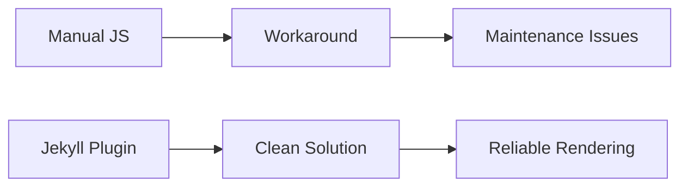

While working on my [SASS architecture article](/sass-circular-dependency-nightmare/), I encountered a frustrating issue: my carefully crafted Mermaid diagram wasn't rendering. What seemed like a simple diagram display problem revealed deeper challenges with Jekyll's syntax highlighting and diagram integration.

<!-- excerpt-end -->

## The Problem: Diagrams Trapped in Code Blocks

I had added a complex Mermaid diagram to visualize my SASS architecture:

    ```mermaid
    graph TD
        V["🔧 variables.sass"]
        B["📄 basic.sass"]
        V --> B
    ```

But instead of a beautiful diagram, I got syntax-highlighted code. The diagram was trapped inside `<pre><code class="language-mermaid">` tags.

## Initial Approach: Manual JavaScript Integration

My first solution was to manually add Mermaid support to Jekyll's default layout:

```html

<script src="https://cdn.jsdelivr.net/npm/mermaid@10.6.1/dist/mermaid.min.js"></script>
<script>
  mermaid.initialize({ startOnLoad: true, theme: 'default' });
</script>

```

This didn't work because Jekyll's Rouge syntax highlighter was processing the fenced code blocks before Mermaid could see them.

## The JavaScript Workaround

I then created a more sophisticated solution that converts Rouge-processed code blocks:

```javascript
document.addEventListener('DOMContentLoaded', function() {
  mermaid.initialize({ startOnLoad: false, theme: 'default' });
  
  // Find code blocks with language-mermaid and convert them
  const mermaidBlocks = document.querySelectorAll('code.language-mermaid');
  mermaidBlocks.forEach(function(block, index) {
    const content = block.textContent;
    const div = document.createElement('div');
    div.className = 'mermaid';
    div.textContent = content;
    div.id = 'mermaid-' + index;
    block.parentNode.replaceWith(div);
  });
  
  mermaid.run();
});
```

This worked, but felt like fighting the framework rather than working with it.

## Understanding the Root Cause

The issue stems from Jekyll 4.4's default configuration:

### Rouge Syntax Highlighter
Jekyll uses Rouge to syntax-highlight code blocks. When it sees:

    ```mermaid
    graph TD
      A --> B
    ```

Rouge treats this as code to be highlighted, not a diagram to be rendered. It wraps the content in `<pre><code class="language-mermaid">` tags.

### Jekyll Version Challenges
Older Jekyll versions had different syntax highlighting behavior. The upgrade to Jekyll 4.4 changed how fenced code blocks are processed, breaking existing Mermaid implementations that relied on different HTML output.

## The Better Solution: Modern Mermaid 11 API

Instead of fighting Rouge with DOM manipulation, use Mermaid 11's built-in support for Jekyll's syntax highlighting:

### Modern Implementation

```html

<script type="module">
  import mermaid from 'https://cdn.jsdelivr.net/npm/mermaid@11/dist/mermaid.esm.min.mjs';
  
  // Detect dark mode and set appropriate theme
  const isDarkMode = window.matchMedia && window.matchMedia('(prefers-color-scheme: dark)').matches;
  const theme = isDarkMode ? 'dark' : 'default';
  
  mermaid.initialize({ 
    startOnLoad: true,
    theme: theme
  });
  
  await mermaid.run({
    querySelector: '.language-mermaid',
  });
</script>

```

### Key Improvements
- **ES Modules**: Uses modern JavaScript module system
- **Direct Integration**: Works with Rouge's `.language-mermaid` class
- **No DOM Manipulation**: Mermaid handles Jekyll's output directly
- **Dark Mode Support**: Automatically switches themes based on user preference
- **Cleaner Code**: Eliminates custom JavaScript workarounds

## Why Plugins Should Be Better (But Aren't)

### The Plugin Reality Check
While plugins should theoretically be the better solution, the available Jekyll Mermaid plugins have significant issues:

- **[jekyll-mermaid](https://github.com/jasonbellamy/jekyll-mermaid)** (last updated 6 years ago)
- **[jekyll-mermaid-diagrams](https://github.com/fuzhibo/jekyll-mermaid-diagrams)** (last updated 11 years ago)
- Probably more out there but I was disappointed in my first two...
- Both throw `NoMethodError` exceptions with modern Jekyll versions
- Missing configuration requirements not documented properly

### Plugin Advantages (When They Work)
1. **Framework Integration** - Work with Jekyll's processing pipeline
2. **GitHub Pages Compatibility** - Some plugins are allowlisted
3. **Clean Separation** - No custom JavaScript in layouts
4. **Maintenance** - Plugin authors handle updates (in theory)

### The Reality
Unmaintained plugins become liabilities. They break with framework updates and create more problems than they solve.

## Testing the Solution

Here's a simple diagram to verify the plugin works:



## Lessons Learned

### 1. Understand Your Framework
Jekyll's Rouge highlighter processes fenced code blocks by design. Fighting this creates fragile solutions.

### 2. Version Upgrades Have Consequences
Jekyll 4.4 changed syntax highlighting behavior. Always test diagram rendering after framework upgrades.

### 3. Use Purpose-Built Tools
Dedicated plugins handle edge cases better than custom JavaScript solutions.

### 4. Consider Maintenance Burden
Manual JavaScript solutions require ongoing maintenance as frameworks evolve.

## Implementation Steps

1. **Remove custom JavaScript** from layout files
2. **Add jekyll-mermaid** to Gemfile and _config.yml
3. **Run bundle install** to install the plugin
4. **Restart Jekyll** server
5. **Test diagram rendering** with existing content

## Conclusion

What started as a simple diagram rendering issue revealed the challenges of integrating third-party libraries with Jekyll's processing pipeline. While plugins should be the ideal solution, unmaintained packages create more problems than they solve.

**Recommendation**: Use Mermaid 11's modern ES module API for Jekyll diagrams. It's:
- Built-in support for Jekyll's syntax highlighting
- No DOM manipulation required
- Uses modern JavaScript standards
- Directly maintained by the Mermaid team
- Future-proof as Mermaid evolves

The 2025 solution is cleaner than both plugins and custom workarounds.

---

*This experience reinforced the value of understanding framework internals and choosing appropriate tools for the job.*