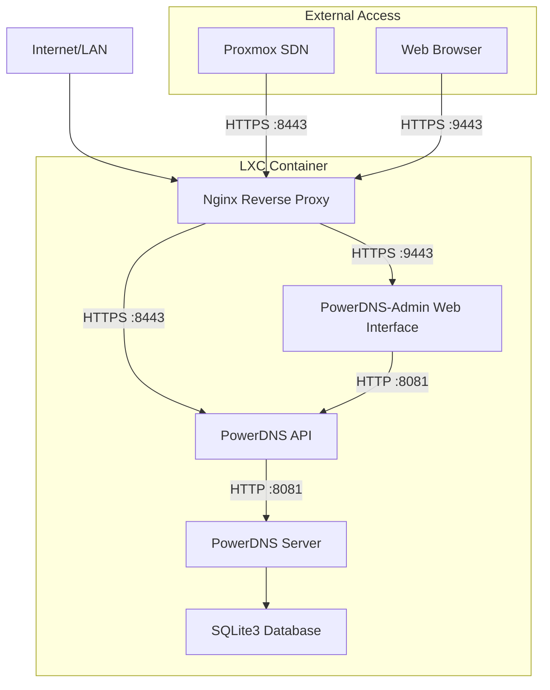

**DRAFT ahead of submitting Pull Request**

I've been working on integrating PowerDNS with Proxmox VE 8.4's Software Defined Networking (SDN) features, and I'm excited to share the current state of this project. The PowerDNS LXC container implementation has reached a mature state with full HTTPS/TLS support, Web Admin Interface and seamless Proxmox SDN integration.

<!-- excerpt-end -->

## Project Overview

The PowerDNS implementation in the [ProxmoxVE community scripts repository](https://github.com/community-scripts/ProxmoxVE) provides a complete DNS solution that can function as:

- **Authoritative DNS Server** - Host your own zones and records
- **Recursive DNS Server** - Forward queries and cache responses  
- **Both** - Combined authoritative and recursive functionality
- **PowerDNS-Admin Web Interface** - Optional web-based management

## Key Features for Proxmox SDN Integration

### HTTPS/TLS Security

The latest implementation includes full HTTPS/TLS support with:

- Self-signed certificates for immediate deployment
- Nginx reverse proxy for SSL termination
- Secure API endpoints for Proxmox SDN integration
- Separate HTTPS ports for API (8443) and web interface (9443)

### Proxmox SDN Ready Configuration

The container automatically configures itself for Proxmox SDN integration:

```bash
# Proxmox SDN Configuration
ID:           powerdns
API Key:      [auto-generated 64-character hex key]
URL:          https://[SERVER_IP]:8443/api/v1/servers/localhost
TTL:          300
Fingerprint:  [SHA256 certificate fingerprint]
```

### Flexible Installation Options

The installation script supports both interactive and non-interactive modes:

```bash
# Interactive installation
bash ct/powerdns.sh

# Non-interactive with environment variables
ROLE=authoritative \
PRIVATE_ZONE=home.local \
INSTALL_WEBUI=yes \
PDNS_WEB_BIND=0.0.0.0 \
bash ct/powerdns.sh
```

## Installation Process

### Container Creation

The PowerDNS container uses minimal resources:

- **CPU**: 1 core (2 cores if web interface enabled)
- **RAM**: 512MB (1GB if web interface enabled)  
- **Disk**: 4GB
- **OS**: Debian 12 (unprivileged container)

### Automatic Configuration

The installation handles:

- SQLite backend configuration
- API key generation and security
- SSL certificate creation
- Nginx reverse proxy setup
- PowerDNS-Admin installation (if requested)
- Zone creation (private/public zones)
- Proxmox SDN integration parameters

### Service Architecture



## Development Journey

The `feature/powerdns-lxc` branch represents a comprehensive development effort spanning multiple iterations:

### Initial Implementation (November 2025)

- **First Commit**: Basic PowerDNS LXC script with SQLite backend
- **Core Features**: Authoritative, recursive, and combined DNS server modes
- **Interactive Setup**: Menu-driven configuration with environment variable support
- **API Integration**: Generated API keys for Proxmox SDN compatibility

### PowerDNS-Admin Integration

- **Web Interface Addition**: Complete PowerDNS-Admin web management interface
- **SQLite Focus**: Streamlined installation without MySQL/PostgreSQL complexity
- **Node.js Build Process**: Frontend asset compilation and dependency management
- **Flask Application**: Gunicorn-based WSGI deployment for production stability

### Production Hardening (40+ commits)

- **Installation Refinement**: Extensive bug fixes and stability improvements
- **Resource Optimization**: Dynamic CPU/RAM allocation based on selected features
- **URL Handling**: Flexible installation URL support for development branches
- **Error Handling**: Robust failure recovery and diagnostic messaging

### HTTPS/TLS Implementation

- **SSL Termination**: Nginx reverse proxy with self-signed certificates
- **Dual HTTPS Ports**: Separate secure endpoints for API (8443) and web interface (9443)
- **Security Headers**: Comprehensive HTTP security header implementation
- **Certificate Management**: Automated SSL certificate generation and validation

### Production Ready Features

- ✅ **Multi-Role DNS Server**: Authoritative, recursive, or combined functionality
- ✅ **SQLite Backend**: Lightweight, maintenance-free database storage
- ✅ **HTTPS API Endpoints**: Secure Proxmox SDN integration with SSL termination
- ✅ **PowerDNS-Admin Web Interface**: Full-featured web management with authentication
- ✅ **Automatic SSL Certificates**: Self-signed certificate generation for immediate deployment
- ✅ **Zone Management**: Complete pdnsutil integration for DNS record management
- ✅ **Non-Interactive Deployment**: Environment variable-driven automation support
- ✅ **Resource Scaling**: Dynamic container sizing based on selected features
- ✅ **Development Branch Support**: Flexible installation URL configuration

## Proxmox SDN Integration

### Why PowerDNS for SDN?

Proxmox VE 8.4 introduced enhanced SDN capabilities that benefit from dynamic DNS:

- Automatic VM/container hostname registration
- Network isolation with DNS resolution
- Dynamic IP address management
- Service discovery within VNets

### Integration Steps

1. **Deploy PowerDNS Container**: Use the community script
2. **Configure Proxmox SDN**: Add PowerDNS as DNS provider
3. **Create DNS Zones**: Set up forward and reverse zones
4. **Test Integration**: Verify automatic record creation

### Configuration Example

```bash
# Proxmox SDN DNS Configuration
pvesh set /cluster/sdn/dns/powerdns \
  --type powerdns \
  --url https://192.168.1.100:8443/api/v1/servers/localhost \
  --key [API_KEY] \
  --ttl 300
```

## Web Interface Access

When PowerDNS-Admin is installed, you get a full web interface:

- **URL**: `https://[SERVER_IP]:9443`
- **Default Login**: admin / admin (change immediately)
- **Features**: Zone management, record editing, statistics
- **Security**: HTTPS with self-signed certificates

## Future Enhancements

### Planned Improvements

- **Automatic SDN Registration**: Feature to automatically register PowerDNS with Proxmox SDN (planned - requires additional research)
- **Let's Encrypt Integration**: Automatic SSL certificate management
- **Multi-Backend Support**: PostgreSQL and MySQL options
- **Advanced Monitoring**: Prometheus metrics integration
- **Backup/Restore**: Automated zone backup functionality
- **High Availability**: Master/slave configuration support

### Community Contributions

The PowerDNS implementation is part of the community-scripts project and welcomes contributions for:

- Additional backend support
- Enhanced security features
- Monitoring integrations
- Documentation improvements

## Getting Started

To deploy PowerDNS for Proxmox SDN integration:

```bash
# Clone the repository
git clone https://github.com/mcgarrah/ProxmoxVE.git
cd ProxmoxVE

# Switch to PowerDNS feature branch
git checkout feature/powerdns-lxc

# Deploy with web interface
ROLE=authoritative \
INSTALL_WEBUI=yes \
PRIVATE_ZONE=home.local \
bash ct/powerdns.sh
```

The PowerDNS LXC implementation provides a robust, secure, and Proxmox-integrated DNS solution that's ready for production homelab environments. The HTTPS/TLS support and automatic Proxmox SDN configuration make it an ideal choice for modern Proxmox VE deployments.

For the latest updates and contributions, visit the [ProxmoxVE repository](https://github.com/mcgarrah/ProxmoxVE) and check out the `feature/powerdns-lxc` branch.
