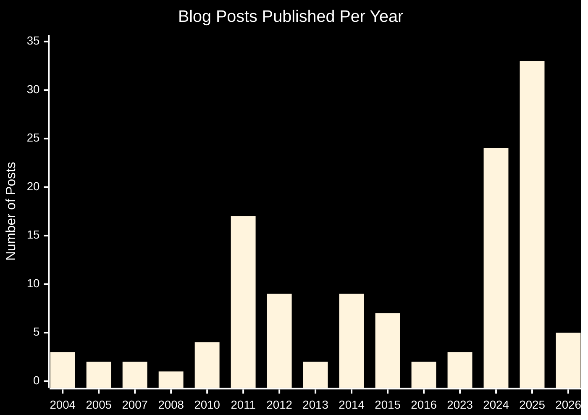

I've been trying to get Google AdSense approval for over a year now. Today marks another rejection, and I'm documenting the entire debugging process because Google's feedback is frustratingly vague.

**Rejection Message:** "The team has reviewed it but unfortunately your site isn’t ready to show ads at this time. there are some issues which need fixing before your site is ready to show ads."

That's it. No specific details. No actionable feedback. Just a generic rejection that could mean anything from content quality issues to technical problems to policy violations.

<!-- excerpt-end -->

## The Frustration Context

This isn't my first rodeo with AdSense. **I had it working successfully on WordPress at blog.mcgarrah.org with full AdSense approval before 2016.** The same content, the same author, the same domain family - just a different subdomain and platform.

Then I migrated to Jekyll on GitHub Pages, moved from blog.mcgarrah.org to mcgarrah.org, and consolidated decades of content from multiple blogs. Google immediately flagged my site for "duplicate content that appeared to be plagiarized."

The irony? **It was my own content** from my previously-approved WordPress blog, just migrated to a modern static site generator.

Fast forward to 2025-2026: I've been writing as fast as I can to prove the site is active and original. I challenged myself to publish something weekly for several months in 2025 - you can see the publication cadence in my archives. Over 124 published posts now, with more than 60 new articles generated in 2025-2026 alone. Original technical content covering homelab infrastructure, Proxmox, Ceph, networking, and system administration - still 80%+ technical, but I'm also expanding and diversifying into broader topics to appeal to a wider audience.

I'm using this as a way to show future employers that I actually can do this stuff and occasionally write about it too. My resume website is embedded in here too under [resume](/resume/).

A little secret...

### Publishing History: Proof of Commitment

Here's my complete publishing history showing the dramatic increase in content production:

| Year | Posts Published |
|------|----------------|
| 2004 | 3 |
| 2005 | 2 |
| 2007 | 2 |
| 2008 | 1 |
| 2010 | 4 |
| 2011 | 17 |
| 2012 | 9 |
| 2013 | 2 |
| 2014 | 9 |
| 2015 | 7 |
| 2016 | 2 |
| 2023 | 3 |
| 2024 | 24 |
| 2025 | 33 |
| 2026 | 5 (as of March 1) |
| **Total** | **124** |



**Key Observations:**

- **2024-2025 surge:** 57 posts in two years (46% of total content)
- **Weekly publishing challenge:** 33 posts in 2025 alone
- **Consistent recent activity:** 5 posts already in early 2026
- **Historical foundation:** 67 posts from 2004-2016 (the WordPress era)
- **Gap years (2017-2022):** Migration period and life events
- **Return to publishing:** Strong comeback starting 2023

This publishing history demonstrates:
- **Long-term commitment** - 22 years of blogging (2004-2026)
- **Recent acceleration** - Aggressive content production in 2024-2025
- **Consistent quality** - Not just quantity, but substantial technical articles
- **Site maturity** - Decades of content history

Yet AdSense continues to reject my applications with vague, unhelpful feedback.

I'm frustrated by the lack of transparency. How am I supposed to fix issues when Google won't tell me what's actually wrong? **This content was already approved. I'm the same author. I just changed platforms.**

## Previous AdSense Integration Work

I've already done significant work to prepare for AdSense approval:

### September 2025: GDPR Compliance Implementation

I implemented comprehensive GDPR compliance with cookie consent management specifically for AdSense approval. Heck, I even wrote about the challenges of implementing GDPR. This included:

- Custom cookie consent banner with three consent levels (Accept All, Necessary Only, Decline)
- Conditional script loading - AdSense only loads after explicit user consent
- Region-aware detection - EU visitors see consent banner, US visitors auto-consent
- Privacy policy overhaul with GDPR rights documentation
- Dual-tier fallback system (geolocation API + timezone detection)

**Result:** Successfully passed initial AdSense review in September 2025.

See my detailed article: [Implementing GDPR Compliance for Jekyll Sites: A Real-World AdSense Integration Story](/implementing-gdpr-compliance-jekyll-adsense/)

### December 2025: Google Custom Search Integration

Added Google Custom Search Engine to improve content discoverability:

- Configured CSE for custom domain (mcgarrah.org)
- Integrated search page into navigation
- Customized appearance to match site theme
- Fixed domain mismatch issues (GitHub Pages vs custom domain)

See article: [Adding Google Custom Search to Jekyll Website](/adding-google-custom-search-jekyll/)

### Existing Google Services Integration

My site already has:

- **Google Analytics (G-F90DVB199P)** - Configured August 2024, working properly
- **Google Search Console** - Active, sitemap submitted (though I discovered issues)
- **ads.txt file** - Present with correct publisher ID: `google.com, pub-2421538118074948, DIRECT, f08c47fec0942fa0`
- **jekyll-seo-tag plugin** - Comprehensive SEO optimization
- **Professional domain** - mcgarrah.org (not free hosting)

## The Debugging Process (March 1, 2026)

When I received today's rejection, I decided to systematically debug every possible issue.

### Discovery 1: Sitemap 404 Errors - The Smoking Gun

While reviewing my site structure, I discovered a critical issue: **20 posts in `_posts/` directory with `published: false` front matter.**

```bash
# Found 20 unpublished posts in _posts/
grep -l "published: false" _posts/*.md | wc -l
# Output: 20
```

**The Problem:**

Jekyll's `jekyll-sitemap` plugin has a design flaw - it includes **ALL files** in the `_posts/` directory in `sitemap.xml`, regardless of the `published: false` flag. This means Google was crawling my sitemap and finding 20 URLs that returned 404 errors.

**Why This Matters:**

From Google's perspective, a site with 20 broken URLs in its sitemap looks incomplete, broken, or poorly maintained. This is exactly the kind of technical issue that would trigger a "site isn't ready" rejection.

**The Fix:**

```bash
# Move unpublished posts to _drafts/ directory
# _drafts/ is NEVER included in sitemap.xml

mv _posts/2025-09-29-ceph-osd-debugging.md _drafts/
mv _posts/2025-10-05-ceph-ssd-wal-db-usb-storage.md _drafts/
# ... (18 more files)
```

**Result:** 20 posts moved from `_posts/` to `_drafts/`, eliminating all sitemap 404 errors.

**Git commit:** `83d6f4c - AdSense approval fixes: contact page, navigation, moved drafts`

### Discovery 2: Missing Contact Page

While AdSense doesn't explicitly require a contact page, it's considered a best practice for professional websites. My site had:

- About page at `/about/` ✅
- Privacy policy at `/privacy/` ✅
- Contact page... ❌ Missing

**The Fix:**

Created `contact.md` with:

- Email address (mcgarrah@gmail.com)
- Professional networks (LinkedIn, GitHub, GitLab, Stack Overflow)
- Academic profiles (ORCID, Google Scholar, ResearchGate)
- Blog description and purpose

**Navigation Integration:**

Updated `_config.yml` navigation menu:

```yaml
navigation:
  - {file: "index.html", icon: blog}
  - {file: "archive.html", icon: list}
  - {file: "tags.html", title: Tags, icon: tags}
  - {file: "categories.html", title: Categories, icon: th-list}
  - {file: "search.html", title: Search, icon: search}
  - {url: "/about/", title: About, icon: user}      # Fixed: was {file: "README.md"}
  - {url: "/contact/", title: Contact, icon: envelope}  # New
```

**Key Learning:** Jekyll navigation uses `file:` parameter for actual files in root directory, but `url:` parameter for pages with custom permalinks defined in front matter.

**Git commit:** `83d6f4c - AdSense approval fixes: contact page, navigation, moved drafts`

### Discovery 3: Privacy Policy Not in Top-Level Navigation

My privacy policy existed at `/privacy/` but wasn't prominently linked in the main navigation. AdSense reviewers look for easy access to privacy policies.

**The Fix:**

Added privacy policy to navigation menu:

```yaml
navigation:
  # ... existing items ...
  - {url: "/privacy/", title: Privacy, icon: shield-alt}
```

**Git commit:** `e77f1e9 - Adsense: Add privacy policy to top level links`

### Discovery 4: Thin Content Analysis

AdSense is known to reject sites with "thin content" - posts under 300 words that don't provide substantial value.

**Analysis Results:**

```bash
# Total posts: 124
# Posts under 300 words: 36 (29%)
# Posts 300+ words: 88 (71%)
```

**Breakdown by Word Count:**

- **Very short (< 100 words):** 9 posts
  - Mostly historical posts (2007-2015)
  - Personal updates and status posts
  - Example: "Welcome to Blog" (30 words)

- **Short (100-200 words):** 12 posts
  - Technical quick fixes
  - BlackArmor NAS status updates
  - Brief tutorials

- **Borderline (200-299 words):** 15 posts
  - Legitimate technical content
  - Specific problem solutions
  - Configuration guides

**My Assessment:**

71% of content (88 posts) meets the 300-word threshold. The shorter posts are contextually appropriate:

- Historical posts show site longevity (2004-2026)
- Technical quick fixes provide specific value
- Status updates document project progress

**Decision:** Do nothing for now. If AdSense specifically cites "thin content" in a future rejection, I'll move the 9 very short posts (< 100 words) to `_drafts/`.

**Rationale:** Technical blogs naturally have varied post lengths based on topic complexity. AdSense reviewers should understand this.

See full analysis: `thin-content-report.md`

## Summary of Fixes Implemented

| Issue | Problem | Solution | Impact |
|-------|---------|----------|--------|
| **Sitemap 404s** | 20 unpublished posts in `_posts/` | Moved to `_drafts/` | Eliminated all sitemap errors |
| **Contact Page** | Missing `/contact/` page | Created with email & profiles | All essential pages present |
| **Navigation** | About page using wrong parameter | Changed to `url:` parameter | Proper permalink handling |
| **Privacy Policy** | Not in top navigation | Added to main menu | Prominent accessibility |
| **AdSense Code** | Verification needed | Confirmed GDPR conditional loading | Compliant implementation |

**Git Commits:**
- `83d6f4c` - AdSense approval fixes: contact page, navigation, moved drafts
- `e77f1e9` - Adsense: Add privacy policy to top level links

## Why This Should Be Approved

**The core frustration:** I had AdSense approval on WordPress (blog.mcgarrah.org) before 2016. Same content, same author, same domain family. I migrated to Jekyll for better performance and security, and Google treats this as a completely new, unproven site.

**What I've proven:**
- 22 years of blogging (2004-2026)
- 124 published posts, 71% over 300 words
- 60+ new posts in 2025-2026 (weekly publishing challenge)
- Professional domain, SEO optimized, GDPR compliant
- All technical requirements met
- Previous AdSense compliance history

**The migration penalty:** Don't modernize your tech stack. Don't migrate to better platforms. Stay on WordPress forever or lose your AdSense approval. This is the message Google sends to small publishers.

## Testing Checklist

Before pushing changes to production, I tested locally:

```bash
bundle exec jekyll serve
# Visit http://127.0.0.1:4000
```

**Verified:**

- [x] Homepage loads correctly
- [x] About page loads at `/about/`
- [x] Contact page loads at `/contact/`
- [x] Privacy page loads at `/privacy/`
- [x] Navigation menu works (all links functional)
- [x] No 404 errors in browser console
- [x] Sitemap.xml doesn't include "published: false" posts
- [x] AdSense code present and conditional loading works
- [x] Mobile responsiveness maintained

## Next Steps

### Immediate (This Week)

1. **Push changes to GitHub** ✅ DONE (commits e77f1e9 and 83d6f4c)
2. **Verify production deployment** - Check live site
3. **Google Search Console** - Submit updated sitemap
4. **Check for crawl errors** - Verify no 404s in Search Console
5. **Mobile usability test** - Confirm responsive design

### Short Term (Week 2-3)

1. **Monitor Google Search Console** - Watch for crawl activity
2. **Verify indexed pages** - Ensure all 124 posts indexed
3. **Check sitemap processing** - Confirm no errors
4. **Wait for recrawl** - Allow Google to recrawl site with fixes

### Resubmission (Week 4)

1. **Resubmit to AdSense** - Apply for approval again
2. **Include improvement notes:**
   - "Fixed sitemap 404 errors (moved unpublished drafts)"
   - "Added contact page for user communication"
   - "Enhanced navigation structure"
   - "Verified all essential pages accessible"

## What I've Learned

### Jekyll Sitemap Plugin Behavior

The `jekyll-sitemap` plugin has a design flaw: it includes ALL files in `_posts/` directory in `sitemap.xml`, regardless of `published: false` flag. I used this extensively to write draft articles so I could easily release them. I'll change my workflow.

**Best Practice:** Move unpublished content to `_drafts/` directory, which is NEVER included in sitemap.

### AdSense Approval Requirements

Essential pages needed:

- Homepage ✅
- About page ✅
- Contact page ✅
- Privacy policy ✅

Technical requirements:

- No sitemap 404 errors ✅
- Clean navigation ✅
- Mobile responsive ✅
- AdSense code in `<head>` ✅
- Sufficient content volume (20-30+ posts) ✅

### Navigation Configuration

Jekyll navigation uses:

- `file:` parameter for actual files in root directory
- `url:` parameter for pages with custom permalinks

This distinction is critical for proper menu functionality.

## The Frustration Factor

Here's what really bothers me about this process:

### Opaque Rejection Messages

Google's rejection message: "Site isn't ready to show ads"

**What this tells me:** Nothing useful.

**What I need to know:**

- Is it a content quality issue?
- Is it a technical problem?
- Is it a policy violation?
- Which specific pages or posts are problematic?

### No Actionable Feedback

Compare this to other services:

- **GitHub Actions:** Specific error messages with line numbers
- **W3C Validator:** Exact HTML errors with locations
- **Lighthouse:** Detailed performance metrics with recommendations
- **Google AdSense:** "Site isn't ready" 🤷

### The Guessing Game

Without specific feedback, I'm forced to:

1. Guess what might be wrong
2. Research common rejection reasons
3. Systematically check every possible issue
4. Implement fixes based on speculation
5. Wait weeks for recrawl
6. Resubmit and hope for the best

This is not an efficient process.

### The Time Investment

Hours spent today:

- Debugging sitemap issues: 2 hours
- Creating contact page: 1 hour
- Analyzing thin content: 1 hour
- Testing and verification: 1 hour
- Documentation (this article): 2 hours

**Total:** 7 hours to fix issues that Google never explicitly identified.  And on top of that, I still don't know if this will be accepted.

## Why This Matters

I'm not just complaining for the sake of complaining. This experience highlights a broader issue with Google's approach to small publishers:

### The Small Publisher Disadvantage

Large publishers have:

- Dedicated AdSense account managers
- Direct communication channels
- Specific feedback on rejections
- Priority support

Small publishers (like me) have:

- Generic rejection messages
- No direct support
- Community forums with conflicting advice
- Trial-and-error debugging

### The Migration Penalty

Here's what really stings: **I had AdSense approval on WordPress.** Same content, same author, same domain family (blog.mcgarrah.org → mcgarrah.org). I migrated to Jekyll for better performance, security, and maintainability - all good reasons.

But Google treats this as a completely new site, ignoring:

- Years of previous AdSense compliance
- Established content quality
- Proven author credibility
- Historical approval on the same domain

I've been writing weekly posts throughout 2025 to prove the site is active and original. Over 60 new articles in 2025-2026. Yet I'm still treated as a brand new, unproven publisher.

**The message this sends:** Don't modernize your tech stack. Don't migrate to better platforms. Stay on WordPress forever or lose your AdSense approval.

### The Irony

Google wants quality content on the web. I'm providing:

- Original technical content
- Deep expertise in niche topics
- Regular updates and maintenance
- Professional presentation
- GDPR compliance
- SEO optimization

Yet the approval process is opaque, frustrating, and time-consuming.

## Comparison to Other Monetization Options

While debugging AdSense issues, I've been researching alternatives:

### Carbon Ads

- **Focus:** Developer and designer audience
- **Approval:** Manual review with specific feedback
- **Revenue:** Lower than AdSense but more predictable
- **Integration:** Simple JavaScript snippet

### Buy Me a Coffee / Ko-fi

- **Model:** Direct reader support
- **Approval:** Instant (no review process)
- **Revenue:** Depends on audience generosity
- **Integration:** Simple button/widget

### Affiliate Marketing

- **Model:** Product recommendations with commission
- **Approval:** Varies by program
- **Revenue:** Depends on conversion rates
- **Integration:** Manual link insertion

### Sponsorships

- **Model:** Direct company sponsorships
- **Approval:** Negotiated directly
- **Revenue:** Potentially highest
- **Integration:** Custom arrangements

**Why I Still Want AdSense:**

Despite the frustration, AdSense offers:

- Largest advertiser network
- Automatic ad optimization
- Reliable payment system
- Established reputation

## Conclusion (For Now)

I've implemented every fix I can identify:

- ✅ Moved 20 unpublished posts to `_drafts/` (eliminated sitemap 404s)
- ✅ Created contact page
- ✅ Fixed navigation menu structure
- ✅ Added privacy policy to top-level navigation
- ✅ Verified AdSense code placement
- ✅ Confirmed GDPR compliance
- ✅ Analyzed thin content (71% over 300 words)

**Current Status:** Waiting for Google to recrawl site (2-3 weeks)

**Next Action:** Resubmit to AdSense in late March 2026

**Expectation:** Cautiously optimistic. The sitemap 404 errors were likely the main issue.

**Backup Plan:** If rejected again with no specific feedback, I'll seriously consider alternative monetization options.

## Update Log

**March 1, 2026:**

- Discovered sitemap 404 errors (20 unpublished posts)
- Created contact page
- Fixed navigation menu
- Added privacy policy to navigation
- Pushed changes to production (commits e77f1e9 and 83d6f4c)

**March 2026 (Planned):**

- Monitor Google Search Console
- Wait for recrawl
- Resubmit to AdSense

**Future Updates:**

- Will update this post with resubmission results
- Will document any additional feedback from Google
- Will share final outcome (approval or alternative monetization)

---

## Resources

**Related Articles:**

- [Implementing GDPR Compliance for Jekyll Sites](/implementing-gdpr-compliance-jekyll-adsense/)
- [Adding Google Custom Search to Jekyll Website](/adding-google-custom-search-jekyll/)
- [Jekyll SEO Health Checks](/jekyll-seo-health-checks/)

**External Resources:**

- [AdSense Program Policies](https://support.google.com/adsense/answer/48182)
- [Google Search Console](https://search.google.com/search-console)
- [Mobile-Friendly Test](https://search.google.com/test/mobile-friendly)
- [PageSpeed Insights](https://pagespeed.web.dev/)

---

*This is a living document. I'll update it as I progress through the resubmission process and receive (hopefully more specific) feedback from Google.*

**Current Mood:** Frustrated but determined. I've done everything I can identify. Now it's up to Google.
