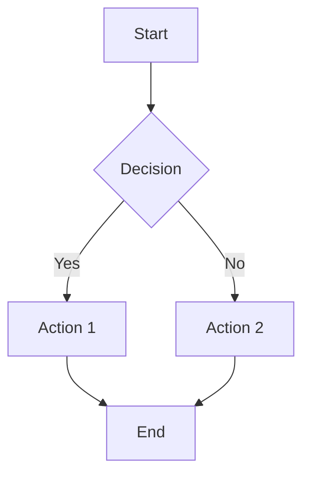
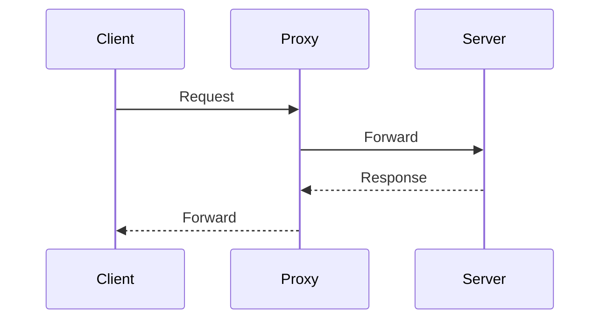

This blog has been running on Jekyll and GitHub Pages since 2023, and over 130+ posts it has accumulated a lot of features. Every time I needed something — diagrams for a [Ceph architecture post](/proxmox-ceph-homelab-settings/), math notation for a [research article](/phonemes-aiml-research/), PDF exports for my [resume](/resume/) — I bolted it on.

The result is a static site that does far more than most people expect from Jekyll. This post documents every feature, how it works, and the syntax to use it. It's the reference I wish I'd had when I started, and it's the one I actually use when writing new articles.

<!-- excerpt-end -->

## Front Matter

Every post starts with YAML front matter between `---` fences. Here's the minimum required:

```yaml
---
title: "Post Title"
layout: post
published: true
---
```

The full set of options I use:

```yaml
---
title: "Full Featured Post"
layout: post
categories: [technical, homelab]
tags: [proxmox, ceph, homelab]
date: 2025-01-01
last_modified_at: 2025-01-15
excerpt: "Custom excerpt text for previews and SEO."
mathjax: true        # Enable KaTeX math rendering
mermaid: true        # Enable Mermaid diagram rendering
published: true
redirect_from:
  - /old-url/        # Redirect old URLs to this post
seo:
  type: BlogPosting
  date_published: 2025-01-01
  date_modified: 2025-01-15
---
```

### Drafts vs Unpublished

Two ways to keep content from going live:

- **`published: false`** in front matter — file stays in `_posts/` but won't render
- **`_drafts/` folder** — files without dates, preview with `jekyll serve --drafts`

See [Jekyll Drafts](https://jekyllrb.com/docs/posts/#drafts) for details.

### Custom Excerpts

This blog uses a custom excerpt separator instead of the default double-newline:

```yaml
# In _config.yml
excerpt_separator: <!-- excerpt-end -->
```

Place `<!-- excerpt-end -->` in your post where you want the preview to cut off.

## Basic Markdown

### Text Formatting

*Italics* with `*single asterisks*`

**Bold** with `**double asterisks**`

***Bold Italics*** with `***triple asterisks***`

<ins>Underline</ins> with `<ins>underline</ins>`

~~Strikethrough~~ with `~~double tildes~~`

<sup><sub>Tiny text</sub></sup> with `<sup><sub>tiny text</sub></sup>`

### Headings

```markdown
## Heading Two (h2)
### Heading Three (h3)
#### Heading Four (h4)
##### Heading Five (h5)
###### Heading Six (h6)
```

### Blockquotes

Single line:

> My mom always said life was like a box of chocolates. You never know what you're gonna get.

Multiline with attribution:

> What do you get when you cross an insomniac, an unwilling agnostic and a dyslexic?
>
> You get someone who stays up all night torturing himself mentally over the question of whether or not there's a dog.
>
> – _Hal Incandenza_

### Horizontal Rules

Three dashes or three asterisks on their own line:

---

### Lists

Unordered:

* First item
* Second item
    * Nested item
    * Another nested item

Ordered:

1. First item
2. Second item
    1. Nested numbered item
    2. Another nested item

### Tables

```markdown
| Title 1     | Title 2     | Title 3     |
|-------------|-------------|-------------|
| First entry | Second      | Third       |
| Fourth      | Fifth       | Sixth       |
```

| Title 1     | Title 2     | Title 3     |
|-------------|-------------|-------------|
| First entry | Second      | Third       |
| Fourth      | Fifth       | Sixth       |

## Links and Anchors

### Standard Links

```markdown
[Link text](https://example.com)
```

### Opening Links in a New Tab

Kramdown (Jekyll's default Markdown processor) supports inline attribute lists. Append `{:target="_blank"}` to any link to open it in a new browser tab:

```markdown
[External resource](https://example.com){:target="_blank"}
```

For links that leave your site, add `rel="noopener"` as a security best practice to prevent the opened page from accessing `window.opener`:

```markdown
[External resource](https://example.com){:target="_blank" rel="noopener"}
```

This also works on image links — see [Clickable Image with Size Control](#clickable-image-with-size-control) below.

### Custom Header Anchors

Link to auto-generated anchors:

```markdown
[Jump to Code section](#code-syntax-highlighting)
```

Or create custom anchor IDs:

```markdown
## My Custom Section {#custom-anchor}

[Jump to custom section](#custom-anchor)
```

## Images

### Basic Image

```markdown

```

### Clickable Image for Larger Version

Wrap an image in a link that points to the full-size file. Adding `{:target="_blank"}` opens the full image in a new tab so readers don't lose their place:

```markdown
[](/assets/images/filename.png){:target="_blank"}
```

### Clickable Image with Size Control

Combine size attributes on the image with the clickable link pattern. The `{:width="..." height="..."}` goes on the image, and `{:target="_blank"}` goes on the wrapping link:

```markdown
[{:width="50%" height="50%"}](/assets/images/filename.png){:target="_blank"}
```

### Centered Image

Add inline CSS to center the image on the page:

```markdown
[{:width="40%" height="40%" style="display:block; margin-left:auto; margin-right:auto"}](/assets/images/filename.png){:target="_blank"}
```

### Two Images Side by Side

```markdown
|  |  |
|:--:|:--:|
| Caption 1 | Caption 2 |
```

## Code Syntax Highlighting

### Fenced Code Blocks

Use triple backticks with a language identifier:

````
```javascript
function foo() {
    return "bar";
}
```
````

Renders as:

```javascript
function foo() {
    return "bar";
}
```

### Jekyll Highlight Tags

The Liquid `highlight` tag with optional line numbers:

```
{{ "
def print_hi(name)
  puts "Hi, #{name}"
end
print_hi('Tom')
{{ "
```


def print_hi(name)
  puts "Hi, #{name}"
end
print_hi('Tom')


### Supported Languages

Common languages: `bash`, `console`, `python`, `ruby`, `javascript`, `java`, `c`, `cpp`, `yaml`, `json`, `sql`, `html`, `css`, `text`, `ini`, `hcl`, `markdown`.

Full list: [Rouge supported languages](https://github.com/rouge-ruby/rouge/wiki/List-of-supported-languages-and-lexers)

### Console Output

Use `console` for shell sessions with prompts:

```console
root@harlan:~# ceph health
HEALTH_OK
root@harlan:~# zpool status
  pool: rpool
 state: ONLINE
```

## Escaping Liquid Template Code

When writing about Jekyll, you'll often need to show Liquid tags like `{{ "{{ variable }}" }}` or `{{ "" }}` in code blocks. Without protection, Jekyll's Liquid engine will try to evaluate them during the build — silently swallowing your example code or throwing errors.

### The `raw` / `endraw` Tag

Wrap code blocks containing Liquid syntax with `{{ "" }}` and `{{ "" }}`:

````markdown
```html
{{ "" }}<head>
  {{ "{{ content }}" }}
  {{ "" }}
  <script src="mermaid.js"></script>
  {{ "" }}
</head>{{ "" }}
```
````

Place `{{ "" }}` immediately after the opening code fence and `{{ "" }}` just before the closing fence. Everything between them passes through as literal text.

This is the approach used throughout this blog — for example in the [Mermaid diagram rendering challenges]() and [SEO sitemap canonical URL fixes]() posts.

### When You Need It

You need `{{ "" }}` / `{{ "" }}` any time a code block contains:

- **Liquid output tags** — `{{ "{{ site.url }}" }}`, `{{ "{{ page.title }}" }}`
- **Liquid logic tags** — `{{ "" }}`, `{{ "" }}`, `{{ "" }}`
- **GitHub Actions expressions** — `${{ "{{ secrets.GITHUB_TOKEN }}" }}` (the `${{ "{{ }}" }}` syntax triggers Liquid too)
- **Jekyll front matter inside code blocks** — the `---` fences with Liquid variables

### Leaving Yourself a Note

For complex posts, a hidden comment explaining why `raw` is needed helps future-you:

````markdown
{{ "" }}
The next code block has {{ "{{ }}" }} variables that require
raw/endraw Liquid tags to render correctly.
{{ "" }}
```yaml
{{ "" }}on:
  push:
    branches: [ ${{ "{{ github.event.base_ref }}" }} ]
{{ "" }}
```
````

The `{{ "" }}` / `{{ "" }}` block is invisible in the rendered output but visible when editing the markdown source.

## Collapsible Sections

HTML `<details>` tags create expandable sections — great for long console output:

```html
<details>
<summary>Click to expand command output</summary>

Content goes here. You can include code blocks,
markdown, or any other content.

</details>
```

<details>
<summary>Click to see example output</summary>

```console
root@tanaka:~# zpool status
  pool: rpool
 state: ONLINE
  scan: scrub repaired 0B in 00:01:30 with 0 errors
config:

        NAME        STATE     READ WRITE CKSUM
        rpool       ONLINE       0     0     0
          mirror-0  ONLINE       0     0     0
            sda3    ONLINE       0     0     0
            sdb3    ONLINE       0     0     0

errors: No known data errors
```

</details>

You can also put a code snippet in the summary line itself using Liquid highlight tags for a preview of what's inside.

## Embedded Content

### YouTube Videos

This blog uses a custom `_includes/embed.html` that creates a responsive 16:9 container. Use the embed URL format (not the watch URL):

```liquid
{{ "
```

For a YouTube playlist:

```liquid
{{ "
```

The embed automatically scales to 100% width with a 56.25% padding-bottom ratio (16:9 aspect). You can override dimensions with optional `width` and `height` parameters:

```liquid
{{ "
```

### Generic Embeds

The same include works for any embeddable URL (Vimeo, Google Maps, etc.) that supports iframe embedding.

## KaTeX Math Rendering

Enable with `mathjax: true` in front matter (the blog uses KaTeX despite the legacy variable name).

### Inline Math

Wrap with single dollar signs: `$E = mc^2$` renders as $E = mc^2$.

The quadratic formula: $x = \frac{-b \pm \sqrt{b^2 - 4ac}}{2a}$

### Display Math

Wrap with double dollar signs for centered equations:

```latex
$$e^{i\theta} = \cos(\theta) + i\sin(\theta)$$
```

$$e^{i\theta} = \cos(\theta) + i\sin(\theta)$$

### Matrix Example

$$
\begin{pmatrix}
a & b & c \\
d & e & f \\
g & h & i
\end{pmatrix}
$$

### Complex Fractions

$$\frac{1}{\Bigl(\sqrt{\phi \sqrt{5}}-\phi\Bigr) e^{\frac25 \pi}} = 1+\frac{e^{-2\pi}} {1+\frac{e^{-4\pi}} {1+\frac{e^{-6\pi}} {1+\frac{e^{-8\pi}} {1+\ldots} } } }$$

## Mermaid Diagrams

Enable with `mermaid: true` in front matter. Wrap diagrams in a `mermaid` code block:

````markdown

````


### Sequence Diagram



See [Mermaid documentation](https://mermaid.js.org/) for all diagram types: flowcharts, sequence diagrams, Gantt charts, class diagrams, state diagrams, and more.

## Comments with Giscus

Comments are powered by [Giscus](https://giscus.app/) using GitHub Discussions. They appear automatically on published posts. Configuration in `_config.yml`:

```yaml
giscus:
  repo: mcgarrah/mcgarrah.github.io
  repo_id: R_kgDOKBKIdw
  category: Announcements
  category_id: DIC_kwDOKBKId84Cq3DK
  mapping: pathname
```

## Redirects

The `jekyll-redirect-from` plugin handles URL changes when posts are renamed or moved:

```yaml
---
title: "New Post Title"
redirect_from:
  - /old-url/
  - /another-old-url/
---
```

## Unicode Tricks

Unicode superscripts for quick exponents without KaTeX: x⁰¹²³⁴⁵⁶⁷⁸⁹⁺⁻⁼⁽⁾ⁿⁱ

Markdown abbreviations (defined at bottom of post):

```markdown
*[PVE]: Proxmox Virtual Environment
*[DS]: Data Science
```

*[PVE]: Proxmox Virtual Environment

## Font Awesome Icons

This blog uses [Font Awesome Free 5.12.0](https://fontawesome.com/icons) for navigation and social link icons. Icons are loaded as an SVG sprite — only the icons referenced in `_config.yml` are included in the build, keeping the payload small.

### How It Works

Icons are configured in `_config.yml` under `navigation` and `external` using Font Awesome icon names:

```yaml
navigation:
  - {file: "index.html", icon: blog}
  - {file: "archive.html", icon: list}
  - {file: "tags.html", title: Tags, icon: tags}
  - {file: "search.html", title: Search, icon: search}

external:
  - {title: Github, icon: github, url: "https://github.com/mcgarrah"}
  - {title: LinkedIn, icon: linkedin, url: "https://www.linkedin.com/in/michaelmcgarrah/"}
  - {title: Mail, icon: envelope, url: "mailto:mcgarrah@gmail.com"}
```

The `_includes/menu.html` and `_includes/sidebar.html` templates render these as inline SVGs:

```html
<svg class="icon"><use xlink:href="/assets/fontawesome/icons.svg#github"></use></svg>
```

### Finding Icon Names

Browse available icons at [fontawesome.com/icons](https://fontawesome.com/icons?d=gallery&m=free). Use the icon name without the `fa-` prefix in `_config.yml` — for example, `graduation-cap` not `fa-graduation-cap`.

The icon data lives in `_data/font-awesome/icons.json` which maps icon names to their SVG path data. The `assets/fontawesome/icons.svg` file is a Liquid template that builds the sprite at build time from only the icons you reference.

### Using Icons in Post Content

The SVG sprite approach is designed for navigation. If you need icons inline in post content (as in the [resume site](https://www.mcgarrah.org/resume/)), use the standard Font Awesome `<i>` tag approach with a CDN link or local CSS instead.

## Blog-Specific Features

### Google Analytics and AdSense

Configured in `_config.yml` and loaded conditionally via includes:

- `_includes/analytics.html` — Google Analytics (G-F90DVB199P)
- `_includes/adsense.html` — Google AdSense
- `_includes/cookie-consent.html` — GDPR cookie consent banner

### SEO and Meta Tags

The `_includes/meta.html` include generates structured data, Open Graph tags, and canonical URLs. The `jekyll-seo-tag` plugin handles most of this automatically.

### Author Bio

The `_includes/author-bio.html` include adds an author section to posts.

### Sidebar

The `_includes/sidebar.html` provides social links and external profiles when `show_sidebar: true` is set.

## Pandoc Exports

The [jekyll-pandoc-exports](/jekyll-pandoc-exports-plugin/) plugin generates PDF and DOCX versions of posts at build time using Pandoc. This powers the downloadable resume at [mcgarrah.org/resume/](/resume/).

Enable per-post in front matter:

```yaml
---
pandoc_export:
  pdf: true
  docx: true
---
```

The plugin runs during `jekyll build`, converting the rendered HTML to PDF (via LaTeX) and DOCX. Output goes to `assets/pdfs/` and `assets/docx/`. See the [resume integration post](/jekyll-pandoc-exports-resume-integration/) for the full implementation.

## The Stack at a Glance

After all the additions, here's what powers this blog:

| Feature | Implementation | Added |
|---------|---------------|-------|
| Static site | Jekyll 4.4.1 on GitHub Pages | 2023 |
| Theme | Contrast (heavily modified) | 2023 |
| Diagrams | Mermaid.js via front matter flag | 2025 |
| Math | KaTeX via front matter flag | 2025 |
| Comments | Giscus (GitHub Discussions) | 2024 |
| Search | Google Custom Search | 2025 |
| Analytics | Google Analytics (G-F90DVB199P) | 2024 |
| GDPR | Custom cookie consent with EU detection | 2025 |
| SEO | jekyll-seo-tag + structured data + health checks | 2025-2026 |
| PDF/DOCX | jekyll-pandoc-exports plugin | 2026 |
| Redirects | jekyll-redirect-from | 2025 |
| Icons | Font Awesome 5.12.0 SVG sprite | 2023 |
| Syntax highlighting | Rouge with copy buttons | 2024 |
| Tags/Categories | Custom Ruby generator plugin | 2024 |

The base theme is [Contrast](https://github.com/niklasbuschmann/contrast) by Niklas Buschmann, which draws from Hyde, Minima, and Lagrange. At this point, the customizations probably outweigh the original theme code.

## What's Next

Features I'm considering:

- **Table of contents** — auto-generated from headings for longer posts
- **Reading progress bar** — visual indicator for long articles
- **Dark mode toggle** — the theme supports it but it's not exposed yet
- **Image optimization** — automated compression in the build pipeline

If you're building a Jekyll blog and want to see how any of this works, the [source code is on GitHub](https://github.com/mcgarrah/mcgarrah.github.io).

## Related Posts

- [Jekyll Pandoc Exports Plugin](/jekyll-pandoc-exports-plugin/) — The plugin that generates PDF and DOCX from posts
- [Pandoc Exports Resume Integration](/jekyll-pandoc-exports-resume-integration/) — Using Pandoc exports for the downloadable resume
- [Mermaid Diagram Rendering Challenges](/jekyll-mermaid-diagram-rendering-challenges/) — Getting Mermaid to work reliably in Jekyll
- [Jekyll Website Optimization Part 1](/jekyll-website-optimization-part-1/) — Performance and structure improvements
- [Jekyll Website Optimization Part 2](/jekyll-website-optimization-part-2/) — Further refinements
- [Implementing GDPR Compliance for Jekyll and AdSense](/implementing-gdpr-compliance-jekyll-adsense/) — The cookie consent implementation
- [Jekyll SEO Sitemap and Canonical URL Fixes](/jekyll-seo-sitemap-canonical-url-fixes/) — Fixing SEO plumbing
- [Jekyll SEO Health Checks](/jekyll-seo-health-checks/) — Automated SEO validation in CI
- [Adding Google Custom Search to Jekyll](/adding-google-custom-search-jekyll/) — Site search implementation
- [Running GitHub Pages Jekyll Locally](/github-pages-jekyll-locally/) — Local development setup

## References

- [Jekyll Documentation](https://jekyllrb.com/docs/)
- [Markdown Guide](https://www.markdownguide.org/)
- [Rouge Syntax Highlighting](https://github.com/rouge-ruby/rouge/wiki/List-of-supported-languages-and-lexers)
- [KaTeX Documentation](https://katex.org/docs/supported.html)
- [Mermaid Documentation](https://mermaid.js.org/)
- [Giscus](https://giscus.app/)
- [Pandoc User's Guide](https://pandoc.org/MANUAL.html)
- [Jekyll Front Matter Defaults](https://jekyllrb.com/docs/configuration/front-matter-defaults/)
