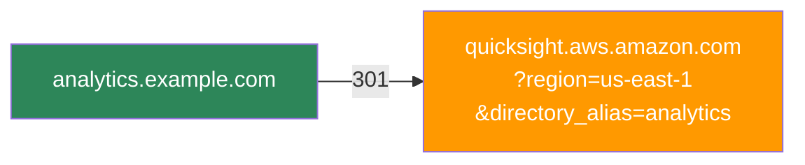
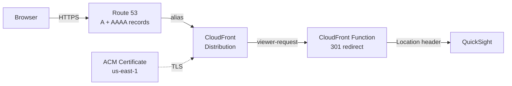

In a large enterprise with multiple AWS accounts and regions, "Where do I log in to QuickSight?" generates more support tickets than it should. Users mix up environments, bookmark the wrong region, and ask which account alias to type every single time. Multiply that across hundreds of business analysts and data scientists, and you have real friction — the kind that erodes adoption of a platform you spent months building.

As an IT Architect, I wasn't looking for a quick fix. I wanted a **zero-maintenance, zero-origin, near-zero-cost** entry point that any team could adopt without becoming AWS networking experts. What makes this project personally satisfying is that it sits at the intersection of everything I do — Networking (Route 53), Security (CloudFront and ACM with zero attack surface), DevOps (Terraform module design), and Programming (dynamically generated JavaScript). It's the kind of elegant solution that just feels right. What started as a manual proof-of-concept became a battle-tested Terraform module that has been running in production for over a year.

<!-- excerpt-end -->

## The Identity Friction Problem

QuickSight's default sign-in page asks users to type their account name on every visit:


Without a vanity URL, users have to remember their directory alias, type it into this field, and then authenticate. With multiple QuickSight instances across regions or accounts, each one gets its own URL with the alias baked into query parameters. Sharing these with non-technical stakeholders is friction you don't need.

The goal: turn that manual step into a clean vanity domain that skips the account name prompt entirely with a 301 redirect:



HTTPS, custom domain, no servers. The user bookmarks `analytics.example.com` and lands on the correct login page — right region, right directory — without ever seeing the account alias prompt.

## The Journey: From Manual to Module

This solution didn't start as a Terraform module. It evolved through three stages, each one paying down operational debt from the last.

**Stage 1 — The Prototype.** When we added a second QuickSight instance for non-prod testing alongside production, the URL problem went from annoying to unworkable. I manually configured a CloudFront distribution with a simple JavaScript function to prove the concept worked. It did — but it was a single point of knowledge with no version control and no way for other teams to replicate it.

**Stage 2 — The Hardening.** I moved the infrastructure into Terraform with static JavaScript embedded in the configuration. This eliminated drift and made the deployment reproducible, but the redirect map was still hand-coded. Adding a new domain meant editing JavaScript by hand inside HCL — error-prone and not something I'd hand to another team.

**Stage 3 — The Platform Primitive.** The final step was abstracting the entire pattern into a reusable Terraform module. The redirect map is now generated dynamically from HCL variables using `jsonencode()`. Input validation catches misconfigurations before `terraform apply`. Any team in the company can deploy a professional vanity URL in minutes without understanding CloudFront internals.

After a year in production with multiple QuickSight instances, this architecture has required **zero maintenance windows**, zero patching, and zero manual intervention. While other teams were patching Nginx vulnerabilities or rotating Lambda runtimes, this CloudFront Function sat silently at the edge handling every request.

## Why Not EC2, Lambda, or Lambda@Edge?

Before landing on CloudFront Functions, I evaluated the alternatives. Each one solves the redirect problem but carries costs — in dollars, in maintenance, or both — that don't match the simplicity of the task.

**EC2 with Nginx or Caddy** was the first suggestion from the team. A reverse proxy can certainly issue 301 redirects. But a VM running 24/7 for a handful of HTTP redirects is wasteful. To make it production-grade, you need an Auto Scaling Group behind an Application Load Balancer — suddenly your "simple redirect" costs $20+/month in idle ALB fees alone, plus the ongoing burden of OS patching, security group audits, SSH key management, and AMI updates. Every EC2 instance is a liability: it has an OS to exploit, ports to scan, and a patching cycle that never ends.

**API Gateway with Lambda** eliminates the server but introduces its own complexity. You're paying for API Gateway request pricing, Lambda invocation and duration, and you're managing a deployment pipeline for a function whose entire job is to return a Location header. Cold starts add latency to what should be an instantaneous redirect.

**Lambda@Edge** gets closer — it runs at CloudFront edge locations — but it's still heavier than needed. Lambda@Edge functions run in a full Node.js or Python runtime, have cold start penalties, cost more per invocation than CloudFront Functions, and are limited to specific CloudFront events. For a stateless 301 redirect that inspects a single header, it's overkill.

**CloudFront Functions** are purpose-built for this. They run at the viewer-request stage in a lightweight JavaScript runtime, execute in sub-millisecond time, have no cold starts, and cost a fraction of Lambda@Edge. There is no origin to contact, no runtime to patch, and no concurrency limits to worry about.

| Approach | Monthly Cost | Maintenance | Latency |
|----------|-------------|-------------|---------|
| EC2 + Nginx/Caddy (with ALB) | ~$20+ | OS patching, security audits, AMI updates | Milliseconds (origin round-trip) |
| API Gateway + Lambda | ~$1-3 | Runtime updates, deployment pipeline | Variable (cold starts) |
| Lambda@Edge | ~$0.50-2 | Runtime updates, regional replication | Low (but cold starts) |
| **CloudFront Function** | **$0.00 - $0.06** | **None** | **Sub-millisecond** |

CloudFront pricing for HTTPS requests in North America and Europe is $0.01 per 10,000 requests. The Always Free tier covers the first 10 million requests per month. For redirect traffic, you will likely never leave the free tier. ACM certificates are free. Route 53 hosted zone costs $0.50/month (which you're already paying if you have the domain).

After a year of production use, the CloudFront costs for all redirects combined were under **$0.06 per month**. Most months it rounds to zero.

## Architecture: The No-Origin Pattern



The architecture is deliberately minimal:

1. Route 53 A and AAAA records alias your custom domains to a single CloudFront distribution (dual-stack IPv4/IPv6).
2. ACM provides HTTPS for all configured domains. The certificate must be in `us-east-1` because CloudFront is a global service.
3. The CloudFront Function inspects the `Host` header and returns a 301 redirect to the appropriate QuickSight URL.
4. The origin is set to a dummy value (`none.none`) — **it is never contacted**.

That last point is the key architectural decision. CloudFront requires an origin to be configured, but since the function intercepts every request at the viewer-request stage and returns a redirect before the request ever reaches an origin, no origin server exists. Setting it to `none.none` makes this explicit.

From a security perspective, this is ideal: **if there is no server, there is no attack surface.** No OS to exploit, no ports to scan, no containers to escape, no patching cycle. The entire redirect engine exists as a few lines of JavaScript running in an isolated edge runtime managed by AWS.

## Dynamic Logic Generation

The CloudFront Function itself is minimal. What makes the module work is how Terraform generates it. The redirect map is built at deploy time using `jsonencode()`, which safely escapes all values and prevents injection:

```javascript
function handler(event) {
    var redirects = {"analytics.example.com":"https://quicksight.aws.amazon.com/?region=us-east-1&directory_alias=analytics","reporting.example.com":"https://quicksight.aws.amazon.com/?region=us-west-2&directory_alias=reporting"};
    var host = event.request.headers.host.value;
    var newurl = redirects[host] || "https://quicksight.aws.amazon.com";

    return {
        statusCode: 301,
        statusDescription: "Moved Permanently",
        headers: { location: { value: newurl } }
    };
}
```

Unmatched hostnames fall back to the base QuickSight URL rather than returning an error. The `cloudfront-js-2.0` runtime is the current CloudFront Functions runtime.

The redirect map is baked into the function code at deploy time. This means adding a new domain requires a `terraform apply`, but it also means there is no external lookup, no latency, and no failure mode at runtime. The JavaScript is always a perfect reflection of the Terraform state.

All input variables include validation blocks to catch misconfiguration before `apply`:

- `name_prefix` — alphanumeric and hyphens only (prevents injection into resource names)
- `r53_hosted_zone_id` — must match the `Z...` format of a valid hosted zone ID
- `acm_certificate_arn` — must be a valid ACM ARN in `us-east-1` specifically
- `redirects` domain keys — validated as proper hostnames
- `aws_region` values — lowercase alphanumeric and hyphens only
- `directory_alias` values — alphanumeric and hyphens only

These validations are the guardrails that make self-service possible. A data science team or a business unit can deploy their own vanity URL without needing to understand CloudFront internals — the module catches their mistakes before anything reaches AWS.

## Using the Module

The module is published on the [Terraform Registry](https://registry.terraform.io/modules/mcgarrah/quicksight-redirect/aws/latest). A single module instance handles multiple domains through one CloudFront distribution:

```hcl
module "quicksight_redirects" {
  source  = "mcgarrah/quicksight-redirect/aws"
  version = "~> 1.0.1"

  name_prefix         = "quicksight"
  r53_hosted_zone_id  = var.r53_hosted_zone_id
  acm_certificate_arn = var.acm_certificate_arn

  redirects = {
    "analytics.example.com" = {
      aws_region      = "us-east-1"
      directory_alias = "analytics"
    }
    "reporting.example.com" = {
      aws_region      = "us-west-2"
      directory_alias = "reporting"
    }
  }
}
```

Works just as well with a single redirect — remove the second entry and you're done. To pin to an exact version:

```hcl
module "quicksight_redirect" {
  source  = "mcgarrah/quicksight-redirect/aws"
  version = "1.0.1"
  # ...
}
```

### AWS Resources Created

The module creates a small, well-defined set of resources:

- **Route 53 A and AAAA records** — one pair per domain, all aliased to the same CloudFront distribution
- **CloudFront distribution** — single distribution with the dummy origin and `PriceClass_100` (North America and Europe)
- **CloudFront cache policy** — forwards the `Host` header so the function can route by hostname
- **CloudFront Function** — the 301 redirect logic
- **S3 bucket** *(optional)* — created only when `enable_access_logging = true`, with AES256 encryption, public access blocked, and 90-day log expiration

### Access Logging

Logging is off by default. When you need it, there are two modes:

**Managed bucket** — the module creates and manages an S3 bucket:

```hcl
enable_access_logging = true
access_log_prefix     = "quicksight/"
```

**Bring your own bucket** — for teams that need SSE-KMS, custom lifecycle policies, or centralized logging:

```hcl
enable_access_logging         = true
access_log_bucket_domain_name = aws_s3_bucket.my_log_bucket.bucket_regional_domain_name
access_log_prefix             = "quicksight/"
```

The external bucket must have ACLs enabled with `BucketOwnerPreferred` object ownership and the `log-delivery-write` canned ACL. Rather than exposing every S3 configuration option as a module variable, the bring-your-own-bucket model lets callers configure the bucket exactly as their organization requires.

## Things Worth Knowing

A few non-obvious details that tripped me up during development:

**The ACM certificate must be in `us-east-1`.** CloudFront is a global service and only reads certificates from `us-east-1`, regardless of where you deploy everything else. The variable validation enforces this, but it is worth understanding why.

**The module does not declare a provider or backend.** This is intentional Terraform module hygiene — the caller configures those. If you are deploying from a region other than `us-east-1`, you may need a provider alias for ACM certificate creation.

**`PriceClass_100` limits edge locations to North America and Europe.** If your users are primarily in those regions, this is the right default. Change it to `PriceClass_All` if you need global coverage.

## Business Impact

The numbers on this project are small in absolute terms, but the ratios tell the real story:

**Cost optimization.** Shifting from $20+/month (EC2 behind an ALB) to under $0.06/month is a 99.7% reduction. Scale that pattern across dozens of internal tools that need vanity URLs and the savings compound. More importantly, the human capital savings are significant — zero maintenance means zero engineering hours spent on patching, monitoring, and troubleshooting a proxy server.

**User experience.** The "Account Alias" prompt and regional confusion disappear entirely. Users bookmark a clean domain and land on the correct login page every time. Adoption of QuickSight dashboards improved because the barrier to entry dropped to a single URL.

**Governance and standardization.** In a large organization, teams building their own haphazard redirect solutions — an Nginx container here, a Lambda there — is a security and compliance risk. A published Terraform module provides a blessed path: every team gets HTTPS via ACM, proper DNS via Route 53, and a consistent architectural pattern without anyone having to police them.

**Time to value.** Without this module, a team might spend days figuring out CloudFront, ACM certificate requirements, and Route 53 aliases. With it, they spend five minutes writing a `redirects` block and running `terraform apply`.

## Beyond QuickSight

While this module is laser-focused on QuickSight, the underlying pattern — Route 53, CloudFront Functions, no origin — is a general-purpose serverless redirect engine. The same architecture could solve:

- **Legacy URL migrations** during domain consolidation or company mergers, replacing old servers kept alive solely to issue 301 redirects
- **Vanity domain management** for marketing campaigns, partner portals, or multi-brand organizations
- **Microservice routing** where hostname-based dispatch needs to happen at the edge before traffic reaches the application layer

The pattern works anywhere you need hostname-based routing at global scale with zero infrastructure to manage. I kept this module focused on QuickSight because focused tools are more reliable than generic ones — but the blueprint is there for anyone who needs it.

The best architecture is the kind you never have to think about again. This is one of those.

## References

- [terraform-aws-quicksight-redirect](https://github.com/mcgarrah/terraform-aws-quicksight-redirect) — Source code on GitHub
- [mcgarrah/quicksight-redirect/aws](https://registry.terraform.io/modules/mcgarrah/quicksight-redirect/aws/latest) — Terraform Registry
- [CloudFront Functions](https://docs.aws.amazon.com/AmazonCloudFront/latest/DeveloperGuide/cloudfront-functions.html) — AWS documentation
- [CloudFront Functions vs Lambda@Edge](https://docs.aws.amazon.com/AmazonCloudFront/latest/DeveloperGuide/edge-functions.html) — AWS comparison guide
- [ACM Certificate Requirements for CloudFront](https://docs.aws.amazon.com/AmazonCloudFront/latest/DeveloperGuide/cnames-and-https-requirements.html) — Why us-east-1 is required
