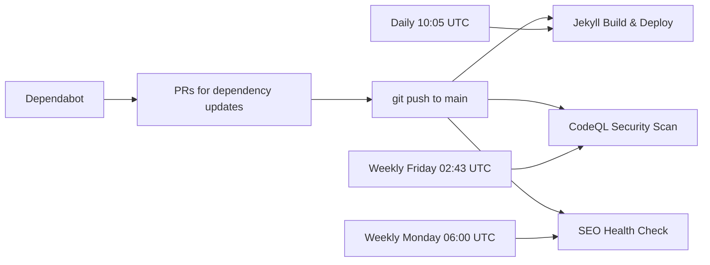

Most Jekyll blogs on GitHub Pages use the default build. Push to main, GitHub builds it, done. That worked for me too — until I needed custom plugins, scheduled future posts, and wanted to stop deploying broken sitemaps. Now I have three GitHub Actions workflows, Dependabot watching three package ecosystems, and a Lighthouse config that blocks my own ad scripts.

Here's how it all fits together.

<!-- excerpt-end -->

## The Pipeline at a Glance



| Workflow | File | Triggers | Purpose |
|----------|------|----------|---------|
| Build & Deploy | `jekyll.yml` | Push, daily cron, manual | Build site, validate sitemap, deploy to GitHub Pages |
| CodeQL | `codeql.yml` | Push, PR, weekly cron | Security scanning of GitHub Actions workflows |
| SEO Health Check | `seo-health-check.yml` | Push (path-filtered), weekly cron, manual | Lighthouse CI, link checking, SEO validation |
| Dependabot | `dependabot.yml` | Daily (Actions, Bundler), weekly (npm) | Dependency update PRs |

## Workflow 1: Build and Deploy

This is the core workflow. It replaced the default GitHub Pages build in August 2024 when I needed custom plugins that aren't in the [GitHub Pages whitelist](https://pages.github.com/versions/).

```yaml
name: Deploy Jekyll site to Pages

on:
  push:
    branches: ["main"]
  schedule:
    - cron: '5 10 * * *'
  workflow_dispatch:

permissions:
  contents: read
  pages: write
  id-token: write

concurrency:
  group: "pages"
  cancel-in-progress: false
```

### Why a Custom Build?

The default GitHub Pages Jekyll build is convenient but limiting:

- **No custom plugins** — Only [whitelisted gems](https://pages.github.com/versions/) run. My [tag/category generator](/jekyll-tag-category-generator-plugin/) and [Pandoc exports plugin](/jekyll-pandoc-exports-plugin/) need a custom build.
- **No Ruby version pinning** — GitHub controls the Ruby version. I pin to 3.2.6 for reproducibility.
- **No build validation** — The default build deploys whatever Jekyll produces. I validate the sitemap before deploying.

### Scheduled Builds for Future Posts

The `schedule` trigger is the key feature that makes future-dated posts work:

```yaml
schedule:
  - cron: '5 10 * * *'  # 10:05 UTC daily (6:05 AM EDT)
```

See [GitHub's scheduled events documentation](https://docs.github.com/en/actions/writing-workflows/choosing-when-your-workflow-runs/events-that-trigger-workflows#schedule) for cron syntax details.

Jekyll's `future: false` setting (the default) excludes posts with dates in the future from the build output. When a post's date arrives, the next build picks it up. The daily cron at 10:05 UTC (6:05 AM EDT) means a post dated `2026-05-15` will go live within 24 hours of that date — close enough for a blog.

Without this, I'd have to manually push a commit or trigger a build on the day I want a post to go live.

### The `--future` Flag Gotcha

During local development, `bundle exec jekyll serve` also respects `future: false` — future-dated posts won't render locally unless you add the `--future` flag:

```bash
bundle exec jekyll serve --future
```

This confused me early on. I'd write a post with tomorrow's date, run the local server, and the post wouldn't appear. The `future: false` config setting only controls the *build output*, not whether the file is recognized. The `--future` flag overrides it for local previewing. In production, the daily cron handles it — you never need `future: true` in `_config.yml`.

### Sitemap Validation

After discovering that a bad build once deployed a sitemap full of `localhost` URLs, I added a pre-deploy validation step:

```yaml
- name: Validate sitemap URLs
  run: |
    if grep -q 'localhost' ./_site/sitemap.xml; then
      echo "::error::sitemap.xml contains localhost URLs"
      grep 'localhost' ./_site/sitemap.xml | head -5
      exit 1
    fi
    echo "Sitemap OK: all URLs use production domain"
```

This is a cheap check that has saved me at least once. The `JEKYLL_ENV: production` environment variable is also critical — without it, Jekyll may use development URLs.

### Build Steps

The full build job:

```yaml
jobs:
  build:
    runs-on: ubuntu-latest
    steps:
      - uses: actions/checkout@v6
      - uses: ruby/setup-ruby@v1.300.0
        with:
          ruby-version: '3.2.6'
          bundler-cache: true
          cache-version: 1
      - uses: actions/configure-pages@v6
      - name: Build with Jekyll
        run: bundle exec jekyll build --baseurl "${{ steps.pages.outputs.base_path }}"
        env:
          JEKYLL_ENV: production
      - name: Validate sitemap URLs
        run: |
          if grep -q 'localhost' ./_site/sitemap.xml; then
            echo "::error::sitemap.xml contains localhost URLs"
            exit 1
          fi
      - uses: actions/upload-pages-artifact@v4
```

Key details:

- **`bundler-cache: true`** — Caches installed gems between runs. Cuts build time significantly.
- **`cache-version: 1`** — Increment this to force a fresh gem install if the cache gets corrupted.
- **`configure-pages`** — Sets the base path for GitHub Pages. Required for correct URL generation.
- **`cancel-in-progress: false`** — Don't cancel a running deployment if a new push arrives. Let it finish.

### Evolution

The build workflow has been through nine commits since August 2024:

1. **Aug 2024** — Initial creation, replacing default GitHub Pages build
2. **Jan 2025** — Ruby version updates and deploy comments
3. **May 2025** — Fix caching issues during build
4. **Sep 2025** — Add scheduled daily builds for future posts
5. **Sep 2025** — Dependabot bumps for checkout and upload-pages-artifact
6. **Apr 2026** — Add sitemap localhost validation
7. **Apr 2026** — Update all actions to Node 24 compatible versions

## Workflow 2: CodeQL Security Scanning

```yaml
name: "CodeQL Advanced"

on:
  push:
    branches: ["main"]
  pull_request:
    branches: ["main"]
  schedule:
    - cron: '43 2 * * 5'  # Weekly Friday at 02:43 UTC
```

### What Does CodeQL Scan on a Jekyll Blog?

Not much, honestly. The initial setup in September 2025 included Ruby and JavaScript language analysis, but those were removed the same day — CodeQL's Ruby analysis isn't useful for Jekyll plugins (they're too simple), and the JavaScript is mostly CDN-loaded.

What remains is **GitHub Actions workflow analysis** (`language: actions`), which scans the workflow YAML files themselves for security issues like:

- Untrusted input in `run` steps
- Missing permission restrictions
- Vulnerable action versions
- Script injection via `${{ }}` expressions

```yaml
strategy:
  fail-fast: false
  matrix:
    include:
    - language: actions
      build-mode: none
```

### Is It Worth It?

For a static blog? Marginally. The Actions language scanner has caught zero issues so far. But it's free, runs weekly, and takes under a minute. The real value is that it's already configured — if I add more complex JavaScript or Ruby in the future, I can re-enable those language scanners with one line change.

## Workflow 3: SEO Health Check

This is the most complex workflow and has its own [dedicated article](/jekyll-seo-health-checks/). Here's the summary of what it validates on every content push and weekly:

### Triggers

```yaml
on:
  schedule:
    - cron: '0 6 * * 1'  # Weekly Monday at 6 AM UTC
  workflow_dispatch:
  push:
    branches: [main]
    paths:
      - '_config.yml'
      - '_layouts/**'
      - '_includes/**'
      - '_plugins/**'
      - '_posts/**'
      - '_sass/**'
      - 'assets/**'
      - 'robots.txt'
      - '.github/workflows/seo-health-check.yml'
      - '.lighthouserc.json'
```

The `paths` filter is important — this workflow only runs on pushes that change content or configuration, not on README edits or draft changes. This saves CI minutes.

### What It Checks

The workflow builds the site, serves it locally, then runs a gauntlet of checks:

1. **Lighthouse CI** — Performance (≥0.8), accessibility (≥0.9), best practices (≥0.8), SEO (≥0.9 — hard fail). Runs 3 times per URL and averages. Blocks AdSense and Analytics scripts to get clean scores.
2. **Canonical URL consistency** — Every `<link rel="canonical">` tag must use `mcgarrah.org`
3. **Sitemap validation** — Valid XML, correct domain, no `www` prefix
4. **Sitemap index validation** — References both blog and resume sitemaps
5. **Robots.txt** — Exists, references correct sitemap index
6. **Meta tags** — Description and Open Graph tags on homepage
7. **RSS feed** — Valid XML
8. **Link checking** — [Lychee](https://github.com/lycheeverse/lychee-action) for broken links across all HTML
9. **Structured data** — JSON-LD presence
10. **Image optimization** — Missing alt text, oversized images (>500KB)
11. **Content quality** — Duplicate titles, duplicate meta descriptions, generic link text ("click here", "read more")
12. **Mobile optimization** — Viewport meta tag coverage
13. **Accessibility indicators** — Invalid anchors, small tap targets

### Lighthouse Configuration

The `.lighthouserc.json` blocks ad and analytics scripts to get clean performance scores:

```json
{
  "ci": {
    "collect": {
      "numberOfRuns": 3,
      "settings": {
        "blockedUrlPatterns": [
          "**/pagead/js/adsbygoogle.js*",
          "**/googlesyndication.com/**",
          "**/googletagmanager.com/**"
        ]
      }
    },
    "assert": {
      "assertions": {
        "categories:performance": ["warn", {"minScore": 0.8}],
        "categories:accessibility": ["warn", {"minScore": 0.9}],
        "categories:seo": ["error", {"minScore": 0.9}]
      }
    }
  }
}
```

SEO is the only hard fail (`error`). Performance and accessibility are warnings — I want to know about regressions but don't want to block deploys over a 0.79 performance score.

### The Canonical URL Bug

The SEO health check went through five rapid-fire commits on April 8, 2026 — all fixing the same class of problem. The canonical URL check was matching `mcgarrah.org` in blog post *content* (syntax-highlighted code examples), not just in `<link>` tags. The fix narrowed the grep to match only actual `<link rel="canonical">` tags:

```bash
find _site -name "*.html" -exec grep -h '<link[^>]*rel="canonical"' {} \;
```

Lesson: when your blog posts contain code examples about your own blog's configuration, your CI checks will match the examples. Always be specific in your grep patterns.

## Dependabot

```yaml
version: 2
updates:
  - package-ecosystem: "github-actions"
    directory: "."
    schedule:
      interval: "daily"
  - package-ecosystem: "bundler"
    directory: "./"
    schedule:
      interval: "daily"
  - package-ecosystem: "npm"
    directory: "./"
    schedule:
      interval: "weekly"
```

Three ecosystems, three schedules:

- **GitHub Actions** (daily) — Catches action version bumps quickly. These are the most security-sensitive since they run with repo permissions.
- **Bundler** (daily) — Jekyll and Ruby gem updates. The `Gemfile.lock` pins exact versions.
- **npm** (weekly) — Tracks CDN library versions in `package.json` for security scanning, even though the actual libraries load from CDN at runtime. See [the security dependency management](/implementing-gdpr-compliance-jekyll-adsense/) post for why.

Dependabot creates PRs automatically. Each PR triggers the build and CodeQL workflows, so I get a test build before merging.

## How the Pieces Interact

The workflows aren't isolated — they form a feedback loop:

1. **Dependabot** creates a PR to bump `actions/checkout` from v5 to v6
2. The PR triggers **CodeQL** (scans the updated workflow YAML) and **Build** (tests the build with the new action version)
3. I merge the PR → push to main
4. Push triggers all three workflows: **Build** deploys, **CodeQL** scans, **SEO Health Check** validates
5. If the SEO check finds a regression (broken link, missing meta tag), I fix it and push again

The **daily cron** on the build workflow handles future-dated posts without any manual intervention. The **weekly crons** on CodeQL and SEO catch drift — a dependency that introduced a vulnerability, or an external link that went dead.

## Cost

All of this runs on GitHub's free tier for public repositories. The monthly usage is minimal:

- Build & Deploy: ~30 runs/month (daily cron + pushes), ~2 min each
- CodeQL: ~8 runs/month (weekly + pushes), ~1 min each
- SEO Health Check: ~12 runs/month (weekly + content pushes), ~4 min each
- Total: ~100 minutes/month, well within the 2,000 free minutes

## What I'd Add Next

- **HTML-Proofer** — More thorough internal link validation than my custom script
- **Pa11y** — Automated accessibility testing beyond Lighthouse
- **Build time tracking** — Alert if build time exceeds a threshold (currently ~90 seconds)
- **Deployment notifications** — Slack or email on successful deploy of future-dated posts

## Related Posts

- [Advanced Jekyll SEO Health Checks](/jekyll-seo-health-checks/) — Deep dive into the SEO workflow
- [Building This Blog: Jekyll on GitHub Pages](/setting-up-jekyll-blog-github-pages/) — Setup guide with CI/CD overview
- [Using GitHub Actions with pip-audit](/github-actions-pip-audit-pr/) — Similar CI pattern for Python projects
- [Building a Custom Tag and Category Generator Plugin](/jekyll-tag-category-generator-plugin/) — One of the custom plugins that requires this pipeline
- [Your Jekyll Sitemap Is 60% Garbage](/jekyll-sitemap-bloat-tags-categories-pagination/) — The sitemap problem that led to the validation step
- [How the Sausage Is Made](/jekyll-markdown-feature-reference/) — Full feature inventory
- [Ruby Gem Release Automation](/ruby-gem-release-automation/) — CI/CD for the Pandoc exports gem
