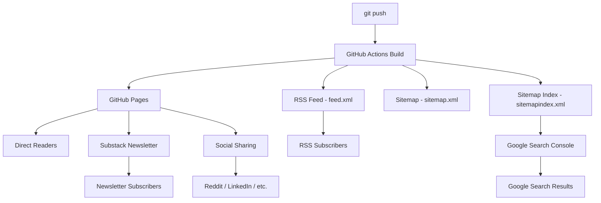

I write a markdown file, push to GitHub, and GitHub Actions builds the site. That's the publishing step. But publishing isn't distribution — a post that exists on a server isn't a post that reaches readers.

This blog has six distribution channels, each serving a different audience and timeline. The same content distribution pipeline concept applies to any content platform — documentation sites, developer portals, knowledge bases — the channels differ but the architecture is the same. Here's how they work together.

<!-- excerpt-end -->

## The Distribution Channels



| Channel | Audience | Timeline | Effort |
|---------|----------|----------|--------|
| Direct URL | Bookmarkers, repeat visitors | Immediate | Zero |
| RSS feed | Technical readers, feed aggregators | Minutes after build | Zero (automated) |
| Google Search | New readers searching for solutions | Days to weeks | Zero (automated via sitemap) |
| Substack newsletter | Subscribers, broader audience | Manual, batched | 2-4 hours per newsletter |
| Social sharing | Reddit, LinkedIn, Hacker News | Manual, per-post | 15 minutes per post |
| Cross-references | Readers of related posts | At publish time | Built into writing process |

## RSS Feed

The RSS feed is the oldest and simplest distribution channel. The `jekyll-feed` plugin generates `feed.xml` automatically at build time.

```yaml
# Gemfile
gem "jekyll-feed", "~> 0.17.0"
```

That's it. Every post gets an entry in the feed with title, date, excerpt, and full content. Feed readers like Feedly, NewsBlur, and Miniflux pick it up automatically.

The feed URL is `https://mcgarrah.org/feed.xml` and is advertised via a `<link>` tag in the HTML head that feed readers auto-discover.

### What RSS Gets Right

- **Zero ongoing effort** — Once configured, every new post is automatically in the feed
- **Reader-controlled** — Subscribers choose when and how to read. No algorithm, no inbox competition
- **Full content** — The feed includes the complete post, not just a teaser. Readers don't have to click through

### What RSS Misses

- **Shrinking audience** — RSS readership has declined since Google Reader shut down in 2013. Most non-technical readers don't use feed readers
- **No analytics** — I can't tell how many people read via RSS (by design — that's a feature for privacy-conscious readers)

## Sitemap and Sitemap Index

The sitemap tells search engines what pages exist and when they were last modified. This blog has a two-level sitemap structure because it hosts two Jekyll sites under one domain.

### The Multi-Site Problem

The main blog lives at `mcgarrah.org/` and the resume lives at `mcgarrah.org/resume/`. Each has its own `sitemap.xml` generated by `jekyll-sitemap`. But Google Search Console wants a single sitemap entry point for the domain.

The solution (added April 8, 2026) is a `sitemapindex.xml` at the domain root:

```xml
<?xml version="1.0" encoding="UTF-8"?>
<sitemapindex xmlns="http://www.sitemaps.org/schemas/sitemap/0.9">
  <sitemap>
    <loc>https://mcgarrah.org/sitemap.xml</loc>
  </sitemap>
  <sitemap>
    <loc>https://mcgarrah.org/resume/sitemap.xml</loc>
  </sitemap>
</sitemapindex>
```

The `robots.txt` points to the index, not the individual sitemaps:

```text
Sitemap: https://mcgarrah.org/sitemapindex.xml
```

This was a direct fix for the fragmented sitemap problem documented in [Managing Multiple Jekyll Sites: Sitemap Challenges](/managing-multiple-jekyll-sites-sitemap-challenges/).

### Sitemap Hygiene

The sitemap went through significant cleanup — from 434 URLs down to ~172 after excluding auto-generated tag pages, category pages, and pagination. That story is told in [Your Jekyll Sitemap Is 60% Garbage](/jekyll-sitemap-bloat-tags-categories-pagination/). The SEO health check workflow validates the sitemap on every build.

## Google Search Console

Google Search Console (GSC) is where the sitemap meets Google's crawler. Submitting the sitemap index tells Google about every page on both the blog and resume sites.

### The Indexing Journey

Getting Google to properly index the site was a multi-month process:

1. **Domain verification** — Proved ownership of `mcgarrah.org` via DNS TXT record
2. **Sitemap submission** — Submitted `sitemapindex.xml` pointing to both sitemaps
3. **Canonical URL fixes** — Resolved "Duplicate without user-selected canonical" errors by aligning `url` and `canonical_url` in `_config.yml` (published [December 2025](/jekyll-seo-sitemap-canonical-url-fixes/))
4. **404 cleanup** — Removed testing artifacts from `_site/` that were generating crawl errors
5. **Sitemap bloat fix** — Excluded thin tag/category/pagination pages that Google flagged as "Discovered – currently not indexed"

The SEO health check GitHub Actions workflow now validates all of this automatically on every push — canonical URL consistency, sitemap XML validity, correct domain usage, and broken links.

### What GSC Tells You

- **Coverage** — Which pages are indexed, which are excluded, and why
- **Performance** — Search queries that lead to your site, click-through rates, average position
- **Core Web Vitals** — Page speed and user experience metrics
- **Links** — External sites linking to your content (this is where you see the Substack and Reddit inbound links)

## Substack Newsletter

Substack is the highest-effort, highest-impact distribution channel. Each newsletter is a curated collection of blog posts with narrative connecting them, aimed at a broader audience than the blog's typical reader.

### The Cross-Posting Workflow

1. **Write blog posts** — Individual technical articles published on the blog over weeks/months
2. **Identify a theme** — Group related posts into a narrative arc
3. **Write the newsletter** — A 2,000-3,000 word article that tells the story across multiple posts, with links back to each one
4. **Archive in `_substack/`** — Keep a markdown copy in the repository for version control

The `_substack/` directory is excluded from the Jekyll build (the `_` prefix ensures Jekyll ignores it). It's purely for archival:

```
_substack/
├── README.md                                    # Publication schedule and tags
├── 2026-04-04-from-homelabs-to-machine-learning.md  # Published
└── 2026-04-20-from-markdown-to-production.md        # Published
```

### The Inbound Link Effect

Each Substack newsletter contains **20-25 links back to specific blog posts**:

| Newsletter | Date | Inbound Links |
|-----------|------|---------------|
| From Homelabs to Machine Learning | 2026-04-04 | 24 links |
| From Markdown to Production | 2026-04-20 | 23 links |
| **Total** | | **47 links** |

These aren't generic "visit my blog" links — each one points to a specific post URL like `https://mcgarrah.org/proxmox-ceph-nearfull/`. This is why [permalink stability](/jekyll-content-plumbing-permalinks-reading-time/) matters so much. If I changed the permalink structure, 47 newsletter links would break instantly, and I can't edit published Substack articles retroactively.

The inbound links also serve as backlinks for SEO — external sites linking to your content is one of Google's strongest ranking signals.

### Publication Scheduling

Blog posts must be live before the newsletter that references them goes out. The DRAFTS.md tracker includes a dependency checklist for each Substack publication:

```
The Apr 20 Substack references the following blog posts that should be live:
- 2026-04-14-ceph-osd-recovery-power-failure.md ✅
- 2026-04-15-zfs-ceph-overlapping-failures.md ✅
- 2026-04-18-jekyll-markdown-feature-reference.md ✅
- 2026-04-19-setting-up-jekyll-blog-github-pages.md ✅
```

### Planned Newsletters

| # | Theme | Status |
|---|-------|--------|
| 1 | Infrastructure (Proxmox, Ceph, Dell Wyse, monitoring) | Published 2026-04-04 |
| 2 | Web Development (Jekyll, SEO, GDPR, Pandoc, Mermaid) | Published 2026-04-20 |
| 3 | Machine Learning (AI/ML research, phonemes, cloud DS) | Planned |

## Social Sharing

Reddit, LinkedIn, and other platforms are manual, per-post distribution. The effort is low (15 minutes to write a post title and context) but the reach is unpredictable — a Reddit post might get 3 views or 3,000.

### What Makes Posts Shareable

- **Clean URLs** — `mcgarrah.org/proxmox-ceph-nearfull/` looks better than a date-heavy URL in a Reddit title
- **Open Graph meta tags** — When someone pastes a link on LinkedIn or Twitter, the `jekyll-seo-tag` plugin provides the title, description, and image for the preview card
- **Descriptive titles** — "Your Jekyll Sitemap Is 60% Garbage" gets more clicks than "Sitemap Optimization Notes"

### The Permalink Contract

Every external share creates a permanent reference to a specific URL. A Reddit post from 2025 still points to `mcgarrah.org/proxmox-8-dell-wyse-3040-upgrade/`. That URL must work forever — or at least redirect via `jekyll-redirect-from` if the post is renamed.

This is the same constraint as Substack links, but harder to track. I know exactly which URLs my newsletters reference (they're in the `_substack/` archive). I don't know which URLs have been shared on Reddit or bookmarked by readers.

## Cross-References Between Posts

The newest distribution channel is the "Related Posts" section at the bottom of articles. Currently 16 of 139 posts have hand-curated cross-references — all from September 2025 onward.

These serve double duty:

- **Reader navigation** — A reader finishing the Ceph OSD recovery post sees links to the ZFS failure post and the SSD acceleration post
- **Internal linking for SEO** — Google uses internal link structure to understand which pages are most important. Posts with many inbound internal links rank higher

## How the Channels Reinforce Each Other

The channels aren't independent — they form a flywheel:

1. **Blog post published** → appears in RSS feed and sitemap automatically
2. **Google indexes it** → organic search traffic starts arriving (days to weeks)
3. **Substack newsletter** bundles multiple posts → drives traffic spike to all referenced posts
4. **Reddit/LinkedIn share** → drives traffic spike to individual post
5. **Inbound links from Substack and social** → improve Google ranking → more organic traffic
6. **Cross-references in new posts** → drive traffic to older posts → keep them relevant

The daily GitHub Actions cron build ensures future-dated posts enter this pipeline automatically. The SEO health check ensures the pipeline stays healthy.

## What I'd Add Next

- **Social sharing buttons on posts** — Currently on the TODO list. Would reduce friction for readers who want to share
- **Substack RSS import** — Substack can auto-import from an RSS feed, which would reduce the manual cross-posting effort
- **Analytics per channel** — Google Analytics shows referral sources, but I don't track which Substack newsletter drove which traffic spike
- **Automated cross-references** — The 123 older posts without "Related Posts" sections could benefit from tag-based automated suggestions

## Related Posts

- [Jekyll Content Plumbing: Permalinks, Reading Time, Excerpts, and Redirects](/jekyll-content-plumbing-permalinks-reading-time/) — Why permalink stability matters for distribution
- [Your Jekyll Sitemap Is 60% Garbage](/jekyll-sitemap-bloat-tags-categories-pagination/) — Sitemap cleanup
- [Managing Multiple Jekyll Sites: Sitemap Challenges](/managing-multiple-jekyll-sites-sitemap-challenges/) — The multi-site sitemap problem
- [Jekyll SEO, Sitemap, and Canonical URL Fixes](/jekyll-seo-sitemap-canonical-url-fixes/) — Google Search Console indexing fixes
- [The CI/CD Pipeline Behind This Jekyll Blog](/jekyll-github-actions-cicd-pipeline/) — The build system that powers the pipeline
- [Building This Blog: Jekyll on GitHub Pages](/setting-up-jekyll-blog-github-pages/) — Overall setup guide
