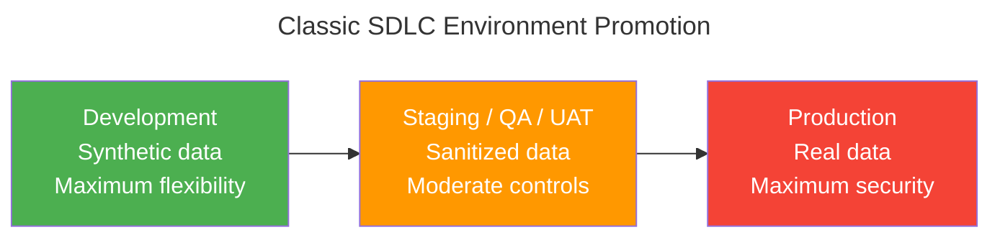
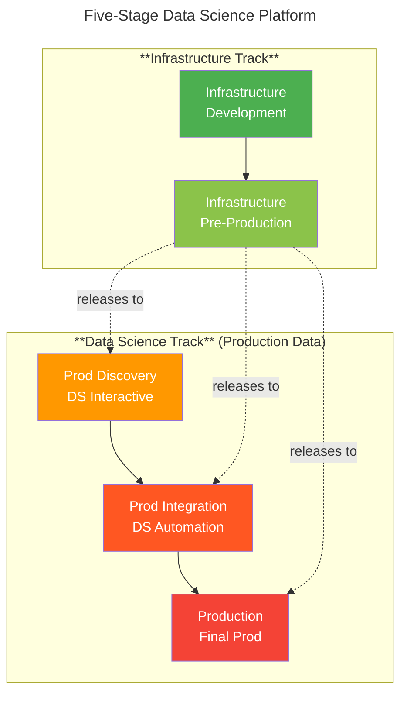
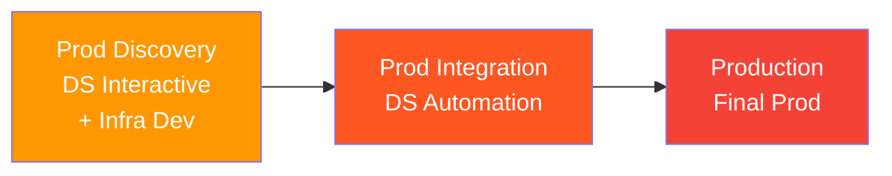
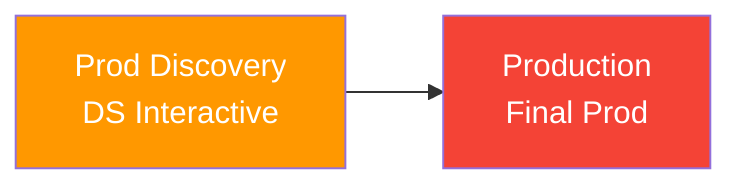

Every enterprise I have worked in for over a decade has hit the same wall: data scientists need production data to build useful models, but the standard software development lifecycle assumes production data stays in production. The SDLC model that works perfectly for application development — synthetic data in dev, sanitized data in staging, real data only in prod — fundamentally breaks when applied to machine learning.

This is not a tooling problem. It is an organizational architecture problem that sits at the intersection of data engineering, security, compliance, and platform engineering. Getting it wrong means either your data scientists train on garbage data and produce garbage models, or your security team grants exceptions that erode your compliance posture. Getting it right requires a promotion framework purpose-built for the constraints of data science work.

<!-- excerpt-end -->

## The Conflict

In classic SDLC, the environment hierarchy is straightforward:

Development environments never have production data. The middle environments (staging, QA, UAT — every enterprise names them differently, and the naming is hotly debated) may have sanitized copies. Production has the real data under the strictest controls. Security and flexibility are inversely correlated as you move up the stack.

This model works because application developers do not need real data to write and test code. A payment processing service can be fully tested with synthetic transactions. A user management system works fine with fake users.

**Data science is different.** Training a machine learning model on synthetic or sanitized data produces a model that has learned the patterns of synthetic data — not the patterns of your actual business. Feature engineering on sanitized datasets misses the edge cases, distributions, and correlations that exist in production. The entire value proposition of ML depends on learning from real data.

So the conflict becomes clear: a data scientist needs the interactive flexibility of a development environment — notebooks, experimentation, iterative exploration — combined with access to production data that requires the security controls of a production environment. These two requirements are architecturally opposed in the standard SDLC model.

I have had this argument with development managers, project managers, and security teams across healthcare (BCBSNC), financial services (Envestnet), and government (NC DIT). The conversation always starts the same way: "Why can't they just use the staging data?" And the answer is always the same: because staging data is not production data, and the model quality difference is measurable.

## The Five-Stage Framework

The resolution is a promotion framework designed specifically for data science workloads. Instead of forcing DS into the SDLC model, you build a parallel track that acknowledges the production data requirement from the start.

### Stage 1: Infrastructure Development

Where you develop and test the platform itself — new tools, infrastructure changes, configuration updates. No production data. Maximum flexibility. This is standard IaC development: Terraform modules, Helm charts, CI/CD pipelines, new service integrations.

This environment protects your data science users from infrastructure development cycles. You do not want a Terraform apply breaking a data scientist's notebook session.

Likewise, this is often where you manually install a piece of software or infrastructure to test it out before committing to IaC implementations.

### Stage 2: Infrastructure Pre-Production

Validated infrastructure changes are promoted here before release to the production data environments. This is your gate between "infrastructure team is experimenting" and "infrastructure is ready for data science users." Changes released from here deploy to all three production-data environments in close succession.

This is the promotion from the prior stage that could have had manual operations introduced that means the IaC has some unintended affects from those manual operations. This region never has anything introduced without a clean IaC promotion.

### Stage 3: Prod Discovery (Data Science Development)

This is where the SDLC model breaks and the DS model begins. **Discovery has production data.** It is the interactive, exploratory environment where data scientists do their work — notebooks, feature engineering, model experimentation, data exploration.

The "Prod" prefix is deliberate and important. It signals to security and compliance teams that this environment holds real data and requires production-grade controls. But it also has development-like flexibility: data scientists can install packages, run experiments, create copies of datasets for feature engineering, and iterate rapidly.

Key characteristics:
- **Production data access** — read access to production datasets with the real, unadulterated statistical distributions intact
- **Interactive workloads** — Jupyter notebooks, SageMaker Studio, interactive Spark sessions
- **Heavy storage** — feature engineering creates many copies and transformations of data
- **Extensive monitoring and auditing** — every data access is logged because this is production data in a flexible environment
- **Cross-environment reach** — may access datasets in Final Prod for model training, and datasets being developed by data engineers in the same environment

**A critical distinction on data access:** Regulatory data minimization is not the same as data sanitization. Masking a Social Security Number or a patient's name while leaving the raw, unadulterated transactional distributions intact preserves the mathematical integrity of the data. Data scientists do not need to see a customer's actual name to predict churn — they need the unskewed, un-truncated behavioral patterns and anomalies. What destroys model quality is *structural sanitization*: mocking schemas, fabricating distributions, truncating outliers, or replacing real values with synthetic ones that alter the statistical properties of the dataset. The former is a compliance control; the latter is data poisoning dressed up as security.

### Stage 4: Prod Integration (Data Science Pre-Production)

No interactive work happens here. This is the automation layer — where data science work is promoted from Discovery for validation before reaching Final Prod.

The promotion mechanism is critical: experimental work in Discovery lives in Jupyter notebooks, ad-hoc scripts, and iterative exploration. **Stage 4 forces the transition from experimental `.ipynb` files into version-controlled, automated Python packages or containers managed by an MLOps pipeline.** This is where the research model hands off to the engineering model — the hypothesis has been confirmed in Discovery, and Integration validates that it can run reproducibly, at scale, without human intervention.

Automated pipelines run here: model training jobs, data pipeline promotions, scheduled retraining. If something breaks in Integration, it does not affect customers in Final Prod.

### Stage 5: Production (Final Prod)

Where customers consume AI/ML insights. Hosts the final copies of data engineering datasets, trained models, and inference endpoints. The most restrictive controls, the least flexibility, the highest audit requirements.

Changes arrive here only through automated promotion from Integration. No interactive access. No ad-hoc queries. No notebook sessions.

## The Three-Stage Variant

Not every organization needs five stages. Startups and smaller teams can collapse this to three environments while preserving the core principle: production data in an interactive environment with appropriate controls.

This variant merges infrastructure development into Discovery (accepting the risk of infra changes affecting DS users) and eliminates the separate infrastructure pre-production stage. It works when:
- The platform team is small (1-3 engineers)
- Infrastructure changes are infrequent
- The blast radius of a bad infra change is limited

An even more minimal variant drops Integration entirely:

This is the startup model: data scientists work directly in an environment with production data, and promotions go straight to Final Prod. It works until your first compliance audit asks how you validate ML pipeline changes before they affect customers. It also creates an operational dependency loop: if a model retrains automatically on live data and mutates its weights without an integration gate, you are deploying unvalidated probabilistic logic directly to consumers. One distribution shift in the training data produces a silently degraded model with no gate to catch it.

## Security and Compliance Implications

The "Prod" designation on Discovery is not just naming — it carries real consequences:

- **Access controls** — IAM policies, role-based access, least-privilege principles apply even in the interactive environment
- **Audit logging** — every data access, every query, every file creation is logged (CloudTrail, VPC Flow Logs, application-level audit)
- **Data classification** — regulatory data minimization (masking identifiers like SSN, patient name) preserves model-relevant distributions while satisfying compliance. This is not sanitization — the statistical properties of the data remain intact. Only direct identifiers are removed.
- **Network segmentation** — Discovery can reach production data stores but is isolated from the public internet and from non-DS systems
- **Compliance framework mapping** — SOC 2, HIPAA, PCI-DSS all have controls that apply to any environment with production data. Removing the word "Development" from the environment name simplifies compliance conversations significantly

The last point is pragmatic but important. When a SOC 2 auditor sees an environment called "Development" with production data, they flag it immediately. When they see "Prod Discovery" with documented controls, monitoring, and access restrictions, the conversation is about whether the controls are adequate — not whether the architecture is fundamentally wrong.

## Where I Have Applied This

This framework is not theoretical. It evolved from watching the problem manifest across multiple organizations over fifteen years — each role adding a layer to the thinking.

### The Compliance Foundation (2006–2013)

Three roles established the security and data governance principles that underpin this framework. At **BD Biosciences (2006–2007)**, I managed IT for a medical device manufacturing plant under FDA quality system regulations — where every system change required documented validation. At **NC Department of Revenue (2007–2011)**, I managed taxpayer data under IRS Safeguard compliance (Publication 1075), passed a seven-month federal audit producing a 1,300-page report, and learned that production data requires production-grade controls regardless of who is accessing it. At **SAS Institute (2011–2013)**, I administered validated systems for 80+ pharmaceutical customers under FDA CFR Part 11 — clinical trial data across dozens of companies where biostatisticians needed interactive access for analysis while the production systems required change-controlled, auditable deployments. The pharmaceutical tension between analytical flexibility and regulatory compliance is the same DS-vs-SDLC conflict described above, just with FDA enforcement authority behind it.

The common thread: regulated industries figured out decades ago that "interactive access to sensitive data" is not incompatible with "auditable, controlled environments." You just have to design for both simultaneously rather than treating them as mutually exclusive.

### The Catalyst (2013–2016)

- **Measurement Incorporated (2013–2015)** — This is where the seed was planted. MI had PhD researchers building NLP and machine learning models for automated essay scoring — production AI/ML serving millions of student assessments annually. The environment was chaotic: multiple copies of code, data, and infrastructure scattered across researchers' workstations, shared drives, and production servers. The researchers needed to iterate rapidly (the research model), while the production system needed stability (the SDLC model). I watched the conflict daily — researchers breaking production with untested model changes, production freezes blocking research, data copies proliferating without version control. The five-stage framework is the solution I wish we had built. Instead, we evolved toward it incrementally. The progression from chaos to structure taught me this is an organizational capability you build over years, not a one-time architecture decision.

- **NC Department of Information Technology (2015–2016)** — Enterprise architecture for state government. Getting independent agencies with different requirements to agree on shared infrastructure directly informed the "three constituencies" negotiation model described below.

### Full Implementation (2019–present)

- **BCBSNC (2019–2021)** — This is where the framework was fully realized and tested. Built the CarePath ML platform on EKS with GPU-enabled spot instances for model training under HIPAA constraints. Scale-to-zero workload patterns kept costs viable. The production data access model for healthcare required exactly this kind of controlled-but-flexible environment — and the lessons from MI's chaos informed the architecture from day one. Separate the research phase from the engineering phase, build the gates between them before the data scientists arrive, and design the compliance controls into the platform rather than bolting them on after. The framework survived real-world pressure: production ML models processing claims data from all NC members, emergency rooms, and hospitals under near-real-time requirements. It became the standard I carried forward to Envestnet.

- **Envestnet (2021–present)** — Managed SageMaker infrastructure across four AWS accounts (Dev/QA/UAT/Prod) for the Data Science team, then expanded to AWS Bedrock for AI/ML workloads across both shared services accounts and application-specific workload accounts as requirements dictated. The account architecture maps directly to this framework — shared services provide the platform capabilities, while workload accounts maintain isolation appropriate to each environment's data sensitivity. Delivered the first AI/ML production workload (Bedrock Data Automation) on the billing platform — the full arc from evaluation through production. Envestnet's mature DataLake built on vEMR (virtual Enterprise Master Record) and Snowflake exemplifies this model extensively: the vEMR uses phased data migration from source systems through transformation stages to production consumption, with each phase treating data as a first-class citizen — versioned, cataloged, and governed. The Airflow-orchestrated pipelines enforce promotion gates at every stage, and the phased release approach for production data ensures that downstream consumers (including ML models) only access validated, governed datasets. That maturity in data engineering is what makes the AI/ML layer viable — you cannot build reliable models on ungoverned data.

## The Organizational Challenge

The technical architecture is the straightforward part. The hard part is getting three constituencies to agree:

1. **The CISO / Security team** — wants minimal data exposure, maximum controls, and no exceptions to the standard SDLC model
2. **The CDO / Data Science team** — wants production data access with development-like flexibility and minimal friction
3. **The business unit leaders** — want ML models that actually work (which requires real data) without compliance risk

The five-stage framework gives each constituency what they need: security gets production-grade controls and audit logging on every environment with real data; data science gets interactive access to production data; business gets models trained on real data with a documented compliance posture.

The EMBA coursework I am completing at UNC Wilmington has reinforced something I learned through experience: the technical architecture is a negotiation artifact. The framework succeeds not because it is technically elegant, but because it gives each stakeholder a way to say yes without compromising their core requirements.

## Implications

If you are building an AI organization — or evaluating whether your current platform can support one — this is the first infrastructure decision you need to get right. Everything downstream depends on it:

- **Model quality** depends on training data quality, which depends on production data access
- **MLOps maturity** depends on a promotion path from experimentation to production
- **Compliance posture** depends on controls being designed into the architecture, not bolted on after the fact
- **Team velocity** depends on data scientists not waiting weeks for data access approvals

The standard SDLC model will not give you this. You need a purpose-built framework that acknowledges the fundamental difference between application development and data science: production data is not the destination — it is the starting point.
