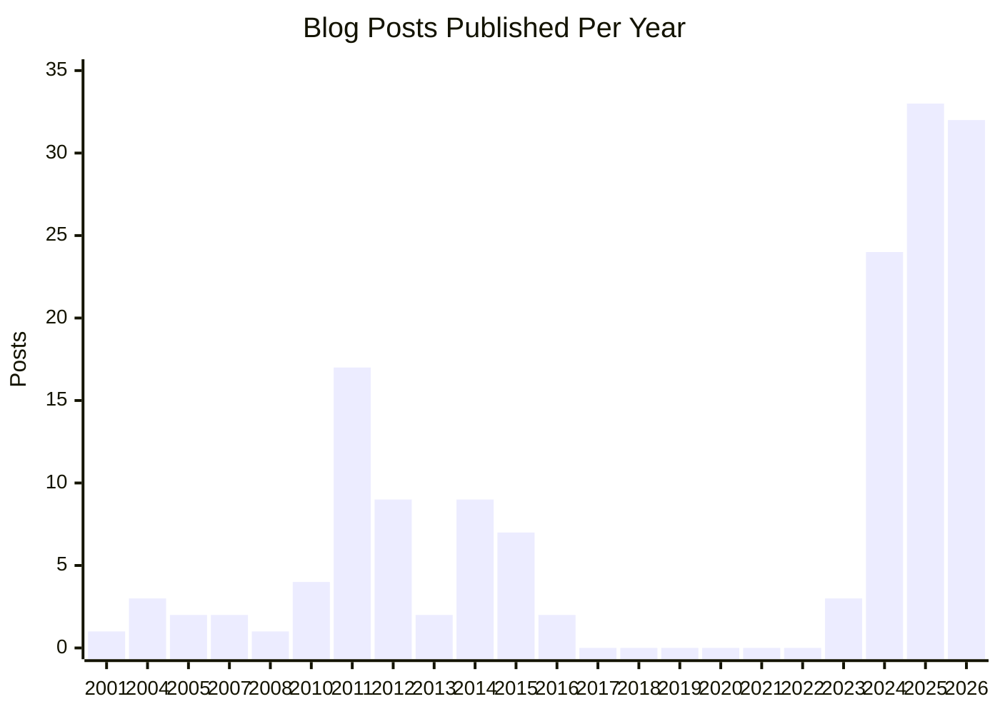
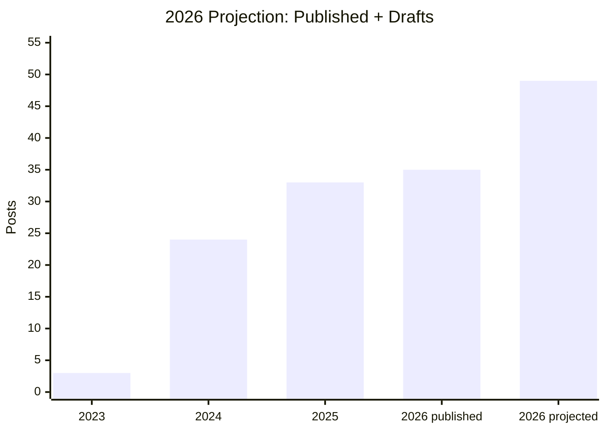

I've been writing about technology since 2004. That's over twenty years of blog posts, platform migrations, and long stretches of silence. If you looked at my publishing history on a timeline, you'd see bursts of intense activity separated by years of nothing. The pattern tells a story I didn't fully understand until recently.

I don't write to share what I know. I write to figure out what I know.

<!-- excerpt-end -->

## The Real Reason I Write

There's a thing that happens when you're deep in a technical problem — you've got six browser tabs open, three terminal windows, and a half-formed understanding of why something isn't working. You *think* you understand it. You can feel the shape of the solution. But you can't articulate it yet.

Writing is how I close that gap. It is often how I find what I call the elegant solution to a problem rather than the brute force one.

When I sit down to document how I got Ceph running on a cluster of machines that were never designed for distributed storage, or why a Jekyll plugin breaks in a way that makes no sense until it suddenly does, I'm not writing for an audience. I'm writing for the version of me that's still confused. If I can explain it clearly enough that someone else could follow along, then I actually understand it. If I can't, I don't — and the writing shows me exactly where the holes are.

That is sometimes why I have draft articles that never see the light of day — because I never solved the problem to my satisfaction. Sometimes I publish them in the hopes someone else (even a future me) will see a solution.

This is the [Feynman Technique](https://en.wikipedia.org/wiki/Learning_by_teaching) dressed up as a blog. Explain it simply or admit you don't get it yet.

I had a model for this before I knew I had one. When I was an undergrad at NC State, a graduate student named [Marshall Brain](https://en.wikipedia.org/wiki/Marshall_Brain) maintained an AFS locker called `mb_info`. You'd `add` it to your local [AFS](https://en.wikipedia.org/wiki/Andrew_File_System) filesystem and find whatever Marshall was currently working through — text files explaining things he was learning, shared openly with anyone who stumbled across them. That was the seed of what became [HowStuffWorks](https://www.howstuffworks.com/). Marshall wasn't writing to teach. He was writing to think, and the teaching was the side effect. I didn't connect those dots until much later, but the model stuck with me.

## The Timeline Tells the Story

My publishing history has a pattern:

2026 is on pace to be the biggest year yet — thirty-five posts published or scheduled with fourteen more drafts in the pipeline. The bar chart doesn't even know about those yet.

The seven-year gap from 2017–2022 is hard to miss. So is the explosion after it.

- **2001–2008** — Nine posts. Life updates, career moves, figuring out what a blog even was.
- **2011–2012** — Twenty-six posts in two years. I'd gotten my hands on a Seagate BlackArmor NAS and couldn't stop pulling it apart. Every post was me working through another layer of that hardware.
- **2013–2016** — Twenty posts across four years. Steady but not urgent. I was learning, but not struggling with anything hard enough to need the writing.
- **2017–2022** — Nothing on the blog. Zero posts for nearly seven years. But I wasn't not writing — I was writing constantly. Research papers for Georgia Tech's OMSCS program. Enterprise architecture documents at work. Security narratives explaining why something works and is safe to use, or compensating controls justifying why something doesn't meet the letter of a policy but satisfies the underlying security goals. Piles of writing. I just wasn't writing *here*.
- **2023** — Three posts. Testing the waters again.
- **2024** — Twenty-four posts. The homelab buildout year. Proxmox, Ceph, ZFS, networking — every week brought a new problem that needed to be written through.
- **2025** — Thirty-three posts. The writing habit fully locked in. Jekyll deep dives, Ceph storage, Proxmox lessons learned — a post nearly every week.
- **2026** — Thirty-five posts already published or scheduled and we're not even halfway through the year. Fourteen more drafts in the pipeline. Something broke open.

The seven-year gap is the most interesting part. I didn't stop writing during that time — I was producing more words per year than I ever had. Academic papers, architecture documents, security assessments, policy justifications. The writing was constant, but it was all locked behind corporate firewalls and academic walls. None of it was public, none of it was searchable, and none of it fed back into the kind of community conversation that a blog enables. Looking back, I think I lost something during that period. Not knowledge or even writing discipline, but *reach*. The kind of reach you only get when you force yourself to explain what you're doing in a way that anyone can find and respond to.

When I came back to writing in 2023, it felt like turning on a light in a room I'd been navigating by feel.

## Writing as Debugging

Programmers have a concept called [rubber duck debugging](https://en.wikipedia.org/wiki/Rubber_duck_debugging) — you explain your code to an inanimate object and the act of explaining reveals the bug. My blog is a very elaborate rubber duck.

[{:width="40%" height="40%" style="display:block; margin-left:auto; margin-right:auto"}](/assets/images/my-rubber-duck-and-confidante.jpeg){:target="_blank"}

I have a small stone figure that sits on my desk. He's been there through graduate school, through the seven-year writing gap, through every late-night debugging session where I couldn't figure out why something wasn't working. I talk to him. He listens. He never tells me I'm wrong, but somehow the act of explaining the problem out loud to him — or writing it down — always reveals where I went wrong. He is my rubber duck, my confidante, and my totem for thinking hard problems through.

I can't count the number of times I've started writing a post about how I solved something, only to realize halfway through that my solution was wrong, incomplete, or accidentally correct for the wrong reasons. The writing caught what the doing missed.

A few examples from recent memory:

- Writing about [Ceph nearfull warnings](/proxmox-ceph-nearfull/) forced me to actually understand erasure coding math instead of just trusting the defaults.
- Documenting my [Jekyll GDPR implementation](/implementing-gdpr-compliance-jekyll-adsense/) revealed three edge cases I'd missed in the code.
- The [ZFS boot mirror](/proxmox-zfs-boot-mirrors-part-1/) series started as a quick how-to and turned into a two-part deep dive because the first draft showed me I didn't understand the failure modes.

Every one of those posts made the underlying work better. The writing wasn't a record of what I'd done — it was part of doing it.

## Sharing Is a Side Effect

Here's the part that took me twenty years to be honest about: sharing is a byproduct, not the goal.

I publish these posts because making them public raises the stakes just enough. If it's just notes in a private wiki, I'll cut corners. I'll write "do the thing with the config" and move on. But if someone might actually read it — even if nobody does — I'll make sure the commands actually work, the explanations actually explain, and the logic actually holds.

The audience is a forcing function for quality. But it's not the motivation.

The motivation is that I genuinely cannot figure out complex things without writing them down. My brain needs the structure that sentences and paragraphs impose on messy, nonlinear problem-solving. Code is one kind of thinking. Writing is another. I need both.

## What's Missing: The Conversation

So if sharing isn't the primary goal, why does it bother me that a static Jekyll blog on GitHub Pages is essentially a one-way street?

Because there's a difference between *sharing* and *interaction*.

I set up [Giscus comments](/jekyll-giscus-comments-implementation/) backed by GitHub Discussions, and it works fine technically. But the barrier to commenting on a static blog is high — you need a GitHub account, you need to find the post, you need to care enough to leave a thought. The result is that most posts get zero comments. The writing helps me think, but I'm thinking alone.

What I actually want is the back-and-forth. Someone who reads a post about Ceph storage economics and says "have you considered this other approach?" or "I tried that and here's what happened." Not engagement metrics. Not likes. Actual technical conversation with people who are working on similar problems.

That's the piece a static blog can't provide, and it's why I'm setting up [Substack](https://mcgarrah.substack.com/) for the coming year.

## Why Substack

I'm not abandoning the blog. The Jekyll site is the permanent archive — version controlled, self-hosted, no platform risk. Every post I've written since 2001 lives there and will continue to live there.

But Substack solves the specific problem I have:

- **Email delivery** — Posts land in inboxes instead of waiting to be discovered. The people who want to read them don't have to remember to check a website.
- **Reply culture** — Substack's comment and reply model is lower friction than GitHub Discussions. People actually respond.
- **Discovery** — Substack has a built-in network of readers interested in technical content. My Jekyll blog has whatever Google decides to send my way.
- **Conversation threading** — The discussion happens alongside the content, not in a separate system.

The plan is straightforward: continue writing on the Jekyll blog as the source of truth, cross-post to Substack for distribution and discussion. The writing process doesn't change. The thinking-through-writing doesn't change. What changes is that the writing might actually start conversations instead of sitting in a well-organized archive.

## 151 Posts Later

I've published 151 posts across twenty-plus years. The topics range from NAS hacking to Ceph cluster economics to Jekyll plugin development to tankless water heater maintenance. The through-line isn't the technology — it's the process of encountering something I don't fully understand and writing my way to understanding it.

The bursts in my publishing history correspond exactly to periods when I was building something new and struggling with it. The silences correspond to periods when I was either too busy to write or — more honestly — not struggling enough to need the writing.

I'm in a burst right now. Fourteen drafts in the pipeline, posts scheduled through mid-2026, and a Kubernetes-on-Proxmox project generating new material every week. The homelab keeps breaking in interesting ways, and every break is a post waiting to happen.

If you've read this far, you're probably someone who thinks by writing too. Or you're considering starting. My advice is simple: don't write for an audience. Write for the confused version of yourself. The audience, if it comes, is a bonus. The understanding is the point.

And if you want to actually talk about any of this — that's what the [Substack](https://mcgarrah.substack.com/) is for.
