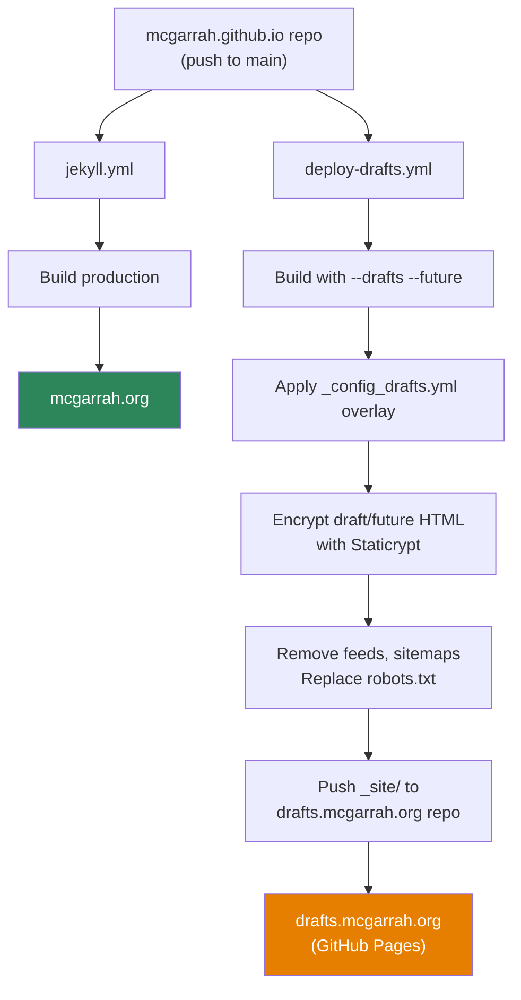

In [Part 1](/jekyll-draft-preview-site-part-1/), I explored seven options for creating a draft preview site and eliminated most of them. The survivor: a separate GitHub repo with Staticrypt encryption, automated via GitHub Actions, served at `drafts.mcgarrah.org`.

Now it's time to design the actual implementation. This is where the interesting problems show up.

<!-- excerpt-end -->

This is Part 2 of a three-part series:
- **Part 1**: [Exploring every option I considered](/jekyll-draft-preview-site-part-1/)
- **Part 2** (this post): Refining the design — config, workflow, feedback, and gaps
- **Part 3**: [The complete implementation](/jekyll-draft-preview-site-part-3/)

## The Architecture

The production site and drafts site share the same source but build differently:



One push to `main` triggers both workflows. The production site builds normally. The drafts site builds with everything visible, encrypts only draft and future post pages, and pushes to a separate repo.

## The Config Overlay

Jekyll supports multiple config files merged left-to-right. A `_config_drafts.yml` overlay in the main repo overrides production values without touching `_config.yml`:

```yaml
url: "https://drafts.mcgarrah.org"
canonical_url: "https://drafts.mcgarrah.org"
baseurl: ""
draft_preview_site: true
main_site_url: "https://mcgarrah.org"

# Disable production tracking and ads on the drafts preview site.
google_analytics: ""
google_adsense: ""
google_cse_id: ""

# Redirect Giscus comments to the drafts repo
giscus:
  repo: mcgarrah/drafts.mcgarrah.org
  repo_id: "<drafts-repo-id>"
  category: "Draft Reviews"
  category_id: "<category-id>"
  mapping: pathname
  strict: 0
  reactions_enabled: 1
  emit_metadata: 0
  input_position: top
  theme: preferred_color_scheme
  lang: en
  loading: lazy

# Mark every rendered page as noindex on the drafts site.
defaults:
  - scope:
      path: ""
    values:
      noindex: true
```

A few things to note:
- `draft_preview_site: true` and `main_site_url` power the preview banner (covered below)
- The `defaults:` block sets `noindex: true` on every page site-wide, which the layout picks up as `<meta name="robots" content="noindex, follow">` — this is the primary defense against search engine indexing
- `google_cse_id` is blanked to disable the custom search engine on the preview site

Build command:

```bash
bundle exec jekyll build --drafts --future --config _config.yml,_config_drafts.yml
```

Jekyll merges configs left-to-right, so `_config_drafts.yml` overrides the production values without touching `_config.yml`.

## The Feedback Problem

The whole point of a drafts site is getting feedback. But how?

### Why Production Giscus Won't Work

The production site uses [Giscus](https://giscus.app/) for comments, configured against `mcgarrah/mcgarrah.github.io` with `data-mapping="pathname"`. If I use the same config on the drafts site:

- Comments would land in the **production repo's** GitHub Discussions
- Draft feedback would mix with real comments on published posts
- When a draft is promoted to `_posts/`, the pathname changes — orphaning any feedback left on the draft URL

### The Solution: Giscus on the Drafts Repo

Enable GitHub Discussions on the `drafts.mcgarrah.org` repo with a "Draft Reviews" category. Point Giscus at that repo via the config overlay. This gives:

- Per-post threaded comments with the same familiar Giscus UI
- Feedback stays completely separate from production comments
- When a post graduates from `_drafts/` to `_posts/`, the draft comments stay behind — they served their purpose
- Reviewers need a GitHub account (fine for my audience)

One concern worth testing: Staticrypt decrypts the page in-browser, and the Giscus `<script>` tag lives inside the encrypted HTML. It should load after decryption since the browser parses the decrypted DOM — but I'll verify this in Part 3.

## Staticrypt: The Details That Matter

### Navigation Between Pages

This is the biggest UX concern. Staticrypt encrypts each HTML file independently. Click a link → new page → new password prompt. Every. Single. Click.

The fix: `--remember 30` stores the decryption key in `localStorage`. After entering the password once, subsequent pages decrypt automatically for 30 days. But if a reviewer's browser blocks `localStorage` or they clear it, they're back to typing the password on every page.

This needs thorough testing before sharing with reviewers.

### What Staticrypt Doesn't Encrypt

Only `.html` files get encrypted. Everything else is served in the clear:

- Images in `/assets/images/`
- PDFs in `/assets/pdfs/`
- CSS, JavaScript, fonts
- `feed.xml` — **this leaks draft content as plain text**
- `sitemap.xml` — leaks the URL structure

The workflow must delete `feed.xml`, `sitemap.xml`, and `sitemapindex.xml` after the Jekyll build. Images being accessible by direct URL is low risk — nobody is guessing image paths for unpublished posts.

### Is Staticrypt Even Necessary?

Given that the source markdown is public on GitHub, Staticrypt is a UX signal, not real security. It says "this is a private preview" and prevents casual browsing. A determined person could read the raw markdown on GitHub instead.

I'm keeping it because:
- It's one line in the build pipeline
- The password prompt sets clear expectations for reviewers
- It blocks web scrapers that ignore `robots.txt`
- It can be removed anytime without changing anything else

If it turns out to be more friction than value, I'll drop it and fall back to the no-auth approach.

## The Visual Banner

Reviewers need to know they're on the preview site, not production. A Liquid conditional in the layout handles this:

```html

<div style="background:#e67e00;color:#fff;text-align:center;padding:0.5em 1em;font-size:0.9em;font-weight:bold;">
  ⚠ DRAFT PREVIEW SITE — unpublished content, may change.
  <a href="{{ site.main_site_url }}" style="color:#fff;text-decoration:underline;margin-left:0.5em;">Go to the main site →</a>
</div>

```

This renders only when `draft_preview_site: true` is set in `_config_drafts.yml`, so it's invisible on production. The link back to the main site gives reviewers a quick way to compare draft content against what's already published.

## DNS and GitHub Pages Routing

The subdomain needs a CNAME record in Porkbun:

```
drafts.mcgarrah.org  CNAME  mcgarrah.github.io.
```

Wait — `mcgarrah.github.io` already points to the production site. How does GitHub know which repo to serve?

The DNS CNAME points to GitHub's *apex domain* (`mcgarrah.github.io.`), not directly to the new repo. GitHub then uses the `CNAME` *file* inside each repo to route the request. This is how multiple repos under one account can each have their own custom domains.

GitHub Pages routes by `Host` header:
1. Browser requests `drafts.mcgarrah.org`
2. DNS resolves to GitHub's IPs (via the CNAME pointing to `mcgarrah.github.io.`)
3. GitHub receives the request with `Host: drafts.mcgarrah.org`
4. GitHub searches all repos under the account for a `CNAME` file containing `drafts.mcgarrah.org`
5. Finds `mcgarrah/drafts.mcgarrah.org` with matching `CNAME`
6. Serves that repo's content

The `CNAME` file is the routing key. The workflow creates it automatically during deployment.

The subdomain approach also gives us a separate cookie and `localStorage` scope from the production site. This matters for Staticrypt's `--remember` feature — the decryption key stored in `localStorage` on `drafts.mcgarrah.org` is invisible to JavaScript on `mcgarrah.org`, keeping the two sites cleanly isolated.

## The Workflow Sketch

This lives in the main repo as `.github/workflows/deploy-drafts.yml`. Here's the high-level structure — the real workflow evolved significantly during implementation (covered in Part 3), but this captures the design intent:

1. **Build** — Jekyll with `--drafts --future` and the config overlay
2. **Encrypt** — Staticrypt on draft and future post pages only (not the full site)
3. **Clean** — Replace `robots.txt`, remove feeds/sitemaps, strip feed discovery links from HTML
4. **Filter** — Remove oversized binaries from deploy output
5. **Deploy** — Push to the drafts repo via PAT

Two secrets needed:
- `DRAFTS_PASSWORD` — the shared Staticrypt password
- `DRAFTS_DEPLOY_TOKEN` — a GitHub PAT with `repo` scope for cross-repo push

The drafts repo needs GitHub Pages configured to "Deploy from a branch" → `main` → `/ (root)`. A concurrency group ensures only one drafts deployment runs at a time.

One setup trap: an empty repo has no `main` branch yet, so GitHub Pages setup fails until the repo has an initial commit. Initialize the repo with a `README.md` or create any file before trying to configure Pages.

## Remaining Gaps

### Public vs Private Drafts Repo

The `drafts.mcgarrah.org` repo is a deployment target — it contains only built HTML (encrypted if using Staticrypt). Should it be public or private?

- **Public**: Free GitHub Pages. The HTML is encrypted. The repo has no source code of value.
- **Private**: Requires GitHub Pro ($4/mo) for private repo Pages.

Leaning public. The source is already public in the main repo. Encrypting the rendered HTML in a private repo adds no real security.

### Full Site Mirror

The build includes the **entire site** — all 139+ published posts plus drafts and future posts. Reviewers see the full context of where a draft fits in the archive. Building only draft posts would require a custom Jekyll plugin and isn't worth the complexity.

### Absolute Links in Content

Draft posts that hardcode `https://mcgarrah.org/some-post/` will link to production, not the drafts site. The `url` override in `_config_drafts.yml` handles Liquid's `{{ site.url }}` references, but hardcoded URLs in markdown won't be rewritten. I should use relative links (`/some-post/`) in drafts — which is good practice anyway.

### Resume Sub-Site

The resume lives in a separate repo and builds independently. Links to `/resume/` from the drafts site will 404 or redirect to production. That's fine — reviewers don't need the resume.

### Build Frequency

Two Jekyll builds per push to `main`. Both run in a public repo, so GitHub Actions minutes are unlimited. Total build time for the drafts workflow (Jekyll + Staticrypt on ~140 posts) should be 2-4 minutes.

## Open Questions

A few things I still need to decide before implementation:

1. **Staticrypt yes or no?** — Leaning yes for the UX signal, but willing to drop it if the navigation friction is too high.
2. **Update frequency** — Every push to `main`, or only on-demand via `workflow_dispatch`? Starting with every push seems right.
3. **Feedback mechanism** — Giscus on the drafts repo is the plan, but I need to test it with Staticrypt. Fallback: a mailto link in the draft banner.
4. **Drafts repo visibility** — Leaning public. No real reason to pay for private.

## What's Next

Part 3 will cover the actual implementation — creating the repo, configuring DNS, the final workflow with all the edge cases I hit, Staticrypt testing results, and what I learned from the whole process.

---

*This is Part 2 of a three-part series on building a Jekyll draft preview site:*
- **Part 1**: [Exploring every option I considered](/jekyll-draft-preview-site-part-1/)
- **Part 2** (this post): Refining the design — config, workflow, feedback, and gaps
- **Part 3**: [The complete implementation](/jekyll-draft-preview-site-part-3/)
