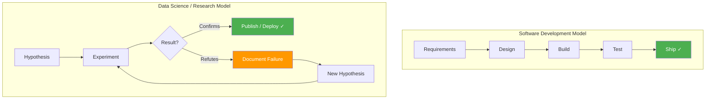
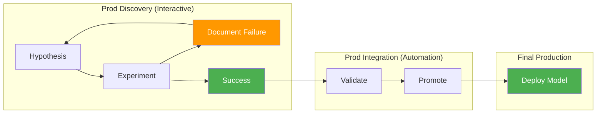

In my previous article on [Five Stages of a Cloud Data Science Platform](/five-stages-cloud-data-science-platform/), I addressed the infrastructure question: how do you give data scientists production data access without compromising your security posture? That article solved the platform architecture problem. This one addresses the operational model problem that sits on top of it.

The core issue: most organizations manage data science teams using software development processes. Sprint planning, story points, predictable delivery timelines, definition of done. And it fails — not because the data scientists are bad at their jobs, but because the work itself follows a fundamentally different success model.

<!-- excerpt-end -->

## The Success Rate Problem

Good software development succeeds more than 4 out of 5 times. You gather requirements, design a solution, build it, test it, ship it. The outcome is predictable. When a sprint fails, something went wrong — a missed requirement, a technical blocker, a scope change.

Good data science succeeds less than 1 out of 5 times. You form a hypothesis about what patterns exist in the data, design an experiment to test it, run the experiment, and discover that your hypothesis was wrong. This is not failure — this is the process working correctly. The 4 out of 5 "failures" are valuable because they eliminate hypotheses and narrow the search space.

When you apply the software development model to data science, the 80% "failure" rate looks like a team performance problem. Managers ask why the team is not delivering. Stakeholders lose confidence. The team starts gaming metrics — reporting incremental progress on doomed approaches rather than honestly documenting failures and pivoting.

## Academic Research as the Correct Model

Academic research has solved this problem for centuries. The model is:

1. **Form a hypothesis** based on existing knowledge and available data
2. **Design an experiment** that can confirm or refute the hypothesis
3. **Execute the experiment** with rigorous methodology
4. **Document the result** — whether it confirms or refutes the hypothesis
5. **Publish** — both successes and failures contribute to the field's knowledge

The critical insight: **documented failure is a first-class output.** A paper that demonstrates "approach X does not work for problem Y under conditions Z" is publishable, citable, and valuable. It prevents the next researcher from wasting time on the same dead end.

Data science in an enterprise context should work the same way:

- A model that does not improve on the baseline is not a failed sprint — it is a documented experiment that narrows the solution space
- Feature engineering that does not improve model performance is not wasted work — it is evidence about what the data does and does not contain
- A hypothesis about customer behavior that the data refutes is not a missed deadline — it is organizational learning

## What This Means for Platform Engineering

The [five-stage platform framework](/five-stages-cloud-data-science-platform/) I described previously provides the infrastructure. But the operational model determines how that infrastructure is used:

**Prod Discovery** is the research lab — where hypotheses are tested, experiments run, and failures documented. The interactive environment exists because research is iterative and exploratory. You cannot plan a sprint around "discover something useful in this dataset."

**Prod Integration** is where confirmed results get automated — the successful experiment becomes a reproducible pipeline. This is where the software development model applies: you have a known-good approach and you are engineering it for production reliability.

**Final Production** is deployment — the model serves customers.

The key architectural insight: the research model operates in Discovery, and the software development model operates in Integration and Production. Trying to apply one model across all three stages is the root cause of most DS team dysfunction.

## Documenting Failure as Organizational Knowledge

In academia, you publish your failures. In enterprise data science, you need the equivalent: a knowledge base of attempted approaches, their results, and the conditions under which they were tested.

This matters for three reasons:

1. **Preventing duplicate work** — when a new data scientist joins the team, they should not spend three months rediscovering that approach X does not work for problem Y. The documentation should tell them immediately.
2. **Revisiting failures when conditions change** — an approach that failed with last year's data volume may succeed with this year's. An approach that failed before a new data source was available may succeed now. But only if the failure conditions are documented.
3. **Justifying investment** — when leadership asks "what has the DS team produced?", the answer should include the search space that was eliminated, not just the models that shipped. Narrowing from 100 possible approaches to 5 viable ones is measurable progress.

## The Management Implications

If you are leading a data science organization — or evaluating one — the operational model determines your success metrics:

| Metric | SD Model (Wrong for DS) | Research Model (Correct for DS) |
|--------|------------------------|-------------------------------|
| Success rate | "Why are we only shipping 20% of what we start?" | "We eliminated 80% of the hypothesis space this quarter" |
| Timeline | "This model was supposed to ship in Sprint 4" | "We have 3 documented experiments; the 4th shows promise" |
| Team performance | "The team is not delivering" | "The team is systematically narrowing the solution space" |
| Documentation | "Update the Jira ticket" | "Publish the experiment notebook with results and conditions" |
| Failure | "What went wrong?" | "What did we learn?" |

The organizations that get this right — Google Brain, DeepMind, Meta FAIR — all operate on the research model internally. They publish papers about what did not work. They celebrate negative results that save future effort. They measure progress in knowledge gained, not just models shipped.

## Connecting the Pieces

This article and the [Five Stages platform framework](/five-stages-cloud-data-science-platform/) are two halves of the same argument:

- **Five Stages** answers: "How do you give data scientists the infrastructure they need?" (production data access with security controls)
- **Research Model** answers: "How do you manage data scientists once they have that infrastructure?" (hypothesis-driven experimentation with documented failure as a first-class output)

Together, they form the foundation for building an AI organization that can sustain long-term investment in ML — not just ship one model, but systematically build organizational capability in machine learning.

The platform without the operational model produces expensive infrastructure that frustrated data scientists underutilize. The operational model without the platform produces brilliant hypotheses that can never be tested against real data. You need both.

## Implications for AI Leadership

If you are building or evaluating an AI organization:

- **Staff for research, not just engineering.** Data scientists with research backgrounds understand the failure model intuitively. Engineers retrained as data scientists often struggle with the ambiguity.
- **Budget for exploration, not just delivery.** A DS team that must justify every experiment with a business case will only pursue safe, incremental work. The breakthrough insights come from exploratory work that might fail.
- **Measure knowledge, not just output.** The documented experiment notebooks — including failures — are the team's intellectual property. They represent the accumulated understanding of what works and what does not for your specific data and business.
- **Separate the research phase from the engineering phase.** Discovery is research. Integration is engineering. Do not apply engineering management to research work, or research timelines to engineering work.

The EMBA coursework I am completing has a useful framing for this: it is a portfolio management problem. You invest across a portfolio of hypotheses knowing that most will not pay off — but the ones that do will more than compensate for the failures. The same logic that makes venture capital work makes data science work. You just need the organizational patience to let the portfolio mature.

## The Numbers Behind the Argument

The industry failure rate for AI and Machine Learning projects validates this thesis empirically. The 80–95% failure rate is not a technology problem — it is a methodology problem.

| Metric | Finding | Source |
|--------|---------|--------|
| Overall ROI failure | 95% of corporate generative AI pilots failed to deliver measurable P&L impact | MIT Sloan / NANDA (2025) |
| Production deployment failure | 80–85% of enterprise AI initiatives never reach full production | RAND Corporation, Gartner |
| Pilot attrition | ~20% progress to pilot; fewer than 5% deploy with sustained value | Industry composite |
| Abandonment costs | 42% of U.S. companies abandoned at least one major AI initiative; average $7.2M sunk cost per project | Enterprise tracking (2025) |
| Infrastructure scaling | 64% of scaling failures attributed to infrastructure; production costs average 380% higher than pilot projections | Industry post-mortems |

The RAND Corporation's technical report identifies the core drivers: data architecture mismatch (models trained on curated data fail on messy production data), infrastructure scaling walls (cost and latency), and strategic misalignment (horizontal AI tools yielding low macro-level ROI). Critically, failure is rarely caused by a flaw in the foundational models — it stems from treating data science like traditional software development.

The classic Google paper "Hidden Technical Debt in Machine Learning Systems" (Sculley et al.) proves the point architecturally: actual ML model code constitutes only a small fraction of a production system. The rest is configuration, data collection, feature extraction, and verification infrastructure — all of which require the research model's iterative approach rather than the SDLC's linear delivery model.

### References

1. RAND Corporation — [Identifying and Mitigating the Risks of AI](https://www.rand.org/pubs/research_reports/RRA2680-1.html)
2. MIT Sloan / NANDA — [Why 95% of AI Pilots Fail](https://fortune.com/2025/08/21/an-mit-report-that-95-of-ai-pilots-fail-spooked-investors-but-the-reason-why-those-pilots-failed-is-what-should-make-the-c-suite-anxious/)
3. RAND Corporation Technical Report — [Full PDF](https://www.rand.org/content/dam/rand/pubs/research_reports/RRA2600/RRA2680-1/RAND_RRA2680-1.pdf)
4. Sculley et al. — "Hidden Technical Debt in Machine Learning Systems" (NeurIPS 2015)
5. Gartner — Enterprise AI deployment failure rates (2024–2025 reports)
6. Forbes — [Why 95% of AI Projects Fail](https://www.forbes.com/sites/garydrenik/2025/10/15/why-95-of-ai-projects-fail-and-how-better-data-can-change-that/)

## Where I Have Seen This Play Out

The research-vs-SDLC conflict is not abstract to me. I have watched it manifest across every organization where data science and software engineering coexist:

- **USPS (2017–2019)** — Data Engineer working directly with the Chief Data Scientist and his team on the Data Science Initiative (DSI) for all of USPS. Administered a 25-node SAS Viya in-memory analytics cluster (26TB RAM) connected to a 50+ node Hadoop data lake approaching 1PB, operating on a closed network under NIST 800-53 high security controls with DEA data hosted. Built custom data acquisition modules that gave the data science team access to production-quality geospatial and operational datasets they could not obtain from existing sources. The environment was the research model in practice — data scientists iterating on hypotheses about mail delivery optimization, package routing, and operational efficiency — while the production systems serving 160 million delivery points daily ran on the SDLC model. The two tracks coexisted because the platform architecture separated them.

- **Measurement Incorporated (2013–2015)** — Where I first witnessed the conflict without a name for it. PhD researchers iterating on NLP models (research model) while the production scoring system served millions of assessments (SDLC model). The chaos of not separating these tracks is what motivated the five-stage framework.

- **BCBSNC (2019–2021)** — Where the separation was designed in from day one. CarePath data scientists explored hypotheses in their EKS-based research environment while the production inference pipeline ran independently with automated promotion gates.

- **Envestnet (2021–present)** — The mature implementation. SageMaker and Bedrock workloads operate in dedicated accounts with clear boundaries between exploration (Discovery) and production (automated pipelines via Airflow). The DataLake's vEMR treats data promotion as a first-class engineering discipline.
