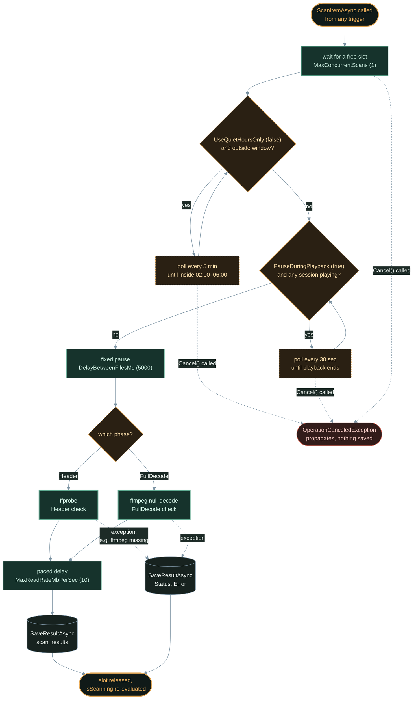
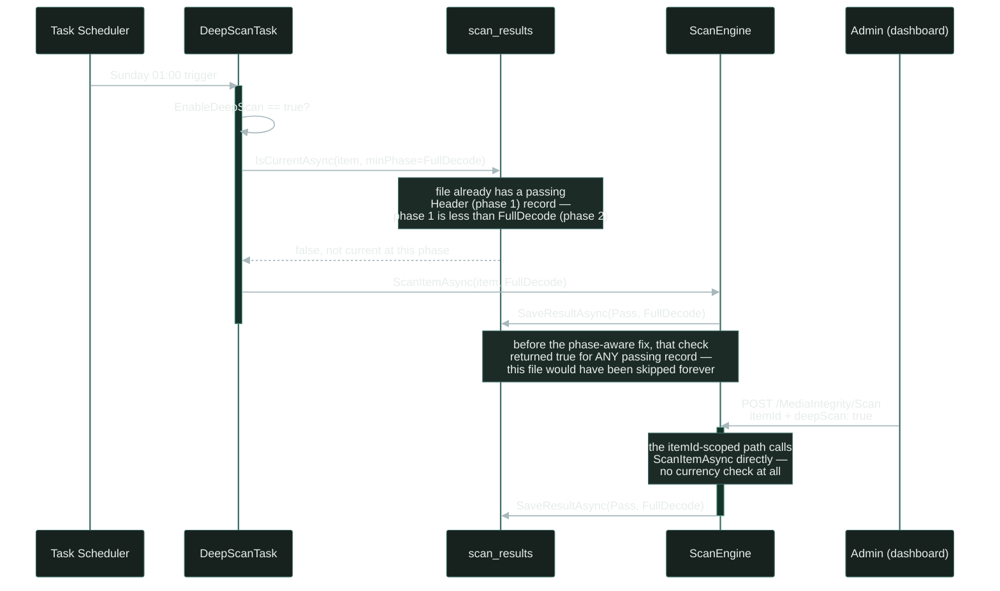

The [architecture article](/jellyfin-media-integrity-architecture-design/) laid out the design decisions — two-phase scanning, I/O throttling, SQLite persistence, event-driven updates. This article implements the core: the plugin skeleton, FFmpeg integration, and the bounded scan engine.

<!-- excerpt-end -->

This is Part 3 of the [Jellyfin Media Integrity Scanner](/jellyfin-media-integrity-scanner-introduction/) development series. The scanner core described below is real, shipped code, not a target design, built and tested against a dedicated Proxmox LXC container running .NET 9 and `jellyfin-ffmpeg` alongside GitHub Actions CI. A few things evolved from the version shown here as testing surfaced real gaps: the FFmpeg process wrapper now drains stdout/stderr concurrently with process exit, to avoid an OS pipe-buffer deadlock on large stderr output, and kills the process tree on cancellation instead of leaving orphaned ffmpeg processes; `IsScanning` is tracked with `Interlocked` counters rather than a semaphore-count comparison; and the scan engine gained two pacing mechanisms not shown below — a quiet-hours window and a post-scan read-rate throttle, covered in the [Scan Pacing update](#update-quiet-hours-and-read-rate-throttling) further down.

## Project Structure

Following the [jellyfin-plugin-template](https://github.com/jellyfin/jellyfin-plugin-template) pattern:

```
jellyfin-plugin-media-integrity-scanner/
├── Jellyfin.Plugin.MediaIntegrityScanner/
│   ├── Plugin.cs                    # Plugin entry point
│   ├── PluginConfiguration.cs       # User-configurable settings
│   ├── ScheduledTasks/
│   │   ├── HeaderScanTask.cs        # Phase 1 scheduled task
│   │   └── DeepScanTask.cs          # Phase 2 scheduled task
│   ├── Scanner/
│   │   ├── IScanEngine.cs           # Scanner interface
│   │   ├── ScanEngine.cs            # Bounded, throttled scan orchestrator
│   │   ├── FfmpegWrapper.cs         # FFmpeg/ffprobe process management
│   │   ├── FfmpegResolver.cs        # Cross-platform binary resolution
│   │   └── ScanResult.cs            # Result model
│   ├── Data/
│   │   ├── IDatabaseManager.cs      # Database interface
│   │   ├── SqliteDatabaseManager.cs # SQLite implementation
│   │   └── Models/
│   │       └── ScanRecord.cs        # Database entity
│   ├── EventHandlers/
│   │   └── LibraryMonitor.cs        # ItemAdded/Removed hooks
│   ├── Api/
│   │   └── MediaIntegrityController.cs  # REST API
│   └── Web/
│       └── integrity_dashboard.html # Admin UI
├── Jellyfin.Plugin.MediaIntegrityScanner.csproj
├── Jellyfin.Plugin.MediaIntegrityScanner.sln
├── Directory.Build.props
├── .github/workflows/build.yml
└── manifest.json
```

## Plugin Entry Point

Every Jellyfin plugin extends `BasePlugin<TConfiguration>`, and Jellyfin constructs it once at startup via DI. A lot of this plugin's *other* classes — `ScanEngine`, the scheduled tasks, the API controller — reach back into it through a static `Instance` property rather than getting `PluginConfiguration` injected directly, since Jellyfin's container doesn't thread plugin config through to every consumer on its own:

```csharp
public class Plugin : BasePlugin<PluginConfiguration>, IHasWebPages
{
    public Plugin(IApplicationPaths applicationPaths, IXmlSerializer xmlSerializer)
        : base(applicationPaths, xmlSerializer)
    {
        Instance = this;
    }

    public static Plugin? Instance { get; private set; }
    public override Guid Id => Guid.Parse("c8f4a3b2-1d5e-4f6a-9b7c-2e8d0f1a3b5c");

    public IEnumerable<PluginPageInfo> GetPages() => new[]
    {
        new PluginPageInfo
        {
            Name = "Media Integrity",
            EmbeddedResourcePath = GetType().Namespace + ".Web.integrity_dashboard.html"
        }
    };
}
```

`GetPages()` is what makes the admin dashboard show up under Dashboard → Plugins at all — Jellyfin sees `IHasWebPages` and serves each `EmbeddedResourcePath` as a config page (it later grew a second entry for the settings page; see the [dashboard article's update](/jellyfin-media-integrity-dashboard-api/#update-a-real-settings-page)). The `Id` GUID has to match `manifest.json` exactly, or Jellyfin treats an upgrade as installing an unrelated plugin.

Full file: [`Plugin.cs`](https://github.com/mcgarrah/jellyfin-plugin-media-integrity-scanner/blob/main/Jellyfin.Plugin.MediaIntegrityScanner/Plugin.cs).

## Plugin Configuration

`PluginConfiguration` is a plain settings bag — Jellyfin serializes it to XML on disk and, later, exposes it to an in-app settings page (see the [dashboard article](/jellyfin-media-integrity-dashboard-api/#update-a-real-settings-page)). The fields fall into a few groups; here's the scanning-related subset:

```csharp
public class PluginConfiguration : BasePluginConfiguration
{
    // Scanning behavior
    public int MaxConcurrentScans { get; set; } = 1;
    public int DelayBetweenFilesMs { get; set; } = 5000;
    public bool PauseDuringPlayback { get; set; } = true;
    public bool EnableDeepScan { get; set; } = false;

    // Throttling / scheduling
    public int MaxReadRateMbPerSec { get; set; } = 10;
    public bool UseQuietHoursOnly { get; set; } = false;
    public string QuietHoursStart { get; set; } = "02:00";
    public string QuietHoursEnd { get; set; } = "06:00";

    // FFmpeg path overrides, event-driven scan toggles...
}
```

None of these fields *do* anything by themselves — they're read by whoever cares. `MaxConcurrentScans` only matters because `ScanEngine`'s constructor sizes a `SemaphoreSlim` from it; `UseQuietHoursOnly`/`QuietHoursStart`/`QuietHoursEnd` only matter because `ScanThrottle.IsWithinQuietHours` checks them (see the [pacing update](#update-quiet-hours-and-read-rate-throttling) below). The real file has grown a second set of fields since — update-channel and manifest-URL settings for the [v0.1.1 update checker](/jellyfin-media-integrity-release-and-updates/) — omitted here since they're unrelated to the scanner core.

Full file: [`PluginConfiguration.cs`](https://github.com/mcgarrah/jellyfin-plugin-media-integrity-scanner/blob/main/Jellyfin.Plugin.MediaIntegrityScanner/PluginConfiguration.cs).

## FFmpeg Binary Resolution

Jellyfin ships its own bundled `jellyfin-ffmpeg`, but this plugin can't assume it's on `PATH`, or even that the admin is running the packaged build. `FfmpegResolver` tries four things in order, falling through only if the previous one comes up empty:

1. **A user-configured override** (`FfmpegPathOverride`/`FfprobePathOverride`) — respected first, so an admin can always pin a specific build.
2. **Jellyfin's own configured ffmpeg path** (`IServerConfigurationManager.GetEncodingOptions().EncoderAppPath`) — the server already resolved this once for its own transcoding, so reuse it instead of asking the admin to configure the same path twice.
3. **Known install locations per OS** — `/usr/lib/jellyfin-ffmpeg/ffmpeg` on Linux, the Jellyfin Server folder on Windows, Homebrew's prefix on macOS.
4. **A plain `PATH` lookup**, the same way a shell would find it.

```csharp
public string ResolveFfmpegPath() =>
    ResolveBinary("ffmpeg", Plugin.Instance?.Configuration?.FfmpegPathOverride);

private string ResolveBinary(string binaryName, string? userOverride)
{
    if (!string.IsNullOrEmpty(userOverride) && File.Exists(userOverride))
    {
        return userOverride;
    }

    var serverFfmpeg = _config.GetEncodingOptions().EncoderAppPath;
    // ... then platform-specific candidates, then a PATH lookup ...

    throw new InvalidOperationException(
        $"{binaryName} not found. Install ffmpeg or configure the path in Media Integrity Scanner settings.");
}
```

If all four come up empty, it throws rather than silently disabling scanning — a scanner that can't run ffmpeg has no useful degraded mode. `ResolveFfprobePath` shares the exact same `ResolveBinary` helper, just parameterized on `"ffprobe"` and its own override field.

Full file: [`Scanner/FfmpegResolver.cs`](https://github.com/mcgarrah/jellyfin-plugin-media-integrity-scanner/blob/main/Jellyfin.Plugin.MediaIntegrityScanner/Scanner/FfmpegResolver.cs).

## The Scan Engine

`ScanEngine` is the one choke point every trigger — library events, scheduled tasks, manual API calls — eventually calls into, which is what makes "bounded" and "thread-safe" actual guarantees rather than just words: a `SemaphoreSlim` sized to `MaxConcurrentScans` gates every concurrent scan through the same instance, no matter what kicked it off.

```csharp
public ScanEngine(FfmpegWrapper ffmpeg, IDatabaseManager db, ISessionManager sessions, ILogger<ScanEngine> logger)
{
    var maxConcurrent = Plugin.Instance?.Configuration?.MaxConcurrentScans ?? 1;
    _scanLock = new SemaphoreSlim(maxConcurrent);
}

public async Task ScanItemAsync(BaseItem item, ScanPhase phase, CancellationToken cancellationToken)
{
    await _scanLock.WaitAsync(cancellationToken);
    try
    {
        if (ShouldPauseForPlayback())
        {
            await WaitForPlaybackEnd(cancellationToken);
        }

        var delay = Plugin.Instance?.Configuration?.DelayBetweenFilesMs ?? 5000;
        await Task.Delay(delay, cancellationToken);

        var result = phase switch
        {
            ScanPhase.Header => await _ffmpeg.ProbeAsync(item.Path, cancellationToken),
            ScanPhase.FullDecode => await _ffmpeg.DecodeAsync(item.Path, cancellationToken),
            _ => throw new ArgumentException($"Unknown phase: {phase}")
        };

        await _db.SaveResultAsync(new ScanRecord { /* item id, path, phase, pass/fail, duration ... */ });
    }
    finally
    {
        _scanLock.Release();
    }
}
```

Every scan takes a slot, checks whether it should pause for active playback, applies the configured inter-file delay, runs the right ffmpeg phase, then persists the result — always in that order, whether it came from a scheduled task or a dashboard button. `ShouldPauseForPlayback`/`WaitForPlaybackEnd` and `Dispose` are omitted above for length; the full gate pipeline — including the quiet-hours window and read-rate throttle added later — is diagrammed further down in this article.

Full file: [`Scanner/ScanEngine.cs`](https://github.com/mcgarrah/jellyfin-plugin-media-integrity-scanner/blob/main/Jellyfin.Plugin.MediaIntegrityScanner/Scanner/ScanEngine.cs).

## FFmpeg Process Wrapper

`FfmpegWrapper` is the only place that actually shells out to ffmpeg/ffprobe. `ProbeAsync` is Phase 1 — ffprobe reading container/stream metadata, cheap and fast. `DecodeAsync` is Phase 2 — a full ffmpeg decode with `-f null -` (decode every frame, write nowhere), expensive but able to catch mid-file frame corruption a header check can't see. Both funnel through the same process runner:

```csharp
public async Task<ScanResult> ProbeAsync(string filePath, CancellationToken ct)
{
    var args = "-v error -show_entries format=duration,size " +
               "-show_entries stream=codec_type,codec_name -of json \"" + filePath + "\"";
    var (exitCode, _, stderr) = await RunProcessAsync(_ffprobePath, args, ct);
    return new ScanResult { Success = exitCode == 0 && string.IsNullOrWhiteSpace(stderr), ErrorOutput = stderr };
}
```

`DecodeAsync` has the same shape, just against `ffmpeg -v error -i "<file>" -f null -`. The real `RunProcessAsync` (not shown) redirects stdout/stderr and drains both *concurrently* with the process exit — an earlier version awaited them sequentially after `WaitForExitAsync`, which deadlocks once a large stderr stream fills the OS pipe buffer — and kills the whole process tree on cancellation, so a cancelled deep scan doesn't leave an orphaned ffmpeg process running against a file nobody's waiting on anymore.

Full file: [`Scanner/FfmpegWrapper.cs`](https://github.com/mcgarrah/jellyfin-plugin-media-integrity-scanner/blob/main/Jellyfin.Plugin.MediaIntegrityScanner/Scanner/FfmpegWrapper.cs).

## Scheduled Task Registration

Jellyfin discovers `IScheduledTask` implementations via DI and lists them under Dashboard → Scheduled Tasks automatically — `Name`/`Key`/`Category` are what show up there, and `GetDefaultTriggers()` is only the *default*; an admin can reconfigure the schedule from that same page.

```csharp
public class HeaderScanTask : IScheduledTask
{
    public string Name => "Media Integrity - Header Scan";
    public string Category => "Media Integrity";

    public IEnumerable<TaskTriggerInfo> GetDefaultTriggers() => new[]
    {
        new TaskTriggerInfo { Type = TaskTriggerInfoType.DailyTrigger, TimeOfDayTicks = TimeSpan.FromHours(3).Ticks }
    };

    public Task ExecuteAsync(IProgress<double> progress, CancellationToken cancellationToken) =>
        _scanner.ScanLibraryAsync(null, ScanPhase.Header, cancellationToken, progress);
}
```

`DeepScanTask` is the same shape, wired to a weekly Sunday trigger and `ScanPhase.FullDecode` instead, and only runs at all if `EnableDeepScan` is on. Both tasks just delegate straight into `ScanEngine`, so a scheduled sweep and a manual "scan library" API call walk the exact same gating logic described above — there's no separate scheduled-task-only code path to keep in sync. (An earlier version of this loop lived directly in the task and had its own concurrency bug — see the [MaxConcurrentScans update](#update-maxconcurrentscans-wasnt-honored-by-bulk-scans) below.)

Full file: [`ScheduledTasks/HeaderScanTask.cs`](https://github.com/mcgarrah/jellyfin-plugin-media-integrity-scanner/blob/main/Jellyfin.Plugin.MediaIntegrityScanner/ScheduledTasks/HeaderScanTask.cs).

## Update: Quiet Hours and Read-Rate Throttling

The [deployment article](/jellyfin-media-integrity-deployment-operations/) recommends specific `MaxReadRateMbPerSec` and `UseQuietHoursOnly`/`QuietHoursStart`/`QuietHoursEnd` values for CephFS and NFS backends. Those config fields existed from the start, but nothing actually enforced them — a gap caught during a later review pass. Two additions to `ScanEngine` close it:

```csharp
public static class ScanThrottle
{
    // Supports windows that wrap past midnight (e.g., 22:00-06:00).
    // Fails open (returns true) if either bound can't be parsed.
    public static bool IsWithinQuietHours(string? start, string? end, TimeSpan timeOfDay) { /* ... */ }

    // Pads wall-clock time after a scan so the average MB/s for that
    // file doesn't exceed the configured cap.
    public static TimeSpan ComputeReadRateDelay(long fileSizeBytes, int maxReadRateMbPerSec, int actualDurationMs) { /* ... */ }
}
```

`ScanItemAsync` checks `IsWithinQuietHours` before scanning (waiting in a loop if outside the window, same pattern as the existing playback-pause check), and calls `ComputeReadRateDelay` after each scan to pad the inter-file gap so the *average* rate for that file doesn't exceed the cap.

The read-rate throttle is deliberately **not** a literal in-flight byte cap. An earlier design considered piping the file through ffmpeg's stdin (`pipe:0`) to get precise control over read bytes/sec, but that breaks seekability — and many MP4/MOV files store the `moov` atom at the end of the file, so probing them over a non-seekable pipe produces a false `"moov atom not found"` failure. That's exactly the corruption signature this plugin exists to detect, so a naive throttle could turn healthy files into false positives. Padding wall-clock time after the fact has zero risk to decode correctness, since ffmpeg still opens the file directly and reads at full speed — it only bounds the long-run average throughput the scanner pulls from storage, which is the actual concern behind the CephFS/NFS tuning guidance.

Both functions are pure and dependency-free (no Jellyfin types), so they're covered by a small xUnit test project — see the [deployment article](/jellyfin-media-integrity-deployment-operations/) for the CI wiring.

Stacking all of this on top of the original `ScanItemAsync` gives a longer gate pipeline than the code above suggests — concurrency slot, quiet hours, playback pause, the fixed inter-file delay, the scan itself, then the read-rate throttle:



Every file, whoever triggered its scan, walks this same path — a manually-triggered API scan and a scheduled sweep get no special treatment once they're queued.

## Update: `MaxConcurrentScans` Wasn't Honored by Bulk Scans

The `HeaderScanTask` loop shown above has a subtle bug: it's a plain `foreach` with a single `await` per iteration. `ScanEngine`'s internal `SemaphoreSlim` is sized to `MaxConcurrentScans`, but a sequential loop never asks it for more than one slot at a time — so setting `MaxConcurrentScans` above `1` had no effect on a scheduled or library-wide scan. It only mattered for manual single-item scans issued concurrently from the API, which almost nobody does.

Fixed by switching both scheduled tasks and `ScanEngine.ScanLibraryAsync` to `Parallel.ForEachAsync` with `MaxDegreeOfParallelism` set to the configured value:

```csharp
var maxConcurrent = Math.Max(1, config?.MaxConcurrentScans ?? 1);
await Parallel.ForEachAsync(
    items,
    new ParallelOptions { MaxDegreeOfParallelism = maxConcurrent, CancellationToken = cancellationToken },
    async (item, ct) =>
    {
        if (!await _db.IsCurrentAsync(item.Id.ToString(), item.Path))
        {
            await _scanner.ScanItemAsync(item, ScanPhase.Header, ct);
        }

        var done = Interlocked.Increment(ref processed);
        progress.Report((double)done / total * 100);
    });
```

The semaphore inside `ScanEngine` isn't redundant with this — it's still what keeps a manual single-item scan and a bulk scan from together exceeding the configured limit. This change fixes the half the semaphore alone couldn't: the loop itself never asking for more than one slot. `Interlocked.Increment` replaces the plain `processed++`, since parallel iterations now complete out of order. Default behavior (`MaxConcurrentScans = 1`) is unchanged.

## Update: The Skip Check Didn't Know About Scan Phase

The `IsCurrentAsync(item.Id.ToString(), item.Path)` check in the loop above — "does this item already have a passing scan with an unchanged mtime" — has a bug that took a while to surface: it never looked at *which phase* produced that passing record. Since files are normally Header-scanned first (either on library add or via `HeaderScanTask`), once a file passes that quick check, `IsCurrentAsync` reports it "current" for **any** later request — including a `DeepScanTask` run asking for a full `FullDecode` pass — as long as the file's mtime hasn't changed.

That's a real problem for `DeepScanTask` specifically: its entire purpose is catching mid-file corruption that a header check misses, but it would silently skip almost every file in the library on every scheduled run, forever, because they'd already "passed" at the Header level. The deep scan had likely never actually deep-scanned anything in a real deployment.

Fixed by adding a `minPhase` parameter to `IsCurrentAsync`, requiring `scan_phase >= minPhase` in the underlying query, and passing the right phase at each of the three call sites — `(int)phase` in `ScanLibraryAsync`, `Header` in `HeaderScanTask`, `FullDecode` in `DeepScanTask`. See the [architecture article's incremental-scanning section](/jellyfin-media-integrity-architecture-design/#incremental-scanning-logic) for how this interacts with the schema design.

Here's the failure mode laid out end to end, alongside the one path that was never affected by it — an `itemId`-scoped API call, which bypasses `IsCurrentAsync` entirely:



If `EnableDeepScan` ever seemed to do nothing against a library that had already loaded in cleanly, this was why.

## What's Next

The [next article](/jellyfin-media-integrity-dashboard-api/) adds the admin-facing layer: the REST API controller for querying scan results and triggering scans, and the HTML dashboard that gives at-a-glance library health visibility.

## Series Navigation

1. [Introduction & Problem Statement](/jellyfin-media-integrity-scanner-introduction/)
2. [Architecture & Design Decisions](/jellyfin-media-integrity-architecture-design/)
3. **Building the Scanner Core** (this post)
4. [The Dashboard & API](/jellyfin-media-integrity-dashboard-api/)
5. [Deployment & Operations](/jellyfin-media-integrity-deployment-operations/)
6. [v0.1.1 Release: Update Checker & Auto-Update](/jellyfin-media-integrity-release-and-updates/)
