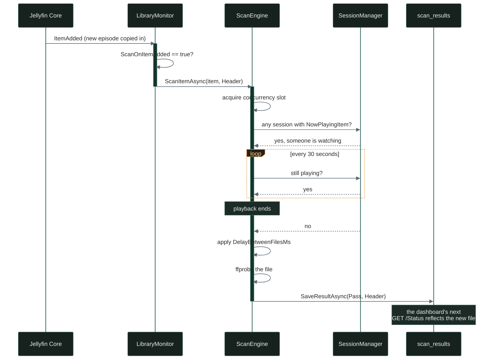

The [scanner core](/jellyfin-media-integrity-scanner-core/) handles the detection work — finding corrupt files and recording results in SQLite. But a scanner that runs silently in the background is only half the solution. Admins need to see what's broken, when it was scanned, and have the ability to trigger scans on demand.

<!-- excerpt-end -->

This is Part 4 of the [Jellyfin Media Integrity Scanner](/jellyfin-media-integrity-scanner-introduction/) development series. The REST API controller and dashboard below are fully implemented and shipping, though two accuracy bugs surfaced during a later review: `GetStatus` originally reported `TotalFiles`/`PendingFiles` straight from the scan-results table, which never reflected the real library size and double-counted items scanned in both phases, and `libraryId` on `GET /Results` was accepted but silently ignored. Both are covered in the [Status Accuracy and Library Filtering update](#update-status-accuracy-and-library-filtering) further down.

## REST API Controller

`MediaIntegrityController` exposes the scan engine over Jellyfin's own ASP.NET Core pipeline. Every route requires the `RequiresElevation` policy (admin-only), and the controller itself stays thin — it wires HTTP verbs to `IScanEngine`/database calls without implementing any scanning logic of its own:

```csharp
[ApiController]
[Route("MediaIntegrity")]
[Authorize(Policy = "RequiresElevation")]
public class MediaIntegrityController : ControllerBase
{
    [HttpGet("Status")]
    public async Task<ActionResult<ScanStatusResponse>> GetStatus() { /* ... */ }

    [HttpGet("Results")]
    public async Task<ActionResult<PagedResultResponse>> GetResults(
        ScanStatus? status, int page = 1, int pageSize = 50, string? libraryId = null) { /* ... */ }

    [HttpGet("Results/{itemId}")]
    public async Task<ActionResult<ItemScanDetail>> GetItemDetail(string itemId) { /* ... */ }

    [HttpPost("Scan")]
    public async Task<ActionResult> TriggerScan([FromBody] ScanRequest request)
    {
        if (_scanner.IsScanning)
        {
            return Conflict("A scan is already in progress.");
        }

        // Fire-and-forget: the request returns immediately and the caller
        // polls GetStatus/GetResults, rather than holding a connection open
        // for a scan that can take hours on a large library.
        _ = Task.Run(() => request.ItemId != null
            ? _scanner.ScanItemAsync(_library.GetItemById(Guid.Parse(request.ItemId)),
                request.DeepScan ? ScanPhase.FullDecode : ScanPhase.Header, CancellationToken.None)
            : _scanner.ScanLibraryAsync(request.LibraryId,
                request.DeepScan ? ScanPhase.FullDecode : ScanPhase.Header, CancellationToken.None));

        return Accepted();
    }

    [HttpPost("Cancel")]
    public ActionResult CancelScan() { _scanner.Cancel(); return Ok(); }
}
```

`TriggerScan`'s early `Conflict` return is the API-level half of the same single-scan-at-a-time guarantee `ScanEngine`'s semaphore already enforces internally (see the [scanner core article](/jellyfin-media-integrity-scanner-core/#the-scan-engine)) — rejecting a second request at the HTTP layer gives an admin an immediate, meaningful `409` instead of a call that silently queues behind the running scan.

Full file: [`Api/MediaIntegrityController.cs`](https://github.com/mcgarrah/jellyfin-plugin-media-integrity-scanner/blob/main/Jellyfin.Plugin.MediaIntegrityScanner/Api/MediaIntegrityController.cs).

### Request/Response Models

```csharp
public class ScanStatusResponse
{
    public bool IsScanning { get; set; }
    public int TotalFiles { get; set; }
    public int PassedFiles { get; set; }
    public int FailedFiles { get; set; }
    public double HealthPercentage { get; set; }
}

public class ScanRequest
{
    public string? ItemId { get; set; }
    public string? LibraryId { get; set; }
    public bool DeepScan { get; set; } = false;
}
```

Plain DTOs — no behavior, just the shape the dashboard's JavaScript reads and writes. That shape is exactly what's wrong in the [JSON casing bug](#update-the-dashboard-was-reading-the-wrong-json-casing) further down.

## Admin Dashboard

The dashboard is a single embedded HTML page: CSS for a stat-card grid and results table, then vanilla JavaScript that polls the API above and renders it. No framework, no build step — Jellyfin serves the file exactly as committed, via `GetPages()`.

```html
<div class="stats-grid" id="stats-grid">
    <div class="stat-card">
        <div class="stat-label">Library Health</div>
        <div class="stat-value status-pass" id="health-pct">—</div>
    </div>
    <!-- Total Files / Passed / Failed / Pending / Status cards follow the same pattern -->
</div>

<script>
    const API_BASE = ApiClient.getUrl('MediaIntegrity');

    async function loadStatus() {
        const resp = await ApiClient.fetch({ url: API_BASE + '/Status', type: 'GET' });
        const data = JSON.parse(resp);
        document.getElementById('health-pct').textContent = data.healthPercentage + '%';
        document.getElementById('scan-status').textContent = data.isScanning ? 'Scanning...' : 'Idle';
        // ...remaining stat cards set the same way
    }

    async function triggerScan(deep) {
        await ApiClient.fetch({
            url: API_BASE + '/Scan', type: 'POST',
            data: JSON.stringify({ deepScan: deep }), contentType: 'application/json'
        });
        setTimeout(loadStatus, 1000);
    }

    loadStatus();
    loadResults();
    setInterval(loadStatus, 10000);
</script>
```

Two things worth calling out that aren't obvious from the excerpt above. First, `ApiClient` is a global object *Jellyfin's own admin dashboard* injects into the page — this plugin never defines it, which turns out to matter a lot (see [how classic Jellyfin pages actually load](#update-the-dashboard-was-never-actually-reachable-in-a-real-browser) further down). Second, the full file's `renderResults` (not shown) builds the results table with one template-literal row per item, keyed off small `getStatusClass`/`getStatusLabel` helpers that map the numeric `ScanStatus` enum to a CSS class and label.

Full file: [`Web/integrity_dashboard.html`](https://github.com/mcgarrah/jellyfin-plugin-media-integrity-scanner/blob/main/Jellyfin.Plugin.MediaIntegrityScanner/Web/integrity_dashboard.html).

That `setInterval(loadStatus, 10000)` at the bottom is doing more work than it looks like. A new file landing in a watched folder while someone's mid-episode doesn't show up as a quick blip — the scan sits waiting for playback to end before it ever touches ffmpeg, and the dashboard keeps polling `IsScanning` through the whole wait:



None of that shows up as a distinct dashboard state — `IsScanning` is just `true` for however long the wait plus the actual scan takes, which is why the "Status" card can sit on "Scanning..." for a lot longer than the file itself would ever take to check.

## API Usage Examples

### Check library health from the command line

```bash
# Get overall status
curl -s http://localhost:8096/MediaIntegrity/Status \
  -H "X-Emby-Token: YOUR_API_KEY" | jq .

# Get failed files only
curl -s "http://localhost:8096/MediaIntegrity/Results?status=2" \
  -H "X-Emby-Token: YOUR_API_KEY" | jq '.items[].filePath'

# Trigger a header scan
curl -X POST http://localhost:8096/MediaIntegrity/Scan \
  -H "X-Emby-Token: YOUR_API_KEY" \
  -H "Content-Type: application/json" \
  -d '{"deepScan": false}'
```

## Update: Status Accuracy and Library Filtering

Two things in the original `GetStatus`/`GetResults` design didn't hold up once real libraries were scanned:

**`TotalFiles`/`PendingFiles` were derived entirely from the `scan_results` table** — `COUNT(*)` over rows that are only ever written as Pass/Fail/Error (nothing ever inserts a "Pending" row), so `PendingFiles` was always `0`, and `TotalFiles` always equaled `ScannedFiles`, even on a freshly-installed library with thousands of files that hadn't been scanned yet. Worse, an item scanned in both phases (header + deep) produced two rows in `scan_results`, so `COUNT(*)` double-counted it.

The fix: `GetStatisticsAsync` now dedupes by `item_id`, keeping only the highest-`scan_phase` (most authoritative) row per item via a `ROW_NUMBER() OVER (PARTITION BY item_id ...)` window query, and adds a distinct `ErroredFiles` bucket (previously errors counted toward the total but vanished from the pass/fail breakdown). The controller then derives the real `TotalFiles` from `ILibraryManager.GetItemList(...)` — the same query shape `ScanEngine` and the scheduled tasks already use — and computes `PendingFiles = TotalFiles - ScannedFiles`. The dashboard grew an "Errored" stat card to match.

**`libraryId` on `GET /Results` was a no-op.** The API accepted the parameter, the XML doc even said "not yet implemented," and the SQL query never touched it. Fixed by resolving `libraryId` to the set of item IDs currently in that library (via the same `ILibraryManager` query, scoped with `ParentId`) in the controller, then passing that set down to a parameterized `item_id IN (...)` clause — keeping the database layer free of any dependency on Jellyfin's library structure.

## Update: A Real Settings Page

Every field in `PluginConfiguration` — throttling, quiet hours, ffmpeg path overrides, the on-add/on-remove toggles — could originally only be changed by hand-editing the plugin's XML config file on disk. There was no in-app way to configure it at all, which meant Jellyfin's admin dashboard technically listed the plugin as "configurable" without actually offering a working configuration UI.

Fixed with a second web page (`integrity_settings.html`), registered alongside the dashboard via a second `PluginPageInfo` entry in `GetPages()`. It's a straightforward form over all twelve config properties, using the same `ApiClient.getPluginConfiguration`/`updatePluginConfiguration` JS calls Jellyfin's own plugin pages use to load and save. One gotcha worth flagging: the settings page's JS has to address the plugin by its **dashless** GUID (`c8f4a3b21d5e4f6a9b7c2e8d0f1a3b5c`, no hyphens) — Jellyfin 10.11.11's `/Plugins/{id}/Configuration` routes 404 on the canonical hyphenated form. The dashboard and settings pages now cross-link to each other via `configurationpage?name=...`.

## Update: The Dashboard Was Reading the Wrong JSON Casing

This one is worth calling out plainly: **the dashboard likely never rendered real data in any live browser session.** Its JS reads `data.isScanning`, `data.totalFiles`, `item.filePath`, and so on — camelCase, which is the ASP.NET Core default for JSON responses. But Jellyfin's host doesn't apply that default to controller output; it serializes using the raw C# property names, so a real `/MediaIntegrity/Status` response looks like `{"IsScanning":false,"TotalFiles":1,...}` — PascalCase. Every field read in `loadStatus`, `renderResults`, and `renderPagination` was silently reading `undefined`.

This surfaced only once an integration test piped a real response through `jq` and the PascalCase keys were staring back. Worth noting the asymmetry: incoming request bodies deserialize case-*insensitively* (the dashboard's own `triggerScan()` already sent `{ deepScan: deep }` and it correctly bound to `ScanRequest.DeepScan`), so only the outgoing side needed the fix. The settings page above was unaffected, since its JS was written by copying the C# `PluginConfiguration` property names directly — which happened to already be PascalCase.

Every `data.`/`item.` field access in the dashboard is now PascalCase, verified against a real Jellyfin 10.11.11 instance end-to-end (trigger a scan, poll status, render results) rather than just by reading the diff.

## Update: The Dashboard Was Never Actually Reachable in a Real Browser

The PascalCase fix above turned out not to be the whole story. Building a Playwright suite to drive this plugin's pages through an actual browser — not curl+grep, not a REST call — surfaced something more fundamental: **both config pages had likely never rendered at all in a genuine admin session.**

Jellyfin's classic (non-React) admin dashboard doesn't navigate to a plugin's config page the way a browser normally would. It fetches the page's HTML via AJAX through an internal `loadView`/`ViewManager` mechanism and injects the result as a *fragment* into the already-running single-page app — which is what supplies the global `ApiClient`/`Dashboard` objects this page's own JS depends on. Both `integrity_dashboard.html` and `integrity_settings.html` were written as full standalone documents (`<!DOCTYPE html><html><head>...<body>`), and that structural mismatch broke two different ways depending on how you reached the page:

- A direct URL (`.../configurationpage?name=...`) forces a real top-level page load, which never gets `ApiClient` injected: `ReferenceError: ApiClient is not defined`.
- A genuine in-app click on the plugin's own auto-generated "Settings" link instead throws inside *Jellyfin's own bundled code* — `Cannot read properties of undefined (reading 'classList')` in `Object.loadView` — because it's trying to graft a full document into the DOM where it expects a content fragment.

Both are the same root cause, confirmed via two distinct real stack traces, not two separate bugs. There's no public documentation for the expected fragment shape (this plugin ships with no external API access during development), so it was reverse-engineered by inspecting a real rendered session: wrap the content in `<div id="...Page" data-role="page" class="page type-interior pluginConfigurationPage"><div data-role="content" class="content-primary">...</div></div>`, with no `<!DOCTYPE>`/`<html>`/`<head>`/`<body>`/`<title>` wrapper.

Fixing the structure surfaced two smaller, related issues in the same pass:
- The pages' own internal cross-links (dashboard's "Settings »", settings' "« Back to Dashboard") used plain relative `href`s with no SPA hash prefix — clicking either one forced the exact same full-page-load path and reproduced `ApiClient is not defined`, even after the fragment fix. Jellyfin's own auto-generated links use `href="#/configurationpage?name=..."`; ours needed the same `#/` prefix.
- Those same nav links, positioned with `float: right`, sat directly underneath Jellyfin's fixed app-bar header on this Jellyfin version's React-based chrome — a real click-target problem for actual users, confirmed by bounding-box inspection, not just a browser-automation artifact. Fixed with more top padding on the page container.

Worth flagging as expected behavior rather than a bug: Jellyfin's `ViewManager` hides a previously-visited page (`display:none`) instead of removing it from the DOM when you navigate back to it, re-injecting a fresh copy — including a fresh copy of the page's own `<script>` block — on every visit. Each visit's `setInterval(loadStatus, 10000)` polling loop keeps running on the hidden, stale copy too. Harmless for a user (only the visible copy is ever read), but worth knowing if you're writing your own plugin-page tests against a classic Jellyfin dashboard page: scope element lookups to the visible page rather than a bare `#id`, since Jellyfin doesn't guarantee that ID stays unique for long.

## Update: An In-Plugin Update Checker

Running a demo instance on an LXC surfaced an obvious gap: nothing told an admin a newer build existed, and updating meant manually rebuilding and redeploying the DLL by hand. The fix leans on Jellyfin's own machinery rather than reinventing it — the same `IInstallationManager` interface Dashboard > Plugins > Catalog uses internally to list and install plugin versions, injected into a new plugin service exactly the way `ILibraryManager` already is in the controller. Its shape (confirmed by reflecting against the real Jellyfin 10.11.11 server assemblies rather than guessing from memory, since this plugin has no live internet access during development) is close to what you'd expect: `GetAvailablePackages` returns everything Jellyfin currently knows about across every registered plugin repository, `FilterPackages` narrows that down to one plugin by GUID, and `InstallPackage` triggers a real install using the exact same code path the Catalog page's own "Update" button does.

**The one hard constraint this whole feature sits on top of**: `IInstallationManager` only ever sees packages from repositories an admin has *already registered* under Dashboard > Plugins > Repositories. A plugin has no way to discover its own updates from a manifest Jellyfin doesn't know about — and this plugin deliberately doesn't write to that registration list on its own behalf, since it's global server config, not this plugin's own. That's a one-time, explicit setup step for whoever runs it, documented on the settings page itself rather than hidden.

That constraint is also what shaped the **stable vs. development channel** design. Since a registered repository can list many versions, and Jellyfin doesn't have a first-class idea of "channels," this plugin publishes two separate manifests — the existing `manifest.json` (stable, updated on tagged releases) and a new `manifest-unstable.json` (development builds, cut automatically on every push to `main` — more on that in the [deployment article](/jellyfin-media-integrity-deployment-operations/#update-automated-development-releases)). Each `VersionInfo` Jellyfin returns carries a `RepositoryUrl` stamped from whichever registered repository it came from, so the plugin classifies "stable" vs. "dev" by matching that URL against two configurable settings fields, rather than trusting a repository's free-text display name (which an admin could label anything).

One assumption that turned out to be wrong, caught only by hitting the real endpoints rather than trusting the usual ASP.NET Core default: **Jellyfin serializes this plugin's new channel enum as its string name** (`"Stable"`/`"Development"`), not the underlying `0`/`1` a bare `System.Text.Json` setup would produce. Both the dashboard's new version banner and the settings page's channel dropdown are written against that string, confirmed by POSTing both a string and (hypothetically) an int body directly against the live endpoint rather than assuming either would work.

The dashboard now shows the running version plus, when a newer one exists for the configured channel, an "Update Available" banner with a one-click "Update Now" button; settings gained the channel dropdown and the two manifest-URL overrides. A daily scheduled task keeps the check result cached so opening the dashboard doesn't fire a network call every time.

## What's Next

The [next article](/jellyfin-media-integrity-deployment-operations/) covers deployment and operations: installing the plugin in Proxmox LXC containers, configuring for CephFS storage, setting up monitoring/alerting, and the CI/CD pipeline for plugin releases.

## Series Navigation

1. [Introduction & Problem Statement](/jellyfin-media-integrity-scanner-introduction/)
2. [Architecture & Design Decisions](/jellyfin-media-integrity-architecture-design/)
3. [Building the Scanner Core](/jellyfin-media-integrity-scanner-core/)
4. **The Dashboard & API** (this post)
5. [Deployment & Operations](/jellyfin-media-integrity-deployment-operations/)
6. [v0.1.1 Release: Update Checker & Auto-Update](/jellyfin-media-integrity-release-and-updates/)
