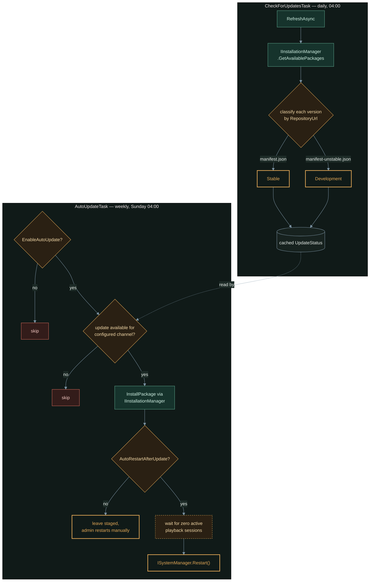

The first five articles in this series documented the development path from problem statement through operational deployment of the Media Integrity Scanner plugin. By the end of that arc (2026-07-31), the plugin was functionally complete — two-phase scanning, SQLite persistence, REST API, dashboard, and event-driven library monitoring all shipping and tested.

But "functionally complete" and "production-ready" are different things. Between v0.1.0 and the v0.1.1 stable release (2026-08-02), the plugin gained automatic update checking, session-aware restart logic, comprehensive end-to-end testing, and critical packaging fixes. This article covers what changed and why.

<!-- excerpt-end -->

No plan survives contact with real data. The first five articles designed a scanner, a dashboard, and a release pipeline that all looked correct on paper — and every one of them still had a gap that only showed up once something real got involved: a real installed release instead of five hand-copied DLLs, a real dashboard response parsed by real browser JavaScript, a real Jellyfin server that has no idea whether anyone's mid-episode when a restart gets triggered. This article is that reckoning, not a sixth increment of new features.

## The v0.1.0 → v0.1.1 Journey

The path from the initial v0.1.0 release to v0.1.1 stable involved:

1. **Development channel releases** — Three pre-releases (v0.1.0-dev.1 through dev.4) to test fixes before marking them stable
2. **Critical packaging bugs** — Discovered and fixed two issues that broke cross-platform installation
3. **Testing infrastructure** — Added Playwright E2E suite and media corruption matrix to validate real-world behavior
4. **Update mechanism** — Implemented automatic update checking with smart restart logic to prevent scan interruption
5. **Documentation** — Created ARCHITECTURE.md with event-flow diagrams, complementing the blog series

This article is Part 6 of the [Jellyfin Media Integrity Scanner](/jellyfin-media-integrity-scanner-introduction/) development series. Unlike the previous five parts, it's not required reading before deploying v0.1.0 — those articles describe a complete, working plugin. This is a "what came next" article for users interested in how production release engineering shaped the project after initial functionality shipped.

## Feature 1: Update Checker with Stable/Development Channels

Users installing the plugin via `manifest.json` could see updates listed in Jellyfin's own Plugins → Catalog page, but nothing surfaced that from *inside* the plugin — no dashboard banner, no way to trigger an install without going through Jellyfin's generic catalog UI. The natural fix leans on machinery Jellyfin already has rather than reinventing it: `IInstallationManager`, the same DI-registered service the Catalog page itself uses to list and install plugin versions.

That interface only ever returns versions from plugin repositories an admin has **already registered** under Dashboard → Plugins → Repositories — a plugin has no way to discover its own updates from a manifest Jellyfin doesn't know about, and this plugin deliberately doesn't register one on the admin's behalf, since that's global server config, not this plugin's own. Registering `manifest.json` (stable) and, optionally, `manifest-unstable.json` (development) is a one-time, explicit setup step, documented on the settings page rather than done silently.



`UpdateStatus` — the cached object both tasks and the dashboard read — tracks `CurrentVersion`, `LatestStableVersion`, `LatestDevVersion`, `UpdateAvailable`, `AvailableVersion`, and which `Channel` it was computed against. Splitting the check (daily, cheap, read-only) from the install-and-maybe-restart step (weekly, and off by default) means opening the dashboard never triggers a live network call or an unexpected install — it just reads whatever the last scheduled check found.

### Channel Selection

Since a single registered repository can list many versions and Jellyfin has no first-class idea of "channels," this plugin publishes two separate manifests and classifies each `VersionInfo` Jellyfin returns by which registered repository URL it came from — not by a repository's free-text display name, which an admin could label anything:

| Setting | Default | Effect |
|---------|---------|--------|
| `UpdateChannel` | `Stable` | `Stable` or `Development` — which channel counts as "available" |
| `StableManifestUrl` | this repo's `manifest.json` | Advanced override; rarely touched |
| `DevManifestUrl` | this repo's `manifest-unstable.json` | Advanced override; rarely touched |
| `EnableAutoUpdate` | `false` | Weekly task installs (stages) a newer version automatically |
| `AutoRestartAfterUpdate` | `false` | After an automatic install, also restart once nobody's watching |

All four update-related settings default to off — a conservative install only ever sees update notifications and clicks "Update Now" on the dashboard by hand. `EnableAutoUpdate` and `AutoRestartAfterUpdate` are deliberately separate toggles: the first lets the plugin stage a newer version without touching the running process at all, the second is what actually restarts Jellyfin to load it, covered next.

Full source: [`Updates/UpdateChecker.cs`](https://github.com/mcgarrah/jellyfin-plugin-media-integrity-scanner/blob/main/Jellyfin.Plugin.MediaIntegrityScanner/Updates/UpdateChecker.cs), [`ScheduledTasks/CheckForUpdatesTask.cs`](https://github.com/mcgarrah/jellyfin-plugin-media-integrity-scanner/blob/main/Jellyfin.Plugin.MediaIntegrityScanner/ScheduledTasks/CheckForUpdatesTask.cs).

## Feature 2: Session-Aware Auto-Restart

Automatic updates are only useful if they actually apply, but blindly restarting Jellyfin the moment a new version installs is a terrible user experience: an in-progress scan gets cut off mid-file, and anyone mid-episode loses playback outright. `AutoUpdateTask` — the same weekly task that performs the install — handles this by refusing to restart until it's actually safe:

```csharp
public async Task ExecuteAsync(IProgress<double> progress, CancellationToken cancellationToken)
{
    if (!config.EnableAutoUpdate) { return; }

    var status = await _updateChecker.RefreshAsync(cancellationToken);
    if (!status.UpdateAvailable) { return; }

    await _updateChecker.InstallAsync(status.Channel, cancellationToken);

    if (config.AutoRestartAfterUpdate)
    {
        await WaitForNoActivePlaybackAsync(cancellationToken);
        _systemManager.Restart();
    }
}

private async Task WaitForNoActivePlaybackAsync(CancellationToken cancellationToken)
{
    while (_sessions.Sessions.Any(s => s.NowPlayingItem != null) && !cancellationToken.IsCancellationRequested)
    {
        await Task.Delay(TimeSpan.FromSeconds(30), cancellationToken);
    }
}
```

Notice what's *not* there: no forced restart after some maximum wait. That was a deliberate call, not an oversight — `ISystemManager.Restart()` is a one-way door with no way to defer or cancel it once called (confirmed by decompiling Jellyfin's own implementation rather than assuming), so there's no safe way to "restart soon anyway" without risking the exact scenario this feature exists to prevent. If playback never stops, the update simply stays installed-but-not-loaded until an admin restarts manually — which is also exactly why `EnableAutoUpdate` and `AutoRestartAfterUpdate` are two separate settings: an install with no restart is a strictly safer default than an install that eventually forces one.

### What Triggers a Restart

Restarts only ever come from this one path:

- `EnableAutoUpdate` is on, a newer version exists for the configured channel, **and** `AutoRestartAfterUpdate` is also on.

Scanning, API requests, and dashboard access never trigger a restart under any circumstances — and the wait loop above re-checks playback every 30 seconds indefinitely, so a scan or a movie that's still running an hour after the update installed simply delays the restart by that same hour.

Full source: [`ScheduledTasks/AutoUpdateTask.cs`](https://github.com/mcgarrah/jellyfin-plugin-media-integrity-scanner/blob/main/Jellyfin.Plugin.MediaIntegrityScanner/ScheduledTasks/AutoUpdateTask.cs).

## Critical Fixes: Packaging and Cross-Platform Support

Two packaging bugs surfaced during testing and needed to be fixed before calling the release stable.

### Issue 1: Shipping Redundant Assemblies

The initial plugin package included:

- Every Jellyfin assembly (even though the host already provides them)
- Platform-specific native SQLite libraries for Windows, Linux, and macOS (all bundled together)

This bloated the plugin zip to ~40MB, most of it unused. Windows installs included Linux binaries and vice versa. Worse, the duplicate Jellyfin assemblies sometimes shadowed the host versions, causing unpredictable binding-redirect behavior.

**Fix (PR #29):** Removed all redundant assemblies and platform-specific natives from the package. The plugin now:

- Declares Jellyfin assemblies as `<FrameworkReference>` (the server provides them)
- Declares `Microsoft.Data.Sqlite` as a NuGet dependency (the runtime installs the right native library for the target platform)
- Publishes only the plugin's own code and essential cross-platform dependencies

**Result:** Package size dropped from ~40MB to ~3MB. Installation is faster, and cross-platform conflicts disappeared.

### Issue 2: Assembly Whitelist for Cross-Platform Loading

Trimming the package down to just `linux-x64`'s native SQLite binary (Issue 1's fix) stopped the install crash, but it meant Windows, macOS, and every other Linux architecture would have shipped with no working native SQLite library at all. Restoring real cross-platform support meant bundling *every* server platform's native binary back in — which reintroduced the original crash, just for a different set of files.

The actual mechanism, found by decompiling Jellyfin's own `PluginManager` (`Emby.Server.Implementations.dll`, pulled from a real 10.11.11 server image) rather than guessing: a plugin can ship its own `meta.json` with a populated `assemblies` list, and Jellyfin uses **only that whitelist** to decide what to load as a managed .NET assembly — instead of its default fallback of recursively loading every `.dll` under the plugin folder, which is what choked on a bundled native binary that merely *looked* like a managed assembly by extension.

**Fix (PR #30):** a flat `assemblies` whitelist in the plugin's own bundled `meta.json` (not the repository-level `manifest.json` used earlier in this article — a different file, at a different layer):

```json
{
  "guid": "c8f4a3b2-1d5e-4f6a-9b7c-2e8d0f1a3b5c",
  "assemblies": [
    "Jellyfin.Plugin.MediaIntegrityScanner.dll",
    "Microsoft.Data.Sqlite.dll",
    "SQLitePCLRaw.batteries_v2.dll",
    "SQLitePCLRaw.core.dll",
    "SQLitePCLRaw.provider.e_sqlite3.dll"
  ]
}
```

With the whitelist in place, native runtime binaries for every platform (win-x64/arm64, linux-x64/arm/arm64/musl variants, osx-x64/arm64) never reach Jellyfin's assembly loader at all, regardless of filename — so the package can safely bundle all of them in one universal zip. Verified against a real demo instance: staged a build containing every platform's native binary (including the exact `win-x64` DLL that crashed the previous attempt) and confirmed via the server's own logs that it loaded only the five whitelisted managed assemblies and never touched a native runtime file.

Full file: [`meta.json`](https://github.com/mcgarrah/jellyfin-plugin-media-integrity-scanner/blob/main/Jellyfin.Plugin.MediaIntegrityScanner/meta.json).

## Testing Infrastructure: Playwright E2E and Corruption Matrix

Between commits, two major testing initiatives shipped to reduce post-release surprises.

### Playwright End-to-End Testing (PR #24)

The unit test suite (141 tests) covers the core logic: scan engine decisions, database queries, API responses, concurrency safety. But unit tests can't catch everything — particularly UI integration bugs and Jellyfin API version mismatches.

The plugin now includes a **Playwright E2E test suite** that:

1. Launches a real Jellyfin instance in Docker
2. Automates a real web browser (headless Chrome)
3. Logs in as admin
4. Navigates to the plugin dashboard
5. Triggers a scan
6. Verifies results appear in the dashboard
7. Edits settings
8. Confirms the UI reflects the changes

This caught a real bug that slipped past unit tests: the dashboard JSON response was using wrong casing for some fields, causing the UI JavaScript to fail silently. The E2E suite caught it immediately by actually rendering the page.

### Media Corruption Test Matrix (PR #23)

The plugin's core value is detecting corrupt media files. But how do you verify the detection logic works? You need actual corrupt files to scan.

The project now includes a **test fixture generator** that creates good and bad video files:

```bash
# Good files (valid containers, playable streams)
ffmpeg -f lavfi -i testsrc=size=320x240:duration=1 -f lavfi -i sine=f=1000:d=1 good_video.mp4
ffmpeg -f lavfi -i testsrc=size=320x240:duration=1 good_video.mkv

# Bad files (truncated, corrupt headers, invalid codecs)
truncate -s 1M good_video.mp4        # Truncated file
dd if=/dev/zero of=corrupt.mp4 bs=1 count=1024 seek=65536 conv=notrunc  # Corrupt middle
dd if=/dev/urandom of=badheader.mp4 bs=1 count=100  # Corrupt header
```

The matrix validates that:
- **Phase 1 (ffprobe)** catches truncated files, corrupt containers, invalid codecs
- **Phase 2 (ffmpeg decode)** catches mid-file corruption and encoding errors
- **False positives** don't occur on actually valid files

This gives confidence that the plugin's detection logic matches what real ffmpeg does, not what the developer *thinks* ffmpeg does.

## Documentation: ARCHITECTURE.md

The first five articles in this series cover the design, but operators and developers need to understand **every single code path** that can trigger a scan — Jellyfin events, scheduled tasks, manual API calls. A single diagram that shows all of these helps immensely.

[ARCHITECTURE.md](https://github.com/mcgarrah/jellyfin-plugin-media-integrity-scanner/blob/main/ARCHITECTURE.md) includes:

1. **Event-flow diagram** — Every Jellyfin event that feeds into the scan engine:
   - Library item added/removed
   - Scheduled tasks (header scan, deep scan)
   - REST API calls (manual triggers)
   - Settings changes that affect throttling

2. **Gate pipeline diagram** — Every decision the scan engine makes before actually starting a scan:
   - Is it quiet hours? Stop.
   - Is playback active? Pause.
   - Are we at concurrency limit? Queue.
   - Does Phase 1 pass? Skip Phase 2 (unless configured otherwise).

3. **Two worked scenarios**:
   - Scenario 1: User adds a new file to the library while deep scan is running
   - Scenario 2: User manually triggers a deep scan from the dashboard during active playback

These diagrams live in the repository, not in the blog series, because they update as the code evolves. The blog articles describe *why* the design works; ARCHITECTURE.md documents *how* it works in real code.

## The Release Checklist

Getting from v0.1.0-dev to v0.1.1 stable required a formal checklist:

- ✅ Unit tests passing (141 tests)
- ✅ Integration tests passing (Docker + real Jellyfin instance)
- ✅ E2E tests passing (Playwright browser automation)
- ✅ Media corruption matrix validated
- ✅ Cross-platform packaging verified (Windows, Linux, macOS)
- ✅ Update checker tested and working
- ✅ Session-aware restart logic verified
- ✅ Documentation complete (README.md, ARCHITECTURE.md, INSTALL.md, RELEASE.md)
- ✅ GitHub releases API workflow automated (manifest.json version bumps on tagged release)
- ✅ Both stable and development channel builds working

The development channel (`v0.1.0-dev.1` through `dev.4`) provided a staging ground for the fixes. Each dev release was a stepping stone toward stability.

## For Users: What Changed

If you're running v0.1.0 and upgrading to v0.1.1:

1. **Installation is easier** — Package is 13x smaller (3MB vs 40MB)
2. **Cross-platform works now** — If you're on Windows or macOS, the plugin now works reliably
3. **Auto-update is optional** — Disabled by default. Enable in **Dashboard → Plugins → Media Integrity Scanner → Settings** if you want automatic updates
4. **Scans never interrupted by restarts** — Even if you enable auto-update, restarts wait for idle periods
5. **Everything else is the same** — The scanning logic, throttling, database schema, and API are unchanged

No action required. The upgrade is transparent.

## For Developers: What Matters

If you're using this plugin as a reference for Jellyfin plugin development:

1. **Platform-specific artifacts belong in manifest.json, not the package** — Declare them and let the plugin loader sort out what to install where
2. **Update checking is worth doing** — GitHub releases API is free and reliable. Users expect to see "Update available" notifications
3. **Session awareness prevents disasters** — Check playback sessions and scan state before auto-restarting
4. **E2E testing catches what unit tests miss** — Browser automation finds UI bugs, casing bugs, and integration mismatches
5. **Test fixture generation validates detection logic** — Create the edge cases you're trying to detect
6. **Architectural diagrams live in code, not blog articles** — Blog articles explain *why*; diagrams document *what*

## Series Recap

The six-part series now covers:

| # | Article | Focus |
|---|---------|-------|
| 1 | [Introduction](/jellyfin-media-integrity-scanner-introduction/) | Problem statement, project scope, architecture overview |
| 2 | [Architecture & Design Decisions](/jellyfin-media-integrity-architecture-design/) | Plugin vs. script, two-phase scanning, I/O throttling, SQLite |
| 3 | [Building the Scanner Core](/jellyfin-media-integrity-scanner-core/) | FFmpeg integration, plugin structure, scan engine |
| 4 | [The Dashboard & API](/jellyfin-media-integrity-dashboard-api/) | Admin UI, REST API, real-time status |
| 5 | [Deployment & Operations](/jellyfin-media-integrity-deployment-operations/) | Proxmox/CephFS setup, monitoring, CI/CD pipeline |
| 6 | **v0.1.1 Release** (this post) | Update checker, auto-update, testing, packaging |

Together, these articles document a complete development and release cycle: from identifying a problem, designing a solution, implementing it, shipping it, and then hardening it for production use based on real-world feedback.

## Future Work

The plugin is stable and production-ready, but v0.1.1 is the end of the *development series*, not the end of the plugin's evolution. Some of these are old ideas that never got past a bullet point; others came out of specifically sitting down and asking hard questions about parts of the design that had started to feel too convenient to be true. None of it is scheduled — this is the honest state of "things worth doing," not a roadmap with dates.

### Operational improvements

- **A CLI mode.** Right now every interaction goes through the dashboard or the REST API — there's no way to, say, initialize the database or kick off a scan from a script after a fresh install. The catch: a Jellyfin plugin has no `Main()` and depends entirely on Jellyfin's own DI container, so this only works cleanly if it turns out to mean "a thin CLI wrapper over the existing API," not "run the plugin binary standalone."
- **Database size and maintenance visibility.** The SQLite cache has no size reporting and no exposed way to `VACUUM` or run an integrity check — currently that's a manual `sqlite3` shell session. A dashboard stat plus a manual "run maintenance now" button would close that gap, assuming `VACUUM` really is safe to run against the live WAL-mode database without stopping Jellyfin, which needs confirming for real rather than assumed from documentation.
- **Prometheus metrics export** — a native `/metrics` endpoint instead of the polling script from the [deployment article](/jellyfin-media-integrity-deployment-operations/#monitoring--alerting).
- **Scan result export** (CSV, for analysis or archival) and **bulk rescan operations** (scan everything matching a media type, library, or date range).
- **Storage-level integrations** — alerts when CephFS/RAID health itself degrades, not just when a file fails a scan.
- **Webhook notifications** to Discord/Slack/ntfy on failures, and **repair automation** that attempts an `ffmpeg -c copy` remux on the subset of failures that kind of fix can actually help.

### Under the hood

- **The throttling model is more naive than it looks.** `MaxConcurrentScans` is a flat, manually-set number with no relationship to the host's actual CPU count, and `MaxReadRateMbPerSec` is enforced *per file*, not system-wide — run more concurrent scans and the real aggregate read rate off storage can exceed the configured cap by a multiple of however many scans are running at once. Worth a real redesign: a vCPU-aware default for concurrency, and a shared rate limiter every scan draws from instead of each one pacing itself in isolation.
- **The scan-results database is add-and-remove, but only while something's listening.** A removed library item does get purged — confirmed by reading the real code, not assumed — but only if the plugin happens to be running at the exact moment Jellyfin reports the removal. There's no periodic reconciliation pass that catches whatever that missed. Jellyfin's own `ILibraryManager.GetItemIds()` is exactly the primitive a "diff the database against what's actually in the library" task would need; nothing's built against it yet.
- **A per-library throttle profile and a scan-priority queue** (recently-added files first) — both straightforward extensions of the existing throttling model, just not built.
- **Live-reload of Jellyfin's own ffmpeg path.** The resolver already checks Jellyfin's global transcoding ffmpeg override, which is nice — but it's only read once, at plugin startup, and cached from then on. Change that setting in Jellyfin's own dashboard later and this plugin won't notice until a restart.

### Testing and platform coverage

- **Every CI check runs on Linux only.** The unit tests, integration suite, and Playwright suite all execute on `ubuntu-latest` — nothing runs on Windows or macOS, despite the plugin explicitly shipping and claiming support for both. One test file even says so directly in a code comment: the Windows/macOS branches of the ffmpeg path resolver "are not covered." Real proof of cross-platform support means actually running somewhere other than Linux, not just packaging correctly for it.

### An idea that hit a real wall

The one genuinely appealing idea that turned out not to be buildable, at least not yet: using Jellyfin's own playback-failure signal to trigger an immediate follow-up scan on whatever file a client just reported trouble with, instead of waiting for the next scheduled sweep. Jellyfin's client-facing API *does* carry a `Failed` flag when a session stops — but reading the real, decompiled `SessionManager` source shows that flag gets read internally to decide whether to update watch state, and is never copied onto the event a plugin actually receives. A playback that failed and a playback someone simply stopped early look identical from the one hook a plugin can subscribe to. This isn't a plugin design problem to solve — it's a gap in what Jellyfin exposes, and the honest next step is raising it upstream rather than working around something that isn't there.

---

**Related Articles:**
- [Managing Context and Rules Across Multiple AI Coding Assistants](/managing-cross-ai-agent-context/) — Bonus: how this plugin was built
- [AI Coding Agent Context Files: A Reference Guide](/ai-coding-agent-context-files-reference/) — The methodology behind coordinating multiple AI agents on the project
- [AI Agent Context Files in Practice: One Repo, Five Agents](/ai-agent-context-files-in-practice/) — The same plugin as a case study in cross-agent collaboration

**Project Links:**
- [Repository](https://github.com/mcgarrah/jellyfin-plugin-media-integrity-scanner)
- [ARCHITECTURE.md](https://github.com/mcgarrah/jellyfin-plugin-media-integrity-scanner/blob/main/ARCHITECTURE.md) — Event-flow and gate-pipeline diagrams
- [Releases](https://github.com/mcgarrah/jellyfin-plugin-media-integrity-scanner/releases) — Stable and development channel
